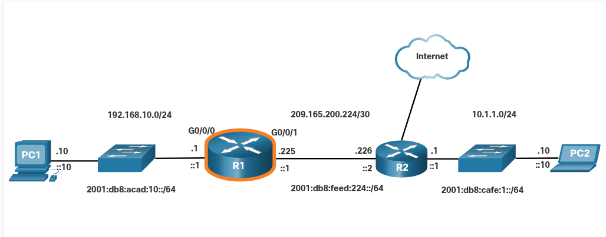

## 10.1. Configure Initial Router Settings

### 10.1. Configure Initial Router Settings

**Ideea centrală:** aici ai practic **checklist-ul standard** pentru orice router nou — 7 pași, în ordine logică, de la identificare până la salvare. E genul de secvență pe care o s-o repeți la fiecare Packet Tracer/lab de acum înainte.

**Cei 7 pași:**

**1. Configure the device name**

```
Router(config)# hostname hostname
```

Primul lucru, mereu — ca să știi cu ce router lucrezi, mai ales când ai mai multe în topologie (R1, R2 etc.).

**2. Secure privileged EXEC mode**

```
Router(config)# enable secret password
```

Parolă pentru modul `#` (privileged EXEC) — cel mai important nivel de acces, de-aici poți schimba orice config. `enable secret` e criptată automat (spre deosebire de vechiul `enable password`, care nu mai e recomandat).

**3. Secure user EXEC mode**

```
Router(config)# line console 0
Router(config-line)# password password
Router(config-line)# login
```

Parolă pentru accesul prin cablul de consolă (portul fizic). `login` e obligatoriu — fără el, parola setată nu e cerută de fapt la conectare.

**4. Secure remote Telnet / SSH access**

```
Router(config-line)# line vty 0 4
Router(config-line)# password password
Router(config-line)# login
Router(config-line)# transport input { ssh | telnet }
```

`vty 0 4` = liniile virtuale pentru acces la distanță (0-4 = 5 sesiuni simultane posibile). `transport input` decide dacă accepți SSH, Telnet, sau ambele — SSH e mereu preferat (criptat), Telnet e trimis clar-text.

**5. Secure all passwords in the config file**

```
Router(config-line)# exit
Router(config)# service password-encryption
```

Fără comanda asta, parolele de tip `password` (nu `secret`) apar **necriptate** în `show running-config` — oricine se uită peste umărul tău sau are acces la config le vede clar. Comanda le criptează pe toate simplu (nu foarte puternic, dar mai bine decât nimic).

**6. Provide legal notification**

```
Router(config)# banner motd delimiter message delimiter
```

Mesaj afișat înainte de login — de obicei un avertisment legal ("acces neautorizat interzis"). `delimiter` e un caracter (ex: `#`) care marchează început/sfârșit de mesaj, ca să poți scrie text pe mai multe linii.

**7. Save the configuration**

```
Router(config)# end
Router# copy running-config startup-config
```

**Foarte important de reținut:** `running-config` = configul activ, în RAM, se pierde la restart. `startup-config` = configul salvat, în NVRAM, se încarcă la boot. Dacă uiți `copy running-config startup-config`, tot ce ai configurat se pierde la un restart/power off.


### **10.1.2 Basic Router Configuration Example**

**Ideea centrală:** aici vezi exact cei 7 pași de la 10.1.1 aplicați concret pe R1, în topologia pe care ai văzut-o și la 9.1.2 (aceeași diagramă PC1-R1-R2-PC2). E practic un "walkthrough" complet, de la `Router>` gol până la un config salvat.

**Pas cu pas, ce se întâmplă:**

**1. Intrare în config mode + hostname**

```
Router> enable
Router# configure terminal
Router(config)# hostname R1
R1(config)#
```

Observă: `enable` te duce din user EXEC (`>`) în privileged EXEC (`#`), apoi `configure terminal` te duce în global config mode. **Notă importantă din text:** după ce setezi hostname, promptul se schimbă imediat din `Router(config)#` în `R1(config)#` — confirmare vizuală instant că a mers comanda.

**2-4. Securizare (enable secret, console, vty) — toate deodată:**

```
R1(config)# enable secret class
R1(config)# line console 0
R1(config-line)# password cisco
R1(config-line)# login
R1(config-line)# exit
R1(config)# line vty 0 4
R1(config-line)# password cisco
R1(config-line)# login
R1(config-line)# transport input ssh telnet
R1(config-line)# exit
```

Aici e ceva de reținut ca și convenție: parola pentru **privileged EXEC** e `class`, iar pentru **console/vty** e `cisco` — e o convenție foarte comună în labs Cisco/NetAcad, o s-o vezi peste tot în exemple și Packet Tracer.

**5. Criptare parole:**

```
R1(config)# service password-encryption
```

**6. Banner:**

```
R1(config)# banner motd #
Enter TEXT message. End with a new line and the #
****...****
WARNING: Unauthorized access is prohibited!
****...****
#
```

Aici vezi practic cum funcționează `delimiter`-ul din 10.1.1 — ai ales `#` ca delimiter, scrii mesajul pe una sau mai multe linii, apoi închizi tot cu `#` din nou.

**7. Salvare — cu un detaliu în plus față de 10.1.1:**

```
R1# copy running-config startup-config
Destination filename [startup-config]?
Building configuration...
[OK]
```


---

## 10.2 Configure Interfaces


### 10.2.1 Configure Router Interfaces

- un router configurat cu hostname, parole și banner (ca la 10.1) tot nu e funcțional pentru trafic **interfețele trebuie configurate separat**, altfel routerul nu e accesibil de la end devices. Deci pasul ăsta e obligatoriu, nu opțional.

**Comenzile, în ordine:**

```
Router(config)# interface type-and-number
Router(config-if)# description description-text
Router(config-if)# ip address ipv4-address subnet-mask
Router(config-if)# ipv6 address ipv6-address/prefix-length
Router(config-if)# no shutdown
```

**Ce face fiecare linie:**

- **`interface type-and-number`** — intri în modul specific al interfeței respective (ex: `interface GigabitEthernet0/0/0`). Prompt-ul devine `(config-if)#`.
- **`description`** — text opțional, **nu e necesar** pentru ca interfața să funcționeze, dar e "good practice". Util în troubleshooting — de exemplu, dacă interfața e conectată la un ISP, notezi acolo cine e providerul și un contact. Limitat la **240 caractere**.
- **`ip address`** — adresa IPv4 + subnet mask
- **`ipv6 address`** — adresa IPv6 + prefix length (poți avea ambele, IPv4 și IPv6, pe aceeași interfață — dual-stack)
- **`no shutdown`** — **cel mai important pas**, practic "pornește" interfața. Fără el, interfața rămâne administrativ oprită indiferent de restul configului.

**Detalii importante de reținut:**

1. **`no shutdown` = activare, dar nu e suficient de unul singur** — interfața trebuie să fie și conectată fizic la alt device (switch, alt router) ca layer-ul fizic să devină activ. Dacă vezi mesaje de confirmare (link enabled) după `no shutdown`, înseamnă că ambele condiții sunt îndeplinite.
2. **Caz special — conexiuni router-la-router fără switch între ele** (exact ca legătura R1-R2 din exemplul cu topologia aia, 209.165.200.224/30): aici **ambele** interfețe (de pe ambele routere) trebuie configurate și activate separat — nu există switch care să facă legătura, deci nu poți avea o parte configurată și cealaltă nu.


### 10.2.2 Configure Router Interfaces Example

**Ideea centrală:** aplicarea concretă a comenzilor de la 10.2.1 pe R1, cu ambele interfețe active — G0/0/0 spre LAN (PC1) și G0/0/1 spre R2. Aici vezi și **log-urile pe care le generează routerul** când o interfață se activează — foarte important să știi să le citești.



**Configurarea G0/0/0 (spre LAN, 192.168.10.0/24):**

```
R1(config)# interface gigabitEthernet 0/0/0
R1(config-if)# description Link to LAN
R1(config-if)# ip address 192.168.10.1 255.255.255.0
R1(config-if)# ipv6 address 2001:db8:acad:10::1/64
R1(config-if)# no shutdown
```

**Configurarea G0/0/1 (spre R2, link point-to-point /30):**

```
R1(config)# interface gigabitEthernet 0/0/1
R1(config-if)# description Link to R2
R1(config-if)# ip address 209.165.200.225 255.255.255.252
R1(config-if)# ipv6 address 2001:db8:feed:224::1/64
R1(config-if)# no shutdown
```

**Cele mai importante lucruri de reținut aici — log-urile automate:**

```
%LINK-3-UPDOWN: Interface GigabitEthernet0/0/0, changed state to down
%LINK-3-UPDOWN: Interface GigabitEthernet0/0/0, changed state to up
%LINEPROTO-5-UPDOWN: Line protocol on Interface GigabitEthernet0/0/0, changed state to up
```

Astea sunt exact mesajele menționate la 10.2.1 ("information messages should be displayed confirming the enabled link"). Trei linii, două straturi diferite:

- **LINK-3-UPDOWN** = Layer 1 (fizic) — cablul e conectat și interfața e "pornită"
- **LINEPROTO-5-UPDOWN** = Layer 2 (protocol) — legătura e complet funcțională, celălalt capăt răspunde.


### 10.2.3 Verify Interface Configuration

**Ideea centrală:** după ce ai configurat interfețele, nu te bazezi doar pe log-urile automate (de la 10.2.2) — verifici explicit cu comenzi de `show`, ca să vezi status-ul complet, dintr-o singură privire.

**Comanda principală IPv4:**

```
R1# show ip interface brief
```

```
Interface              IP-Address       OK? Method Status                  Protocol
GigabitEthernet0/0/0   192.168.10.1     YES manual up                      up
GigabitEthernet0/0/1   209.165.200.225  YES manual up                      up
Vlan1                  unassigned       YES unset  administratively down   down
```

**Cum citești coloanele:**

- **Status / Protocol** = exact aceleași două straturi de la 10.2.2 (LINK vs LINEPROTO), doar afișate compact. Vrei să vezi **up / up** pe ambele coloane — asta înseamnă Layer 1 și Layer 2 OK.
- **Method = manual** — confirmă că adresa IP a fost setată manual de tine (`ip address ...`), nu prin DHCP sau alt mecanism automat.
- **Vlan1 → administratively down / down** — perfect normal, e o interfață virtuală pe router care nu a fost configurată/activată (router-ul nu are nevoie de ea în acest scenariu, VLAN-urile sunt relevante mai ales pe switch-uri).

**Comanda pentru IPv6:**

```
R1# show ipv6 interface brief
```

```
GigabitEthernet0/0/0    [up/up]
    FE80::201:C9FF:FE89:4501
    2001:DB8:ACAD:10::1
GigabitEthernet0/0/1    [up/up]
    FE80::201:C9FF:FE89:4502
    2001:DB8:FEED:224::1
```

**Detaliu important de reținut aici:** fiecare interfață are **două adrese IPv6**, nu una:

1. **FE80::...** — adresă **link-local**, generată automat de router (din MAC address, via EUI-64) de îndată ce interfața se activează. Nu ai configurat-o tu, apare automat. E folosită doar local, pe segmentul respectiv (de exemplu pentru ND, pe care l-ai învățat la 9.3).
2. **2001:DB8:...** — adresa **globală**, cea pe care ai configurat-o tu manual cu `ipv6 address`.


### **10.2.4 Configuration Verification Commands**

**Ideea centrală:** un tabel de referință cu toate comenzile `show` folosite pentru verificare — practic "cheat sheet"-ul pe care o să-l folosești constant în labs și la troubleshooting.

**Comenzile, organizate logic:**

**1. Status rapid (cel mai folosit, de la 10.2.3):**

```
show ip interface brief
show ipv6 interface brief
```

Vezi toate interfețele, IP-urile și status-ul dintr-o privire. Regula de aur: **Status = up, Protocol = up** = totul OK. Orice altceva = problemă de config sau de cablare.

**2. Tabela de rutare:**

```
show ip route
show ipv6 route
```

Arată conținutul tabelei de rutare din RAM — practic "hărțile" pe baza cărora routerul decide pe unde trimite pachetele. O să devină foarte relevantă în modulele următoare, cu rutare statică/dinamică.

**3. Statistici detaliate:**

```
show interfaces
```

Statistici complete pentru **toate** interfețele, dar **atenție** — afișează doar informația de adresare **IPv4**, chiar dacă ai și IPv6 configurat.

```
show ip interface
```

Statistici IPv4 detaliate, pentru toate interfețele.

```
show ipv6 interface
```

Echivalentul de mai sus, dar pentru IPv6.

--- 

## 10.3. Configure the Default Gateway

### 10.3.1 Default Gateway on a Host

**Ideea centrală:** default gateway-ul e folosit **doar** când destinația e pe altă rețea. Dacă destinația e pe același LAN, gateway-ul e complet irelevant — device-ul trimite direct, via switch. Practic asta confirmă exact regula de la 9.1.1/9.1.2, doar că acum din perspectiva host-ului, nu a router-ului.

**Reguli de bază:**
- Dacă ai **un singur router** pe rețea → el e automat default gateway pentru toate host-urile și switch-urile
- Dacă ai **mai multe routere** → trebuie ales explicit unul ca gateway
- **Condiție obligatorie:** IP-ul host-ului și IP-ul interfeței routerului (gateway) trebuie să fie **în aceeași rețea** — altfel nu poate funcționa

### 10.3.2 Default Gateway on a Switch

**Ideea centrală:** switch-ul e Layer 2 din natură — n-are nevoie de IP ca să facă forwarding între device-uri pe LAN. Dar dacă vrei să-l **administrezi de la distanță** (SSH, dintr-o altă rețea), atunci el are nevoie de propria adresă IP + gateway — exact ca un host oarecare.

**Ce trebuie configurat pe switch pentru management remote:**

1. **SVI (Switch Virtual Interface)** — o interfață virtuală, configurată cu IP + subnet mask, pe LAN-ul local
2. **Default gateway** — pentru ca switch-ul să poată răspunde la conexiuni venite din alte rețele

**Comanda pentru gateway pe switch (diferă de router!):**

```
ip default-gateway ip-address
```

**De reținut — diferență importantă:** pe switch e comandă de **global configuration**, nu se leagă de o interfață anume (spre deosebire de router, unde gateway-ul практic e implicit interfața pe care o configurezi). `ip-address` = IP-ul interfeței routerului conectat la switch.


**Diferență IPv4 vs IPv6 pe switch:**

- **IPv4** → gateway configurat **manual**, cu `ip default-gateway`
- **IPv6** → switch-ul **nu are nevoie** de configurare manuală — primește automat gateway-ul din mesajele **Router Advertisement (RA)** — exact mesajul pe care l-ai învățat la 9.3.2! Aici se leagă direct: RA nu e doar pt hosturi, e folosit și de switch-uri ca să-și afle automat gateway-ul.