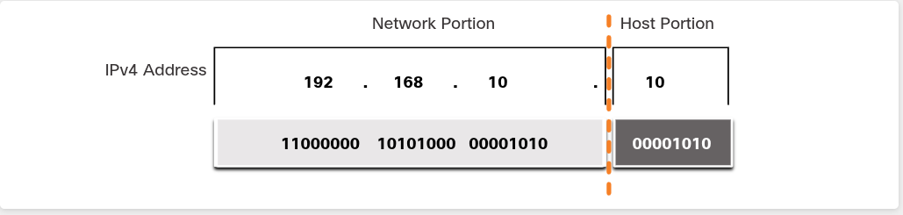
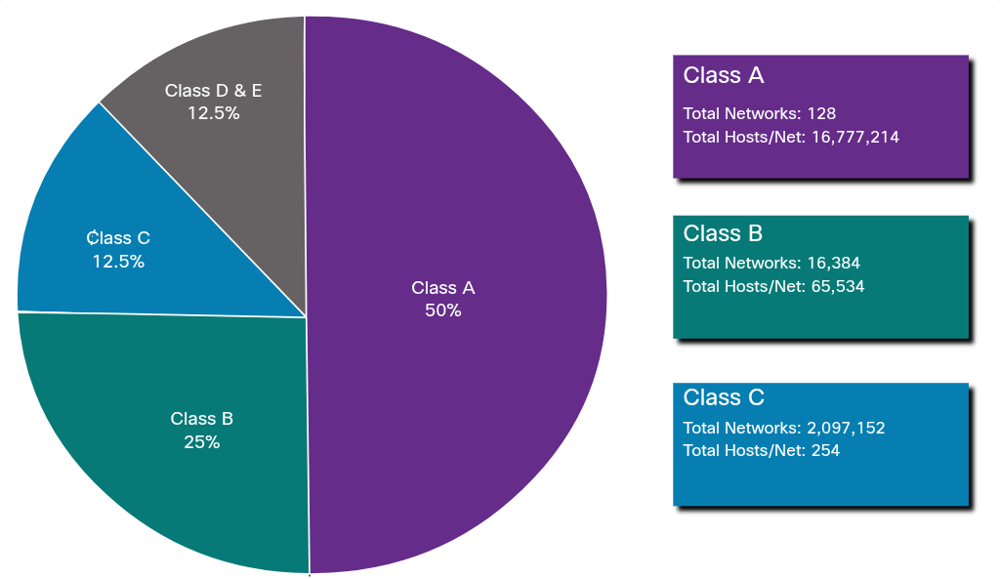
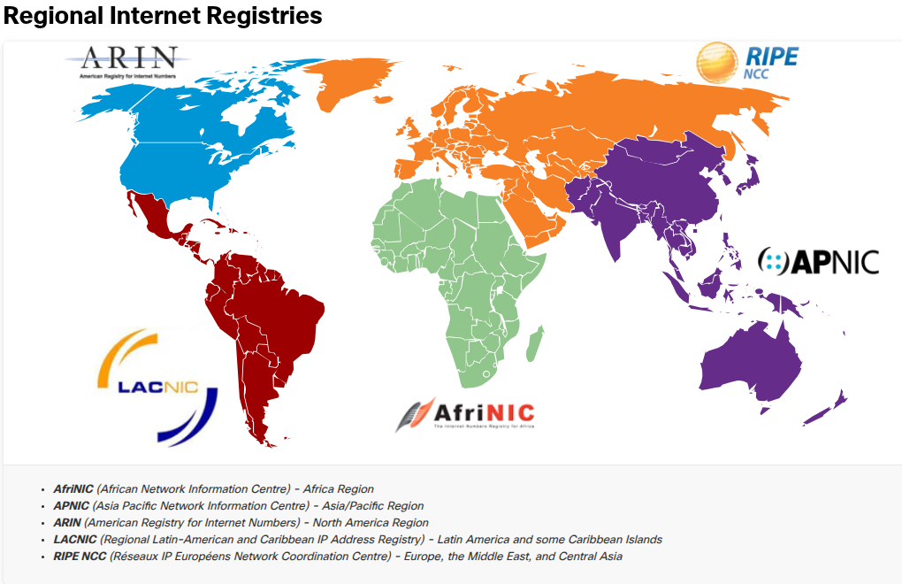

## 11.1 IPv4 Address Structure

### 11.1.1 Network and Host Portions

**IP-ul are 2 părți: network + host**

- O adresă IPv4 = 32 de biți total, împărțiți în porțiune de rețea și porțiune de host
- Unde se face "tăietura" între ele depinde de subnet mask

**Regula de aur:**

- Toate device-urile din aceeași rețea au **aceiași biți** în porțiunea de network (partea din stânga liniei portocalii din imagine)
- Porțiunea de host trebuie să fie **unică** pentru fiecare device din rețeaua respectivă
- Dacă doi hosts au aceiași biți în porțiunea de network → sunt automat în aceeași rețea, indiferent ce au în porțiunea de host.



### 11.1.2 The Subnet Mask

**Ideea centrală:** subnet mask-ul e un al doilea număr de 32 de biți, care merge mereu împreună cu IP-ul. El nu conține adresa în sine, ci doar îi spune calculatorului "până aici e network, de aici încolo e host".

**Cum funcționează, pe exemplul din imagine:**

```
IP:      192.168.10.10   → 11000000.10101000.00001010.00001010
Mask:    255.255.255.0   → 11111111.11111111.11111111.00000000
```

Regula e simplă:
- **bit de 1 în mască** → bitul corespunzător din IP face parte din **network portion**
- **bit de 0 în mască** → bitul corespunzător din IP face parte din **host portion**

**Ce mai trebuie reținut:**

- IP + subnet mask sunt **mereu împreună** — un IP fără mască nu-ți spune nimic despre ce e network și ce e host
- Adresa de rețea (network address) = toate device-urile din același subnet vor avea aceleași cifre în porțiunea de network
- Procesul prin care calculatorul combină efectiv IP-ul cu masca ca să extragă network address-ul se numește **ANDing** (AND logic, bit cu bit) — asta e practic pasul următor din curs, 11.1.3 probabil


### 11.1.3 The Prefix Length

**Ideea:** în loc să scrii masca întreagă (255.255.255.0), poți scrie doar **câți biți de 1 are masca**, precedați de `/`.

**Cum numeri:**  
Iei masca în binar și numeri biții de 1 consecutivi de la stânga:

```
255.255.255.0 → 11111111.11111111.11111111.00000000
                 8    +    8    +    8    +   0    = 24 biți de 1
```

→ deci `/24` = exact aceeași mască ca 255.255.255.0

**Câteva de reținut pe de rost, că apar tot timpul:**

| Mască dotted decimal | Prefix |
| -------------------- | ------ |
| 255.0.0.0            | /8     |
| 255.255.0.0          | /16    |
| 255.255.255.0        | /24    |
| 255.255.255.128      | /25    |
| 255.255.255.192      | /26    |
| 255.255.255.240      | /28    |


### 11.1.4 Determining the Network - Logical AND

**Regula AND (logic):**

```
1 AND 1 = 1
0 AND 1 = 0
1 AND 0 = 0
0 AND 0 = 0
```

Practic: rezultatul e 1 **doar** dacă ambii biți sunt 1. Orice altă combinație dă 0.

**De ce se folosește:** ca să afli network address-ul, iei IP-ul și masca, le pui bit-lângă-bit, și aplici AND pe fiecare pereche de biți.

**Exemplul din imagine, pas cu pas:**

```
IP:      192.168.10.10  → 11000000.10101000.00001010.00001010
Mask:    255.255.255.0  → 11111111.11111111.11111111.00000000
                           ---------------------------------------- AND
Network: 192.168.10.0   → 11000000.10101000.00001010.00000000
```

Ce se întâmplă practic pe fiecare octet:

- Primii 3 octeți: masca e toată din 1 → orice bit AND 1 = **bitul rămâne neschimbat** (îl "copiezi" din IP)
- Ultimul octet: masca e toată din 0 → orice bit AND 0 = **0** (îl "ștergi", devine 00000000)

**De reținut ca shortcut, ca să nu mai faci AND bit-cu-bit manual de fiecare dată:**

- Unde masca are octet **255** → copiezi octetul din IP identic
- Unde masca are octet **0** → pui 0 în octetul respectiv
- Unde masca are un octet intermediar (192, 224, 240 etc., cazul /25, /26...) → acolo chiar trebuie să faci AND bit cu bit, pentru că doar o parte din octet e network


### 11.1.6 Network, Host, and Broadcast Addresses

**Cele 3 tipuri de adrese într-o rețea, pe exemplul 192.168.10.0/24:**

|Tip|Ce e|Exemplu|Poate fi asignată unui device?|
|---|---|---|---|
|**Network address**|toți biții de host = 0|192.168.10.**0**/24|❌ NU|
|**Host addresses**|biții de host = orice, în afară de "toate 0" sau "toate 1"|192.168.10.**1** până la 192.168.10.**254**|✅ DA|
|**Broadcast address**|toți biții de host = 1|192.168.10.**255**/24|❌ NU|

**De ce network și broadcast nu se pot da unui PC:**

- Network address = e "eticheta" întregii rețele, rezultatul ANDing-ului (ce ai văzut mai devreme)
- Broadcast address = adresa specială folosită când vrei să trimiți un pachet către **toate** device-urile din rețea deodată (all 1 în host portion)

**Shortcut simplu pentru /24 (mască 255.255.255.0):**

- Network = X.X.X.**0**
- Primul host valid = X.X.X.**1**
- Ultimul host valid = X.X.X.**254**
- Broadcast = X.X.X.**255**

--- 

### 11.2. IPv4 Unicast, Broadcast, and Multicast

### 11.2.1 Unicast

**Unicast — one-to-one**

- Un device trimite la exact un alt device
- Sursa e mereu unicast (un pachet nu poate porni de la "mai multe surse")
- Cel mai comun tip de trafic (navigare web, SSH, etc.)


### 11.2.2 Broadcast

**Broadcast — one-to-all**

- Un device trimite la **toate** device-urile din rețea/broadcast domain
- Destinație = toți biții de host la 1 (ce ai văzut deja la network/broadcast address)

- Două tipuri:
    - **Limited broadcast**: 255.255.255.255 → merge la toate device-urile din rețeaua locală, routerele NU-l trimit mai departe
    - **Directed broadcast**: gen 172.16.4.255 pentru rețeaua 172.16.4.0/24 → țintește toate device-urile dintr-o rețea _specifică_, chiar dacă tu ești în altă rețea. E dezactivat by default pe Cisco (`no ip directed-broadcasts`), din motive de securitate (a fost abuzat în trecut pentru atacuri DoS)
    
- Problema broadcast-ului: consumă resurse, fiecare device trebuie să proceseze pachetul → de-asta se împart rețelele în subnet-uri mai mici (limitezi broadcast domain-ul)


### 11.2.3 Multicast

**Multicast — one-to-many (dar nu toți)**

- Trimiți la un **grup select** de device-uri care s-au "abonat" la acel grup multicast
- Range rezervat: **224.0.0.0 – 239.255.255.255**
- Exemplu concret din curs: OSPF (protocol de routare) folosește 224.0.0.5 ca să comunice între routere — doar routerele cu OSPF activ procesează pachetele alea, restul le ignoră complet
- Un host multicast primește atât pachete pe adresa lui unicast normală, cât și pe adresa de grup multicast la care s-a abonat

---


## 11.3. Types of IPv4 Addresses

### 11.3.1 Public and Private IPv4 Addresses

**Public IPv4**
- Adrese care circulă direct pe internet, între routerele ISP-urilor
- Trebuie să fie **unice global** (nu poate exista același IP public la doi useri diferiți în același timp)

**Private IPv4**
- Nu se rutează pe internet — sunt doar pentru uz intern, în interiorul unei rețele/organizații
- Nu trebuie să fie unice global — le poți refolosi în orice rețea privată (de-asta orice router de acasă dă IP-uri gen 192.168.1.x, indiferent de casă)
- Au apărut ca soluție temporară la epuizarea spațiului de adrese IPv4 (soluția permanentă e IPv6)

**Cum recunoști rapid dacă un IP e privat:**
- Începe cu **10.** → privat
- Începe cu **172.** și al doilea octet e între **16-31** → privat (atenție, nu tot 172.x e privat, doar 172.16-172.31!)
- Începe cu **192.168.** → privat
- Orice altceva → probabil public


### 11.3.2 Routing to the Internet

**Problema:**
- Rețelele interne (case, firme) folosesc adrese private (10.x, 172.16-31.x, 192.168.x)
- Dar adresele private **nu sunt rutabile pe internet** — un router de pe internet nu știe și nici nu are voie să trimită pachete către 192.168.1.5, pentru că adresa aia există în milioane de rețele private diferite simultan, deci nu e unică global
- Deci un pachet cu sursă privată trebuie tradus înainte să iasă, altfel e aruncat (discarded)


**Soluția: NAT (Network Address Translation)**
- Se întâmplă de obicei pe routerul care leagă rețeaua internă de ISP
- Ia IP-ul privat sursă din pachet și îl **înlocuiește** cu un IP public (pe care ISP-ul ți l-a dat ție/organizației)
- Așa poate circula pachetul pe internet, și tot NAT-ul știe să aducă răspunsul înapoi la device-ul intern corect


**DMZ (Demilitarized Zone)**
- Zona din rețea unde pui resursele care _trebuie_ să fie accesibile din internet (ex: un web server al firmei)
- Aceste device-uri primesc IP-uri **publice** direct, pentru că trebuie să fie găsite din exterior
- Routerul de la margine face 3 treabă simultan: **routare** + **NAT** + **firewall** (filtrează ce intră/iese)


### 11.3.4 Special Use IPv4 Addresses

- Blocul rezervat: **127.0.0.0/8** (deci practic 127.0.0.0 – 127.255.255.254 sunt toate loopback, dar în practică folosești mereu doar **127.0.0.1**)
- Scop: un device "se ping-uiește pe el însuși", ca test — verifici dacă stack-ul TCP/IP (placa de rețea, driverele, configurația IP) funcționează, **fără să iasă deloc pe rețea**
- Dacă dai `ping 127.0.0.1` și nu primești răspuns → problema e local, la configurația TCP/IP a device-ului tău, nu la rețea/cablu/router
- Interesant detaliu din curs: **orice** adresă din 127.0.0.0/8 face loopback, nu doar .1 — deci `ping 127.5.5.5` tot la tine se întoarce, deși nimeni nu folosește practic altceva decât 127.0.0.1

**De reținut simplu:** loopback = "eu vorbesc cu mine însumi", util pentru diagnosticare rapidă înainte să bănuiești cablul sau routerul.


### 11.3.5 Legacy Classful Addressing

Înainte (1981) IP-urile se împărțeau rigid în clase, cu prefix fix, nu flexibil ca acum:

|Clasă|Range|Prefix fix|Scop|
|---|---|---|---|
|**A**|0.0.0.0 – 127.0.0.0|/8|rețele uriașe (16M+ hosts)|
|**B**|128.0.0.0 – 191.255.0.0|/16|rețele medii-mari (~65,000 hosts)|
|**C**|192.0.0.0 – 223.255.255.0|/24|rețele mici (254 hosts)|
|D|224.0.0.0 – 239.0.0.0|—|multicast (ce ai văzut la 11.2.3)|
|E|240.0.0.0 – 255.0.0.0|—|experimental|

**Trucul rapid să identifici clasa după primul octet:**

- 0–127 → Clasa A
- 128–191 → Clasa B
- 192–223 → Clasa C
- 224–239 → Clasa D (multicast)
- 240–255 → Clasa E


**De ce a fost o problemă:** prefixul era _fix_ pe fiecare clasă, deci nu puteai alege. Dacă o firmă avea 300 de calculatoare, o rețea Clasă C (254 hosts) era prea mică, dar o Clasă B (65,000 hosts) era enorm de risipitoare — foloseai 300 din 65,000 de adrese posibile, restul irosite. De-asta Clasa A+B (jumătate din tot spațiul IPv4!) erau alocate ineficient, ceea ce a dus rapid la epuizarea adreselor.





### 11.3.6 Assignment of IP Addresses

**Ierarhia de alocare:**

```
IANA (Internet Assigned Numbers Authority)
    ↓
RIR-uri (5 regiuni globale)
    ↓
ISP-uri
    ↓
Organizații / clienți finali
```

**IANA** — organismul central care gestionează _tot_ spațiul de adrese IPv4 și IPv6 la nivel global. Nu vinde direct IP-uri unei firme, ci împarte blocuri mari către cele **5 RIR-uri regionale**.

**RIR (Regional Internet Registry)** — cele 5 sunt împărțite geografic (ex: ARIN pentru America de Nord, RIPE NCC pentru Europa/Orientul Mijlociu, APNIC pentru Asia-Pacific, etc. — probabil apar în figura pe care nu o pot vedea complet, dar astea sunt cele 5 standard).

**De la RIR mai departe:**

- RIR alocă blocuri de IP-uri către **ISP-uri**
- ISP-ul împarte mai departe adrese către organizații/clienți (asta primești tu acasă sau firma ta de la provider)
- Sau, alternativ, o organizație mare poate cere adrese **direct de la RIR**, dacă îndeplinește criteriile RIR-ului respectiv (de obicei doar firme foarte mari, cu nevoi de IP-uri publice masive)




---

## 11.4. Network Segmentation

### 11.4.1 Broadcast Domains and Segmentation

- **Broadcast domain** = grupul de device-uri care primesc și procesează un broadcast trimis de oricare dintre ele
- Switch-urile **propagă** broadcast-urile: dacă un switch primește un broadcast pe un port, îl trimite pe **toate celelalte** porturi (except cel de pe care a venit). Deci un singur switch = tot ce e conectat la el e în același broadcast domain
- Exemple practice de broadcast pe care le folosești constant fără să-ți dai seama:
    - **ARP** — trimite broadcast Layer 2 ca să afle adresa MAC a unui IP cunoscut din rețeaua locală (asta urmează probabil în capitolul următor, Address Resolution)
    - **DHCP** — un device nou trimite broadcast ca să găsească un server DHCP care să-i dea IP
- **Router-ele opresc broadcast-urile** — nu le trimit mai departe între interfețe. Deci routerul e cel care "taie" broadcast domain-ul. Asta e diferența fundamentală switch vs router: switch = extinde broadcast domain, router = separă broadcast domains

### 11.4.2 Problems with Large Broadcast Domains

Exemplu concret: 400 de useri, toți în **172.16.0.0/16** (o singură rețea mare, un singur broadcast domain uriaș).

Problema: fiecare din cei 400 de useri poate genera broadcast (ARP, DHCP etc.), și **toate** celelalte 399 de device-uri trebuie să proceseze fiecare broadcast → trafic exagerat, rețea lentă, device-uri încărcate inutil.

**Soluția — subnetting:** împarți rețeaua mare în bucăți mai mici. În exemplu, cei 400 useri au fost împărțiți în:

- **172.16.0.0/24** → 200 useri (LAN 1)
- **172.16.1.0/24** → 200 useri (LAN 2)

Observă ce s-a schimbat: prefixul a trecut de la **/16 la /24** — practic ai "furat" biți din partea de host și i-ai dat părții de network, ca să creezi mai multe rețele mici din una mare. Ăsta e exact conceptul de subnetting pe care-l vei face manual în curând (calcule).

Rezultat: un broadcast în LAN 1 rămâne în LAN 1, nu se mai propagă în LAN 2 — routerul R1 le separă la mijloc.


### 11.4.3 Reasons for Segmenting Networks

- **Reduci traficul** de broadcast general → rețea mai rapidă
- **Securitate** — poți controla ce subnet vorbește cu ce subnet (ex: subnetul de contabilitate nu vorbește cu cel de IT)
- **Limitezi impactul problemelor** — dacă un device se stricăt și face broadcast storm (trafic anormal de broadcast), doar subnetul lui e afectat, nu toată firma

---

## 11.5. Subnet an IPv4 Network

### 11.5.1 Subnet on an Octet Boundary

**Ideea centrală:**  
Subnetting = **împrumuți biți din partea de host** ca să-i dai părții de network → mai mulți biți de network = mai multe rețele mici, dar fiecare cu mai puțini hosts disponibili. E un trade-off constant: **mai multe subnet-uri ↔ mai puțini hosts per subnet**.

Cel mai simplu caz de reținut este când tăietura cade exact la finalul unui octet (/8, /16, /24) — de-asta se numesc "octet boundary". Nu trebuie să faci calcule pe biți individuali, doar lucrezi cu octeți întregi.

**Tabelul de bază, de reținut pe de rost:**

|Prefix|Mască|# Hosts per subnet|
|---|---|---|
|/8|255.0.0.0|16,777,214|
|/16|255.255.0.0|65,534|
|/24|255.255.255.0|254|

**Formula din spate (de reținut, revine constant):**

```
# hosts utilizabili = 2^(biți de host) - 2
```

De ce **-2**: scazi network address și broadcast address (alea nu se dau la device-uri, cum ai văzut la 11.1.6).

Exemplu verificare pe /24: 8 biți de host → 2^8 = 256, minus 2 = **254** ✓ exact ce arată tabelul.

**Exemplul concret din curs, care e foarte instructiv:**

Ai 10.0.0.0/8 (o firmă mare, 16 milioane hosts posibili — evident prea mult într-un singur broadcast domain).

**Opțiunea 1 — subnetezi la /16:**

- Iei cei 8 biți din octetul 2 și îi transformi din host în network
- Rezultat: **256 de subnet-uri posibile** (10.0.0.0/16, 10.1.0.0/16, 10.2.0.0/16 ... 10.255.0.0/16), fiecare cu **65,534 hosts**
- Practic al doilea octet devine "numărul subnet-ului"

**Opțiunea 2 — subnetezi la /24:**

- Iei și octetul 3, nu doar al 2-lea
- Rezultat: **65,536 subnet-uri posibile** (10.0.0.0/24, 10.0.1.0/24, 10.0.2.0/24 ... 10.255.255.0/24), fiecare cu doar **254 hosts**
- E cea mai populară opțiune în practică — de-asta ai văzut 192.168.x.0/24 peste tot până acum în curs
  

### 11.5.2 Subnet within an Octet Boundary

**Ideea de bază:** pleci de la un /24 (255.255.255.**0**, ultimul octet tot 0 = 8 biți de host disponibili) și "furi" biți din **al 4-lea octet**, unul câte unul, ca să faci subnet-uri și mai mici.

**Cele 2 formule care guvernează tot tabelul:**

```
# subnet-uri create = 2^(biți furați)
# hosts utilizabili per subnet = 2^(biți rămași) - 2
```

Observă că suma biților furați + biților rămași = mereu 8 (că tot din ultimul octet lucrezi).

**Hai să verificăm fiecare rând, ca să vezi de unde vin numerele:**

|Prefix|Biți furați|Biți rămași host|Subnet-uri (2^furați)|Hosts (2^rămași - 2)|
|---|---|---|---|---|
|/25|1|7|2^1 = **2**|2^7-2 = 128-2 = **126**|
|/26|2|6|2^2 = **4**|2^6-2 = 64-2 = **62**|
|/27|3|5|2^3 = **8**|2^5-2 = 32-2 = **30**|
|/28|4|4|2^4 = **16**|2^4-2 = 16-2 = **14**|
|/29|5|3|2^5 = **32**|2^3-2 = 8-2 = **6**|
|/30|6|2|2^6 = **64**|2^2-2 = 4-2 = **2**|

**Pattern-ul de reținut, exact cum zice textul:** fiecare bit furat în plus **dublează** numărul de subnet-uri și **înjumătățește** (aproximativ) numărul de hosts. E o relație inversă directă — cu cât vrei mai multe subnet-uri mici, cu atât ai mai puțin loc pentru device-uri în fiecare.

**Un caz special foarte important de reținut: /30**

- Doar 2 hosts utilizabili — exact cât ai nevoie pentru o legătură **punct-la-punct** între 2 routere (fiecare capăt al link-ului primește 1 IP)
- E folosit constant în practică pentru link-uri WAN între routere, unde n-are sens să "irosești" un /24 întreg pentru doar 2 device-uri

**Cum știi când să alegi ce prefix:** te uiți la câți hosts ai nevoie efectiv într-un subnet, apoi cauți cel mai mic /XX care acoperă numărul ăla (fără să iroseti prea mult spațiu). De exemplu, dacă ai un departament cu 20 de calculatoare, /27 (30 hosts) e alegerea potrivită — /26 (62 hosts) ar irosi prea multe adrese, iar /28 (14 hosts) nu ar fi suficient.


---

## 11.6. Subnet a Slash 16 and a Slash 8 Prefix

### 11.6.1 Create Subnets with a Slash 16 prefix

**Setup-ul exemplului:** 172.16.0.0/16

- Mască default: 255.255.0.0
- 16 biți network (primii 2 octeți: 172.16) + 16 biți host (ultimii 2 octeți)
- Acei 16 biți de host = plaja ta de "furat" pentru subnetting

**Aceleași formule de la 11.5.2rămân valabile, doar că acum ai mai mult loc de joacă:**

```
# subnet-uri = 2^(biți furați)
# hosts per subnet = 2^(biți rămași) - 2
```

Diferența practică: la /24 puteai merge maxim până la /30 (furai maxim 6-7 biți din cei 8 disponibili, ca să-ți rămână măcar 2 pentru hosts). La /16, poți merge mult mai departe — de exemplu poți face un /24 din 172.16.0.0/16 (furi 8 biți din 16, exact octetul 3), și tot îți rămân 8 biți de host disponibili (254 hosts per subnet), pentru că pleci cu mult mai mult "material" de la bază.

**Ce sigur urmează în tabelul din curs (pattern-ul standard, ca la 11.5.2):**

| Prefix | Biți furați (din cei 16) | Biți host rămași | # Subnet-uri | # Hosts/subnet |
| ------ | ------------------------ | ---------------- | ------------ | -------------- |
| /17    | 1                        | 15               | 2            | 32,766         |
| /18    | 2                        | 14               | 4            | 16,382         |
| /20    | 4                        | 12               | 16           | 4,094          |
| /24    | 8                        | 8                | 256          | 254            |
| /25    | 9                        | 7                | 512          | 126            |
| ...    | ...                      | ...              | ...          | ...            |

**De reținut ca idee cheie a acestui subcapitol:** cu /16 ca punct de plecare, poți crea subnet-uri **uniforme** (toate cu același număr de hosts) mult mai flexibil decât cu /24, tocmai pentru că ai mai mulți biți disponibili de împrumutat. E utilă exact în situația din 11.4.2 — o firmă mare care are nevoie de multe subnet-uri, nu doar 2-3.


### 11.6.2 Create 100 Subnets with a Slash 16 prefix

**Regula de bază:** cauți cel mai mic număr de biți furați astfel încât 2^biți ≥ numărul de subnet-uri cerut.

```
2^6 = 64   → prea puțin (sub 100)
2^7 = 128  → ajunge, acoperă și depășește 100 ✓
```

Deci ai nevoie de **7 biți furați** din octetul 3 (mergi de la stânga la dreapta, cum spune textul — începi cu bitul cel mai semnificativ al octetului 3).

**Rezultat:**

- Prefix nou: /16 + 7 = **/23**
- Subnet-uri create: 2^7 = **128** (ai nevoie de 100, dar 128 e cel mai apropiat pas posibil — restul de 28 rămân neutilizate, dar disponibile pentru viitor)
- Biți de host rămași: 16 - 7 = 9 biți → hosts per subnet = 2^9 - 2 = **510**

**De reținut:** de-asta se numește "octetul 3, going left to right" — furi bit cu bit, de la cel mai semnificativ (stânga) spre dreapta, până atingi numărul necesar de subnet-uri. Nu sari direct la un prefix "rotund".


### 11.6.3 Create 1000 Subnets with a Slash 8 prefix

Aici ai și mai mult spațiu: 8 biți network, **24 biți host** disponibili de furat (octeții 2, 3, 4).

**Aceeași logică:**

```
2^9  = 512   → prea puțin (sub 1000)
2^10 = 1024  → ajunge ✓
```

Deci ai nevoie de **10 biți furați**, exact cum zice textul.

**Cum se împart acei 10 biți, mergând tot de la stânga la dreapta:**

- Octetul 2 are 8 biți disponibili → îi furi pe **toți cei 8**
- Mai ai nevoie de încă 2 biți → îi iei din octetul 3 (primii 2 biți din stânga acelui octet)
- Total: 8 + 2 = **10 biți furați** ✓

**Rezultat:**

- Prefix nou: /8 + 10 = **/18**
- Subnet-uri create: 2^10 = **1024** (mai mult decât cele 1000 necesare, dar e cel mai apropiat pas)
- Biți de host rămași: 24 - 10 = 14 biți → hosts per subnet = 2^14 - 2 = **16,382**


---

## 11.7. Subnet to Meet Requirements

### 11.7.1 Subnet Private versus Public IPv4 Address Space

Recapitulare rapidă a arhitecturii unei firme (legată de ce am discutat la NAT/DMZ):

- **Intranet** (partea internă) → adrese **private** — aici ai libertate mare, poți alege orice bloc RFC 1918 (10.x, 172.16-31.x, 192.168.x)
- **DMZ** (partea expusă spre internet, ex: web server) → adrese **publice** — aici ești limitat, pentru că adresele publice sunt o resursă scumpă și controlată (ai văzut la 11.3.6, alocarea prin IANA→RIR→ISP)

**De ce contează diferența la subnetting:** pe intranet, dacă folosești ceva gen 10.0.0.0/8, ai 24 de biți de host la dispoziție — subnetting-ul e "lejer", poți face /16 sau /24 fără să te gândești prea mult, pentru că ai milioane de adrese de irosit. Dar pe DMZ, unde ai puține adrese publice alocate de ISP, **nu-ți permiți să irosești nimic**.


### 11.7.2 Minimize Unused Host IPv4 Addresses and Maximize Subnets

Ideea: nu ești obligat să folosești **aceeași mască** pentru toate subnet-urile tale. Poți avea, din același bloc de adrese, subnet-uri cu prefixuri diferite — unul /26, altul /28, altul /30 — în funcție de câți hosts are nevoie _fiecare_ subnet în parte.

Relația inversă pe care ai văzut-o deja se aplică per-subnet acum, nu global:

- Subnet cu mulți useri → biți de host mai mulți → prefix mai mic (ex: /25)
- Subnet cu puțini useri (sau un link punct-la-punct) → biți de host puțini → prefix mai mare (ex: /30)

**Regula cheie:** te uiți la **cel mai mare subnet** (cel cu cei mai mulți useri) ca să stabilești câți biți de host minim trebuie să lași acolo. Restul subnet-urilor mai mici primesc mai puțini biți de host (deci prefix mai mare, mai "strâns").

### 11.7.3 Example - Efficient IPv4 Subnetting

172.16.0.0/**22** alocat de ISP → 10 biți de host → 2^10 - 2 = **1,022 hosts** disponibili în total pentru firmă.

(Notă interesantă din curs: deși e prezentat ca exemplu de adresă publică alocată de ISP, 172.16.x e de fapt din spațiul privat — probabil doar pentru exemplificare, ca să nu folosească un IP public real.)

**De ce contează exact acest /22:** dacă firma ar fi primit doar /22 de la ISP (1,022 adrese _total_, nu per subnet), și are nevoie de mai multe departamente/subnet-uri diferite (unul cu 500 useri, altul cu 100, altul cu doar 2 pentru un link de router), **nu-și permite** să dea fiecărui departament un /24 fix (254 hosts) — ar irosi enorm din cei doar 1,022 disponibili.

---

## 11.8 VLSM

### 11.8.3 IPv4 Address Conservation

**Ideea centrală a secțiunii:** din cauza epuizării spațiului de IPv4 public, conservarea adreselor e o prioritate majoră la subnetting. (Notă: pentru IPv6 asta nu mai e o problemă, de-asta IPv6 nu are nevoie de conservare la fel de strictă — unul din motivele trecerii la IPv6.)

**Problema demonstrată prin exemplu:**

Topologie: 4 clădiri (A: 25 hosts, B: 20 hosts, C: 15 hosts, D: 28 hosts) legate în lanț prin 3 routere (R1-R2, R2-R3, R3-R4), fiecare legătură router-router având nevoie de doar **2 hosts**.

Total: **7 subnet-uri necesare** (4 pentru clădiri + 3 pentru link-urile dintre routere).

**Subnetting tradițional (aceeași mărime pentru toate):**

Te uiți la cel mai mare subnet (Building D, 28 hosts) și alegi un prefix care să-l acopere:

```
2^5 - 2 = 30 hosts ✓ acoperă 28
```

→ Furi 5 biți, prefix **/27** peste tot, uniform.

**Rezultatul — risipa:**

Pe cele 3 legături WAN (router-router), unde ai nevoie doar de **2 hosts**, tot aplici /27 (30 hosts disponibili):

```
30 hosts disponibili - 2 folosiți = 28 adrese irosite pe fiecare WAN
28 × 3 legături = 84 adrese irosite total
```

### 11.8.4 VLSM

**Ideea centrală:** până acum (subnetting tradițional), toate subnet-urile create foloseau **aceeași mască** → deci toate aveau **același număr de hosts disponibili**. VLSM schimbă asta: îți permite să împarți spațiul de adrese în bucăți **de mărimi diferite**, fiecare cu propria mască.

**De unde vine numele:** "Variable Length Subnet Mask" — masca variază de la un subnet la altul, în funcție de câți biți ai furat pentru **acel** subnet specific.

**Diferența vizuală din curs (cele 2 diagrame tip "plăcintă"):**

- **Traditional subnetting** = toate feliile la fel de mari (8 subnet-uri egale, 30 hosts fiecare)
- **VLSM** = unul din subnet-uri e luat și **subnetat din nou**, mai fin, creând felii mici suplimentare în interiorul unei felii mari — de exemplu un subnet e împărțit mai departe cu /30, creând 8 subnet-uri mici de 2 hosts fiecare, din spațiul unui singur subnet mare original

**Ce înseamnă practic:** VLSM = subnetting **recursiv** / **pe mai multe niveluri**. Iei un bloc mare, îl subnetezi o dată. Dacă o parte din rezultat tot e prea mare pentru nevoia reală, o subnetezi **încă o dată**, mai fin, doar pe bucata aia.

**De ce există:** exact ca să rezolve problema demonstrată la 11.8.3 — risipa de 84 de adrese pe cele 3 WAN links. În loc să forțezi toate subnet-urile la aceeași mărime (/27 peste tot), aplici masca potrivită fiecărei nevoi individuale.

### 11.8.5 VLSM Topology Address Assignment

**Ideea centrală:** acum ai subnet-urile gata calculate, dar trebuie o convenție clară — cine primește ce IP exact în interiorul fiecărui subnet.

**Convenția standard (foarte importantă, se folosește constant în practică):**

> Primul IP disponibil din range-ul de hosts al unui subnet se dă interfeței **LAN a routerului** → devine **default gateway** pentru toate device-urile din subnetul respectiv.

**Aplicat pe exemplu, pentru fiecare clădire:**

|Subnet|Range hosts|Gateway (dat interfeței G0/0/0)|
|---|---|---|
|Building A: 192.168.20.0/27|.1 – .30|**192.168.20.1**/27|
|Building B: 192.168.20.32/27|.33 – .62|**192.168.20.33**/27|
|Building C: 192.168.20.64/27|.65 – .94|**192.168.20.65**/27|
|Building D: 192.168.20.96/27|.97 – .126|**192.168.20.97**/27|

Toate PC-urile din Building A, de exemplu, vor avea IP-uri undeva între .2 și .30, cu **192.168.20.1** setat ca default gateway (adresa routerului R1).

**Pentru link-urile WAN (/30, doar 2 hosts fiecare):**

Aici nu mai există concept de "gateway pentru clienți" — sunt doar 2 capete, câte un router de fiecare parte:

|Link|Subnet|R-stânga primește|R-dreapta primește|
|---|---|---|---|
|R1–R2|192.168.20.224/30|R1 (G0/0/1): **.225**|R2 (G0/0/1): **.226**|
|R2–R3|192.168.20.228/30|R2 (G0/1/0): **.229**|R3 (G0/1/0): **.230**|
|R3–R4|192.168.20.232/30|R3 (G0/1/0): **.233**|R4 (G0/0/1): **.234**|

**De reținut, idee centrală a acestei lecții:**

- Fiecare **interfață de router** primește un IP din subnetul la care e conectată direct
- Pentru subnet-urile LAN, primul host valid = mereu gateway-ul (device-urile clienților primesc restul range-ului)
- Pentru subnet-urile WAN /30, ambele adrese disponibile (network+1 și broadcast-1) sunt folosite direct de cele 2 routere care se leagă — nu rămâne loc pentru altceva, exact de-asta /30 e perfect pentru asta (2 hosts = exact 2 capete de link)


---

## 11.9. Structured Design

### 11.9.1 IPv4 Network Address Planning

Ideea centrală: **nu te apuci de subnetting fără un plan**. Trebuie să știi dinainte:

- Câte subnet-uri ai nevoie
- Câți hosts per subnet
- Ce device-uri intră în fiecare subnet
- Ce parte folosește adrese private și ce parte publice

**Regula practică de reținut (revine constant în curs):**

- **Intranet** (privat) → de obicei conservarea adreselor **nu e o problemă mare**, mai ales dacă folosești ceva gen 10.0.0.0/8 (16+ milioane hosts disponibili) — ai libertate mare
- **DMZ** (public) → aici conservarea **contează serios**, pentru că spațiul public e limitat → aici aproape sigur vei folosi VLSM

**Detaliu interesant din text:** chiar și organizații foarte mari pot epuiza spațiul privat (16 milioane de adrese din 10.0.0.0/8 pare enorm, dar nu e infinit) — ăsta e încă un motiv pentru tranziția spre IPv6, unde problema asta practic dispare.

### 11.9.2 Device Address Assignment

Patru categorii de device-uri, fiecare cu logică diferită de alocare:

1. **End user clients** (PC-uri, telefoane, laptop-uri) → de obicei **DHCP** (dinamic). Avantaj: administratorul nu configurează manual fiecare device, se elimină greșelile de tastare, adresele se refolosesc automat când lease-ul expiră. Foarte util pentru device-uri care vin și pleacă (wireless, useri temporari)
2. **Servere și periferice** (printere, servere interne) → **IP static**, predictibil. Motiv logic: dacă adresa unui server s-ar schimba random, toate device-urile care-l caută s-ar rupe. Se recomandă un sistem de numerotare consistent (ex: toate serverele încep cu .10-.20)
3. **Servere accesibile din internet** → adresă **publică** (de obicei prin NAT, legătura directă cu ce ai învățat la 11.3.2). Interesant detaliu nou: dacă un server intern _nu_ trebuie să fie public, dar userii remote tot au nevoie de acces, soluția e **VPN** — userul se conectează prin VPN și practic "pare" că e în interiorul rețelei interne, ca și cum ar accesa serverul local
4. **Device-uri intermediare** (switch-uri, routere pentru management) → IP **static**, pentru că trebuie să știi mereu exact la ce adresă te conectezi ca să le administrezi/monitorizezi
5. **Gateway** (interfața routerului/firewall-ului) → static, de obicei **cea mai mică sau cea mai mare adresă** din range-ul subnetului (exact ce ai văzut la 11.8.5, unde gateway-ul era mereu primul host disponibil)

**De reținut ca principiu general:** ai nevoie de un **pattern consistent** de alocare (ex: .1-.10 = infrastructură, .11-.199 = DHCP pool pentru clienți, .200-.254 = servere statice) — asta ajută enorm la mentenanță, filtrare de trafic pe bază de IP, și documentare, mult mai simplu decât adrese alocate haotic.


