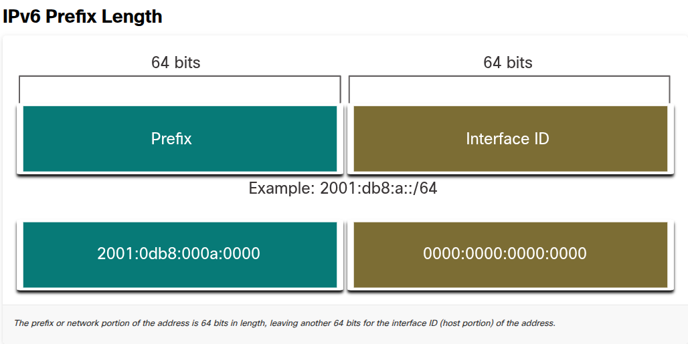
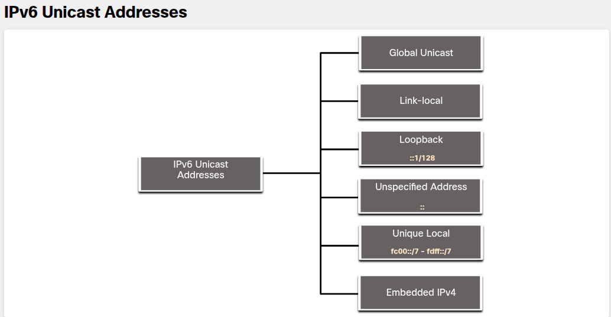
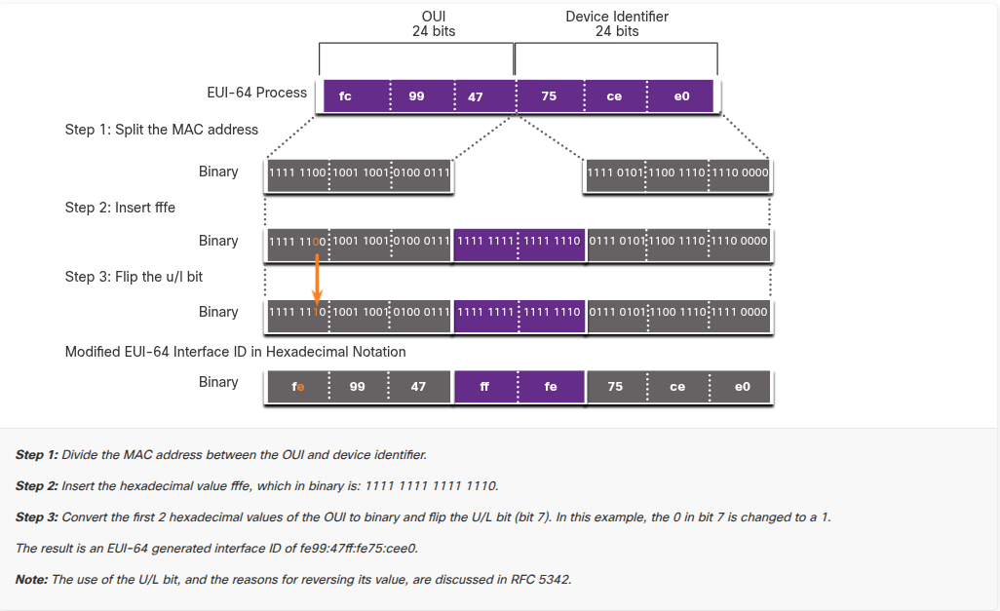

## 12.1. IPv4 Issues

### 12.1.1 Need for IPv6

- IPv4 are 4.3 miliarde adrese teoretic, dar practic mult mai puține utilizabile (clase, subnetting, adrese rezervate). NAT a fost soluția de avarie - practic ai o adresă publică și toată rețeaua ta internă stă în spatele ei cu adrese private (10.x, 192.168.x etc), iar routerul face translation.
	
- Problema e că NAT:	
	- rupe modelul end-to-end (un device nu mai poate fi contactat direct din exterior fără reguli explicite de forwarding)
	- adaugă latență (routerul trebuie să rescrie fiecare pachet)
	- e o bătaie de cap pentru aplicații peer-to-peer (gaming, VoIP, torrente) care au nevoie ca ambele capete să se vadă direct

- IPv6 rezolvă asta prin spațiu de adrese uriaș (128 biți vs 32 biți la IPv4) - practic fiecare device de pe planetă poate avea o grămadă de adrese publice unice, fără NAT.

**IoT ca motor al schimbării**

Cu tot mai multe device-uri conectate (senzori, mașini, electrocasnice), pur și simplu nu mai ajung adresele IPv4. Asta a grăbit adoptarea IPv6 - vezi și statisticile alea din poză (Comcast 65%, Sky 86% adoption).

### 12.1.2 IPv4 and IPv6 Coexistence

1. **Dual Stack** - device-ul/routerul rulează _simultan_ IPv4 și IPv6, complet independent unul de celălalt. E metoda preferată, recomandată de Cisco. Fiecare interfață are și adresă IPv4 și adresă IPv6, iar routerul decide ce stack folosește în funcție de tipul pachetului.

2. **Tunneling** - dacă ai rețele IPv6 izolate care trebuie să comunice printr-o infrastructură IPv4 (sau invers), încapsulezi pachetele IPv6 în interiorul unor pachete IPv4 ca să "călătorească" prin partea de rețea care nu înțelege IPv6. E ca și cum ai băga un plic într-alt plic.

3. **Translation (NAT64)** - traduce efectiv între IPv6 și IPv4, similar cu NAT clasic, pentru cazurile în care un device IPv6-only trebuie să vorbească cu un server care e doar pe IPv4. E cea mai complexă și mai puțin recomandată soluție, folosită doar quando chiar n-ai altă variantă.

---

## 12.2. IPv6 Address Representation

### 12.2.1 IPv6 Addressing Formats

**1. Lungimea adresei**

- IPv6 = 128 biți (față de 32 biți la IPv4)
- Se scrie ca șir de valori hexazecimale


**2. Structura: hextets**

- Fiecare 4 biți = 1 cifră hex (0-9, a-f)
- Adresa are 32 de cifre hex în total (32 × 4 biți = 128 biți)
- Aceste 32 de cifre sunt grupate în **8 blocuri de câte 4 cifre**, separate prin `:`
- Fiecare bloc de 4 cifre hex (= 16 biți) se numește **hextet** (termen neoficial, dar folosit peste tot - analog cu "octet" la IPv4)


**3. Formatul general**

```
x:x:x:x:x:x:x:x
```

unde fiecare `x` = un hextet (4 cifre hex / 16 biți). Total: 8 hextets × 16 biți = 128 biți. ✓


**4. Case-insensitive**

- Poți scrie cu litere mici sau mari (`ab` sau `AB`, `db8` sau `DB8`) - nu contează, IPv6 nu face diferența. De obicei se preferă litere mici ca standard/convenție.


**5. "Preferred format"**

- Asta înseamnă să scrii adresa **completă**, cu toate cele 32 de cifre hex, fără nicio prescurtare
- Exemple din curs:

```
2001:0db8:0000:1111:0000:0000:0000:0200
2001:0db8:0000:00a3:abcd:0000:0000:1234
```

- Important: "preferred" nu înseamnă "cea mai bună/scurtă" variantă de scris - e doar formatul standard, complet, "brut". Abia la 12.2.2 și 12.2.3 (regulile de omitere a zerourilor și `::`) înveți cum să-l scurtezi pentru forma "compressed".

### 12.2.2 Rule 1 - Omit Leading Zeros

Poți elimina zerourile care apar **la începutul** fiecărui hextet (nu în mijloc, nu la final).

Exemplele din curs:

- `01ab` → `1ab` (zero-ul din față dispare)
- `09f0` → `9f0`
- `0a00` → `a00`
- `00ab` → `ab` (aici erau 2 zerouri în față, dispar amândouă)

**Capcana - de ce NU se aplică pe zerouri finale:**

Regula funcționează **doar** pe zerourile de la început, pentru că altfel adresa ar deveni ambiguă. Exemplul din curs e perfect: hextetul `abc` - de unde ai obținut acest `abc`?

- Putea fi `0abc` (zero la început, omis) → valoare = `0abc`
- Sau putea fi `abc0` (zero la final, dacă am permite omiterea) → valoare = `abc0`

Astea sunt **valori complet diferite**! `0abc` ≠ `abc0`. De-aia regula se aplică strict doar pe zerourile din față - acolo nu există ambiguitate, pentru că un hextet complet (4 cifre) cu zerouri lipsă în față se poate reconstitui unic completând cu zerouri până la 4 cifre.

**Regulă mentală simplă:** gândește-te la hextet ca la un număr - `007` (analog) devine `7`, dar `700` rămâne `700`. Nu tai zerouri "utile".

**Exemplu aplicat pe o adresă întreagă:**

```
2001:0db8:0000:1111:0000:0000:0000:0200
```

Aplici regula pe fiecare hextet individual:

```
2001 : db8 : 0 : 1111 : 0 : 0 : 0 : 200
```

### 12.2.3 Rule 2- Double Colon

`::` înlocuiește **un singur șir contiguu** de hextets care sunt **toate zero** (după ce ai aplicat deja Regula 1).

Exemplu din curs:

```
2001:db8:cafe:1:0:0:0:1
```

Ai un șir contiguu de 3 hextets zero (pozițiile 5, 6, 7). Îl comprimi la `::`:

```
2001:db8:cafe:1::1
```

**Cele 3 reguli stricte pe care trebuie să le știi perfect:**

**1. `::` poate apărea o singură dată în toată adresa**

De ce? Pentru că altfel adresa devine ambiguă - nu mai poți ști câte hextete de zero reprezintă fiecare `::`.

Exemplul clasic de eroare din curs:

```
2001:db8::abcd::1234   ❌ GREȘIT
```

Uite ce înseamnă asta - ai putea "despărți" cele 8 hextete în mai multe feluri, toate valide matematic:

- `2001:db8::abcd:0000:0000:1234`
- `2001:db8::abcd:0000:0000:0000:1234`
- `2001:db8:0000:abcd::1234`
- `2001:db8:0000:0000:abcd::1234`

Calculatorul/routerul nu poate ști care variantă ai vrut → adresă invalidă, nu se acceptă.

**2. Dacă sunt mai multe șiruri de zerouri, comprimi cel mai lung**

Exemplu:

```
2001:0:0:1:0:0:0:1
```

Aici ai două șiruri de zerouri:

- poziția 2-3: `0:0` (lungime 2)
- poziția 5-7: `0:0:0` (lungime 3)

Comprimi pe cel lung:

```
2001:0:0:1::1
```

(rămâne primul șir necomprimat ca `0:0`, se aplică doar regula 1 pe el)

**3. Dacă șirurile sunt egale ca lungime, comprimi pe primul**

Exemplu:

```
2001:0:0:1:0:0:1:1
```

Două șiruri, ambele lungime 2 (poziția 2-3 și poziția 5-6). Comprimi pe primul:

```
2001::1:0:0:1:1
```

**De ce contează asta la examen:** Cisco testează exact scenariile astea - dacă comprimi greșit (al doilea șir în loc de primul la lungimi egale, sau șirul mai scurt), răspunsul e considerat greșit chiar dacă "arată bine".

**Recapitulare - cele 2 reguli împreună, pas cu pas:**

Adresă completă:

```
2001:0db8:0000:0000:0000:ab00:0000:1234
```

Pas 1 - Omit leading zeros (pe fiecare hextet):

```
2001:db8:0:0:0:ab00:0:1234
```

Pas 2 - Identifici cel mai lung șir contiguu de zerouri → pozițiile 3,4,5 (`0:0:0`), nu poziția 7 (un singur `0`). Aplici `::`:

```
2001:db8::ab00:0:1234
```

---

## 12.3. IPv6 Address Types

### 12.3.1 Unicast, Multicast, Anycast

3 categorii mari de adrese IPv6:

- **Unicast** - identifică o singură interfață, punct-la-punct (ca la IPv4)
- **Multicast** - un pachet trimis către mai multe destinații simultan (grup de device-uri)
- **Anycast** - o adresă unicast asignată mai multor device-uri; pachetul ajunge la cel mai apropiat device cu adresa respectivă (depășește scopul cursului, doar de reținut că există)

**Important:** IPv6 **nu are broadcast** (spre deosebire de IPv4, unde ai 255.255.255.255 sau x.x.x.255). În loc de asta, folosește o adresă multicast specială "all-nodes" (FF02::1) care face practic același lucru - trimite la toate device-urile din subnet, dar mai eficient.


### 12.3.2 IPv6 Prefix Length

La IPv4 foloseai subnet mask (255.255.255.0) sau slash notation (/24). La IPv6 **există doar slash notation** - nu există echivalent de dotted-decimal.

- Range: /0 până la /128
- **Recomandat pentru LAN-uri: /64**

De ce /64? Pentru că împarte adresa exact în jumătate:

- primii 64 biți = **Prefix** (partea de rețea)
- ultimii 64 biți = **Interface ID** (partea de host)



Reține asta bine, pentru că /64 e folosit aproape peste tot în exemple și e recomandarea standard - în principal fiindcă SLAAC (auto-configurarea) are nevoie de exact 64 biți pentru Interface ID ca să funcționeze corect.


### 12.3.3 Types of IPv6 Unicast Addresses

Aici sunt 6 tipuri, dar contează mai ales primele 2 (celelalte sunt de reținut ca existență):

1. **Global Unicast (GUA)** - echivalentul adresei publice IPv4. Unică global, rutabilă pe internet.
2. **Link-local (LLA)** - obligatorie pe orice interfață IPv6-enabled. Funcționează doar în subnetul local, routerele NU o rutează mai departe.
3. **Loopback** - `::1/128` (echivalent cu 127.0.0.1 la IPv4)
4. **Unspecified** - `::` (adresă "goală", folosită temporar când device-ul încă nu are adresă asignată)
5. **Unique Local** - `fc00::/7` până la `fdff::/7` (similar cu adresele private RFC1918 de la IPv4, dar nu identic)
6. **Embedded IPv4** - adrese IPv6 care conțin o adresă IPv4 în interior (pentru tranziție)



**Diferența cheie de reținut:** la IPv4 aveai o singură adresă per interfață. La IPv6, **fiecare interfață are de obicei minim 2 adrese simultan**: una GUA (pentru internet) și una LLA (obligatorie, pentru comunicare locală).

### 12.3.4 A Note About the Unique Local Address

- Adresele Unique Local (`fc00::/7` - `fdff::/7`) încă nu sunt folosite pe scară largă, așa că modulul se concentrează doar pe GUA și LLA în configurări practice. Sunt similare cu RFC1918 (10.x, 192.168.x) dar diferența e că **nu sunt gândite ca metodă de securitate** - IETF spune clar că nu trebuie folosite pentru "a ascunde" rețeaua, la fel cum nici NAT-ul la IPv4 nu a fost gândit ca soluție de securitate (deși mulți îl folosesc așa).


### 12.3.5 IPv6 GUA

GUA = adresa "publică" pe internet. Cine le alocă? ICANN → RIR-uri → ISP-uri → clienți.

Regulă tehnică importantă: în prezent, GUA-urile active încep doar cu primii 3 biți `001`, adică primul hextet e undeva între `2000` și `3fff` (hex). De-aia aproape toate exemplele de adrese IPv6 pe care le vezi (inclusiv la tine în poze) încep cu `2001:...`.

**Notă bonus:** `2001:db8::/32` e rezervat oficial doar pentru documentație/exemple - nu se va aloca niciodată real. De-aia toate exemplele din curs folosesc `2001:db8:...`


### 12.3.6 IPv6 GUA Structure

O adresă GUA are 3 părți:

```
| Global Routing Prefix | Subnet ID | Interface ID |
|      (ex: /48)        | (16 biți) |  (64 biți)   |
```

- **Global Routing Prefix** - alocat de ISP clientului (de obicei /48)
- **Subnet ID** - folosit de organizație/tine ca să-ți creezi propriile subnete (analog cu "borrowing bits" la IPv4, dar aici e gândit din start pentru asta, nu mai "împrumuți" nimic)
- **Interface ID** - partea de host, recomandat 64 biți

Exemplu clasic cu /48 global prefix:

```
2001:db8:acad::/48
```

- primii 48 biți (3 hextets: `2001:db8:acad`) = Global Routing Prefix, dat de ISP
- dacă folosești /64 total → următorii 16 biți (al 4-lea hextet) = Subnet ID
- restul de 64 biți = Interface ID

**Calcul mental rapid:** cu /48 de la ISP + /64 recomandat total → ai 16 biți liberi pentru Subnet ID = **65,536 subnete posibile**, fiecare cu 18 quintillioane de device-uri posibile. Practic infinit.


### 12.3.7 IPv6 LLA

LLA = adresa obligatorie pe orice interfață cu IPv6 activ, chiar dacă nu are deloc GUA configurată.

Puncte cheie:

- Dacă nu configurezi manual una, **device-ul își generează automat** una singur, fără server DHCP
- Funcționează **doar în subnetul local** - un router nu va ruta niciodată un pachet cu sursă sau destinație LLA mai departe
- Range: `fe80::/10` → primul hextet variază între `fe80` și `febf`
- Se folosește pentru comunicare directă cu alte device-uri din același subnet, inclusiv cu default gateway-ul (routerul)

**De ce contează practic:** când faci `show ipv6 interface` pe un router Cisco, vei vedea întotdeauna o adresă `fe80::...` chiar dacă n-ai configurat nimic altceva - aia e LLA auto-generată.

---

## 12.4. GUA and LLA Static Configuration

## 12.4.1 Static GUA Configuration on a Router

Vestea bună: sintaxa e aproape identică cu IPv4, doar înlocuiești `ip` cu `ipv6`.

IPv4:

```
R1(config-if)# ip address 192.168.1.1 255.255.255.0
```

IPv6:

```
R1(config-if)# ipv6 address 2001:db8:acad:1::1/64
```

**Atenție la sintaxă** - o singură diferență critică: **nu există spațiu** între adresă și prefix length. E `2001:db8:acad:1::1/64`, nu `2001:db8:acad:1::1 /64`. Dacă pui spațiu, IOS-ul dă eroare de sintaxă.

Topologia din exemplu folosește 3 subnete separate, fiecare cu propriul Subnet ID (al 4-lea hextet):

```
2001:db8:acad:1::/64
2001:db8:acad:2::/64
2001:db8:acad:3::/64
```

Observă - Global Routing Prefix e același (`2001:db8:acad`), doar Subnet ID diferă (`1`, `2`, `3`). Exact structura pe care am discutat-o la 12.3.6.

## 12.4.2 Static GUA Configuration on a Windows Host

Pe partea de PC, la fel ca la IPv4, ai 2 opțiuni: automat sau manual. Pentru manual:

- Default gateway = poate fi GUA-ul routerului (`2001:db8:acad:1::1`) **sau** LLA-ul routerului (`fe80::...`)
- Ambele funcționează, dar **best practice e să folosești LLA ca gateway** - motivul practic: dacă schimbi vreodată GUA-ul routerului (de ex. schimbi ISP-ul), LLA rămâne stabilă și nu trebuie să reconfigurezi toate PC-urile din rețea.

Pentru rețele mari, configurarea manuală nu scalează (evident) → de-aia există **SLAAC** și **DHCPv6**, pe care le vei vedea în subcapitolele următoare (12.5, 12.6).

**Notă importantă de reținut:** indiferent dacă folosești SLAAC sau DHCPv6, **default gateway-ul se ia mereu din LLA-ul routerului**, automat - nu din GUA. Asta confirmă de ce LLA e atât de importantă practic, nu doar teoretic.


### 12.4.3 Static Configuration of a Link-Local Unicast Address

Aici e ceva nou important: **poți configura manual și LLA**, nu doar GUA.

De ce ai vrea asta? Ca să faci LLA-ul **ușor de recunoscut** - în loc să lași routerul să genereze automat ceva random-looking gen `fe80::a1b2:c3ff:fe4d:5e6f`, îți setezi tu ceva simplu și memorabil.

**Comanda:**

```
R1(config-if)# ipv6 address fe80::1:1 link-local
```

Observă structura: `ipv6 address [adresă] link-local` - cuvântul cheie `link-local` la final e **obligatoriu** când adresa e în range-ul `fe80` - `febf` (altfel IOS n-ar ști dacă vrei s-o tratezi ca GUA sau ca LLA).

**Exemplul complet pe R1** (din poza ta) - configurezi câte o LLA recognoscibilă pe fiecare interfață:

```
R1(config)# interface gigabitethernet 0/0/0
R1(config-if)# ipv6 address fe80::1:1 link-local
R1(config-if)# exit
R1(config)# interface gigabitethernet 0/0/1
R1(config-if)# ipv6 address fe80::2:1 link-local
R1(config-if)# exit
R1(config)# interface serial 0/1/0
R1(config-if)# ipv6 address fe80::3:1 link-local
R1(config-if)# exit
```

Observă convenția folosită: `fe80::n:1` unde `n` = numărul interfeței (1, 2, 3) - practic un fel de "cod" ca să identifici rapid ce interfață e, doar uitându-te la LLA.


## 12.5. Dynamic Addressing for IPv6 GUAs

### 12.5.1 RS and RA Messages

Ideea de bază: dacă nu vrei să configurezi manual GUA pe fiecare device, routerul poate "anunța" automat informațiile necesare prin ICMPv6.

Cele 2 mesaje:

- **RS (Router Solicitation)** - trimis de host către toate routerele: _"am nevoie de informații de adresare"_
- **RA (Router Advertisement)** - trimis de router, fie periodic (la fiecare 200 secunde) fie ca răspuns direct la un RS: _"uite informațiile"_

**Foarte important - un detaliu care se uită des:** ca routerul să trimită RA-uri, trebuie activat explicit routing-ul IPv6 pe el, cu comanda:

```
R1(config)# ipv6 unicast-routing
```

Fără comanda asta, routerul nu se comportă ca router IPv6 și SLAAC/RA nu funcționează deloc - reține-o, e testată des la examen.

Ce conține un mesaj RA:

- **Network prefix + prefix length** (partea de rețea)
- **Default gateway address** - mereu LLA-ul routerului (sursa mesajului RA), niciodată GUA
- **DNS addresses și domain name**

**Cele 3 metode pe care routerul le poate "sugera" prin RA** (asta e practic harta întregului subcapitol):

| Metodă                      | Ce primești din RA                   | Ce mai trebuie                             |
| --------------------------- | ------------------------------------ | ------------------------------------------ |
| 1. SLAAC                    | tot (prefix, prefix length, gateway) | nimic                                      |
| 2. SLAAC + Stateless DHCPv6 | prefix + gateway                     | DNS/domain de la un server DHCPv6          |
| 3. Stateful DHCPv6          | doar gateway                         | GUA + DNS + tot restul de la server DHCPv6 |

### 12.5.2 Method 1 - SLAAC

Complet fără DHCPv6. Device-ul primește prin RA doar **prefixul**, iar restul (Interface ID) și-l generează singur. E "stateless" - nu există niciun server central care ține evidența cine ce adresă are.

Adresa finală = **Prefix (din RA) + Interface ID (generat local, prin EUI-64 sau random)**


### 12.5.3 Method 2 - SLAAC and Stateless DHCPv6

Combinație: device-ul își creează singur GUA (ca la Metoda 1), dar mai cere separat de la un server DHCPv6 informații suplimentare - **doar DNS și domain name, nu adrese IP**.

**Notă critică:** un server DHCPv6 "stateless" NU alocă deloc adrese IP - doar oferă informații extra (DNS/domain). Nu confunda cu Metoda 3.


### **12.5.4 - Metoda 3: Stateful DHCPv6**

Aici seamănă exact cu DHCP-ul clasic de la IPv4: un server central alocă și ține evidența (de-aia "stateful") a adreselor asignate.

Fluxul complet (din poza ta):

1. PC trimite RS: _"am nevoie de info de adresare"_
2. Routerul trimite RA cu Metoda 3: _"eu sunt gateway-ul, dar pentru adresă du-te la un server DHCPv6"_
3. PC trimite DHCPv6 Solicit către server: _"am gateway-ul, dar am nevoie de adresă IPv6 și restul info"_

**Regulă universală, valabilă la toate 3 metodele:** default gateway-ul vine **întotdeauna** din mesajul RA (deci din LLA-ul routerului), **niciodată** de la un server DHCPv6, indiferent dacă folosești stateless sau stateful. Serverul DHCPv6 nu oferă niciodată gateway.


### **12.5.5 - 12.5.6 - EUI-64 vs Random (partea tehnică cea mai interesantă)**

Când folosești SLAAC (Metoda 1 sau 2), device-ul trebuie să-și construiască singur Interface ID-ul (64 biți). Există 2 metode:

**EUI-64** - folosește MAC address-ul (48 biți) și-l transformă în 64 biți:

Un MAC are 2 părți:

- **OUI** (24 biți) - cod de producător, alocat de IEEE
- **Device Identifier** (24 biți) - unic per device în cadrul acelui OUI

Procesul EUI-64, pas cu pas (exemplu cu MAC `fc99:4775:cee0`):

1. **Iei OUI-ul (24 biți)** - `fc99:47`
2. **Inversezi bitul 7 (U/L bit)** din OUI - dacă e 0 devine 1, dacă e 1 devine 0
3. **Inserezi `fffe`** (16 biți) exact în mijloc, între OUI și Device Identifier
4. **Adaugi Device Identifier-ul** (24 biți) - `75:ce:e0`

Rezultat: `fc:99:47` (cu bitul 7 inversat) + `ff:fe` + `75:ce:e0` = un Interface ID de 64 biți.

**Cum recunoști o adresă generată prin EUI-64:** are `fffe` chiar la mijlocul Interface ID-ului. Dacă vezi asta într-o adresă IPv6, știi instant că a fost generată automat din MAC.

**Avantaj EUI-64:** poți urmări adresa IPv6 direct la MAC-ul fizic al device-ului → util pentru admin, dar exact asta a creat **probleme de privacy** (oricine îți vede pachetele poate identifica fizic device-ul tău).




### **12.5.7 - Interface ID generat random**

Din cauza problemei de privacy de mai sus, sistemele moderne au trecut la generare **aleatorie** a Interface ID-ului:

- **Windows XP și mai vechi** → foloseau EUI-64
- **Windows Vista și mai nou** (deci practic tot ce folosești azi) → generează Interface ID **random**, nu mai bazat pe MAC

Diferența practică: dacă rulezi `ipconfig` pe Windows modern și vezi Interface ID-ul, **nu** va conține `fffe` la mijloc și nu va avea legătură cu MAC-ul - e complet aleatoriu, tocmai pentru anonimitate.


---

## 12.6. Dynamic Addressing for IPv6 LLAs

### **12.6.1 - Dynamic LLAs**

Recapitulare + confirmare: la fel ca GUA, și LLA se poate genera automat, folosind:

- prefixul fix `fe80::/10`
- Interface ID prin EUI-64 sau random (aceleași metode discutate la 12.5)

Nimic nou aici, doar confirmă că același proces de generare a Interface ID-ului (EUI-64/random) se aplică și la LLA, nu doar la GUA.


### **12.6.2 - Dynamic LLAs on Windows**

Windows folosește **aceeași metodă** atât pentru GUA cât și pentru LLA - dacă e Windows Vista+ folosește random pentru amândouă, dacă e Windows XP folosește EUI-64 pentru amândouă. Deci nu ai o metodă pentru GUA și alta pentru LLA - e consistent.


### **12.6.3 - Dynamic LLAs on Cisco Routers (important!)**

Aici e o diferență cheie față de Windows, foarte testată la examen:

**Cisco IOS routers folosesc întotdeauna EUI-64** pentru a genera LLA dinamic (spre deosebire de Windows modern care folosește random). Nu există opțiune "random" pe router pentru LLA.

Detaliu fin: LLA se generează automat **de îndată ce asignezi o GUA pe interfață** - nu ai nevoie de o comandă separată.

Pentru interfețele seriale (care n-au MAC address propriu, fiind WAN, nu Ethernet), routerul **împrumută MAC-ul unei interfețe Ethernet** ca să genereze LLA prin EUI-64. De-aia poți vedea aceeași "bază" de LLA (ex: `fe80::7279:b3ff:fe92:3640`) atât pe GigabitEthernet 0/0/0 cât și pe Serial 0/1/0, ca în poza ta - ambele au folosit MAC-ul interfeței Gi0/0/0.

**Dezavantaj clar:** LLA generat prin EUI-64 e lung și greu de reținut/recunoscut (`fe80::7279:b3ff:fe92:3640` vs ceva simplu ca `fe80::1:1`). De-aia, cum am discutat la 12.4.3, practica comună e să **configurezi manual** LLA-uri simple pe routere - exact pentru identificare ușoară.


### **12.6.4 - Verify IPv6 Address Configuration**

3 comenzi esențiale de verificare, toate foarte testate:

**1. `show ipv6 interface brief`**  
Arată adresele IPv6 pe fiecare interfață + starea Layer 1/Layer 2 (up/up), la fel ca `show ip interface brief` la IPv4.

**2. `show ipv6 route`**  
Arată tabela de rutare IPv6 (doar rețele IPv6, nu și IPv4 - separat complet de `show ip route`).

Coduri importante:

- **`C`** = Connected (rețea conectată direct) - apare când interfața are GUA configurată și e up/up
- **`L`** = Local route - adresa **exactă** a interfeței (nu LLA!), cu prefix **/128** (o singură adresă, nu o rețea întreagă)

**Foarte important de reținut:** LLA-urile **nu apar niciodată** în tabela de rutare, pentru că nu sunt rutabile dincolo de subnetul local - routerul nu are nevoie să știe cum să le rutează, fiindcă nu le rutează niciodată.

Exemplu din poza ta:

```
C   2001:DB8:ACAD:1::/64
       via GigabitEthernet0/0/0, directly connected
L   2001:DB8:ACAD:1::1/128
```

Primul rând = rețeaua întreagă (connected), al doilea = adresa exactă a interfeței routerului (local, /128).

**3. `ping`**  
Identic sintactic cu IPv4, doar cu adresă IPv6. Singura diferență practică: dacă faci ping către o **LLA** de pe router, IOS-ul te întreabă **pe ce interfață de ieșire** să trimită pachetul - pentru că aceeași LLA de destinație ar putea teoretic exista pe mai multe link-uri diferite ale routerului (fiindcă LLA-urile sunt unice doar per-link, nu global), deci routerul nu poate ghici singur.

---

### **Recapitulare rapidă module 12.6:**

- Cisco routere = mereu EUI-64 pentru LLA dinamică (Windows modern = random)
- LLA nu apare NICIODATĂ în `show ipv6 route`
- `C` = rețea connected, `L` = adresa exactă /128 a interfeței
- Ping către LLA de pe router → cere interfața de ieșire

---


## 12.7. IPv6 Multicast Addresses

### **12.7.1 - Assigned IPv6 Multicast Addresses**

Recapitulare rapidă: multicast = un pachet trimis către un grup de destinații simultan. Toate adresele multicast IPv6 încep cu prefixul `ff00::/8` - deci dacă vezi o adresă care începe cu `ff`, știi automat că e multicast.

**Detaliu important, ușor de uitat:** o adresă multicast poate fi **doar destinație**, niciodată sursă. Un device nu trimite niciodată un pachet _de la_ o adresă multicast - doar _către_ ea.

2 tipuri:

- **Well-known multicast addresses** (predefinite, fixe)
- **Solicited-node multicast addresses** (generate automat per-device)


### **12.7.2 - Well-Known IPv6 Multicast Addresses**

Cele 2 adrese pe care trebuie neapărat să le știi pe de rost (apar constant în output-uri și la examen):

**`ff02::1` - All-nodes multicast group**

- Grup din care fac parte **toate** device-urile IPv6-enabled, automat
- Practic înlocuiește broadcast-ul de la IPv4 - dacă trimiți ceva la `ff02::1`, ajunge la toate device-urile din subnet
- Exemplu concret pe care deja l-ai văzut: routerul trimite mesajele RA exact către `ff02::1`

**`ff02::2` - All-routers multicast group**

- Grup din care fac parte **doar routerele** IPv6
- Un router devine membru automat **doar** când activezi `ipv6 unicast-routing` pe el (exact comanda pe care am discutat-o la 12.5.1!)
- Aici e conexiunea logică: RS-urile (Router Solicitation) sunt trimise de host-uri către `ff02::2`, ca să ajungă doar la routere, nu la toate device-urile

**Legătura cu ce ai învățat deja:** acum RS/RA capătă sens complet:

- Host → RS → trimis către `ff02::2` (all-routers)
- Router → RA → trimis către `ff02::1` (all-nodes) sau direct către host-ul care a cerut


### **12.7.3 - Solicited-Node Multicast Addresses**

Asta e partea mai tehnică. Ideea: fiecare device IPv6 are automat o adresă multicast "solicited-node" proprie, generată din propria adresă unicast.

**De ce există:** avantajul e la nivel de eficiență hardware. Adresa solicited-node se mapează pe o **adresă MAC multicast specială** la nivel Ethernet. Asta permite plăcii de rețea (NIC) să filtreze cadrul **direct la nivel hardware** (Layer 2), uitându-se doar la MAC destinație - fără să trebuiască să trimită fiecare pachet mai sus, la procesul IPv6 (Layer 3), doar ca să verifice dacă el e destinatarul.

Practic: e o optimizare de performanță - device-ul "aruncă" rapid pachetele care nu-l privesc, chiar înainte să ajungă la procesarea IPv6, economisind resurse.

**Cum se formează** (deși cursul tău nu intră în formula exactă în poza asta, ține minte conceptul): se ia ultimii 24 biți din adresa unicast (GUA sau LLA) a device-ului și se combină cu un prefix fix `ff02::1:ff00:0/104`. Rezultatul e o adresă solicited-node unică (aproape întotdeauna) pentru fiecare device.

**Folosire practică:** e folosită mai ales de protocolul **NDP (Neighbor Discovery Protocol)** - echivalentul ARP-ului de la IPv4, dar pentru IPv6 - ca să afli MAC address-ul unui vecin fără să trimiți broadcast la tot subnetul (cum face ARP), ci doar la grupul restrâns solicited-node.

---

### **Recapitulare module 12.7:**

- `ff00::/8` = tot ce e multicast
- `ff02::1` = all-nodes (toate device-urile) - folosit pentru RA
- `ff02::2` = all-routers (doar routerele, activ prin `ipv6 unicast-routing`) - folosit pentru RS
- Solicited-node = adresă unică per device, optimizare hardware pentru NDP (echivalent ARP la IPv6)
- Multicast = doar destinație, niciodată sursă


---

## 12.8. Subnet an IPv6 Network

### **12.8.1 - Subnet Using the Subnet ID**

Marea diferență față de IPv4: la IPv4, subnetarea era un "gând ulterior" - trebuia să **împrumuți biți din partea de host** ca să faci subnete, ceea ce complica calculele (măști, bloc de biți, conversii binare etc).

La IPv6, **subnetarea a fost gândită din start** - există un câmp dedicat, **Subnet ID**, exact între Global Routing Prefix și Interface ID. Nu împrumuți nimic, doar folosești câmpul care există deja.

Cu structura tipică /48 (Global Routing Prefix) + /64 total:

```
48 biți (Global Routing Prefix) + 16 biți (Subnet ID) + 64 biți (Interface ID) = 128 biți
```

Ce-ți dă un Subnet ID de 16 biți:

- **65,536 subnete posibile** (2^16)
- fiecare cu **18 quintilioane** de adrese host posibile (2^64)

**De reținut ca frază cheie de examen:** "Address conservation is not an issue" - la IPv6 nu-ți mai pasă să economisești adrese, ai atât de mult spațiu încât poți fi generos cu alocarea, spre deosebire de IPv4 unde fiecare bit conta.

**Cel mai important avantaj practic:** nu mai ai nevoie de conversie binară! La IPv4 trebuia să calculezi în binar ca să afli următorul subnet disponibil. La IPv6, **numeri pur și simplu în hexazecimal** - literalmente incrementezi Subnet ID-ul cu 1 (în hex) pentru fiecare subnet nou.


### **12.8.2 - IPv6 Subnetting Example**

Exemplu concret: organizația primește `2001:db8:acad::/48` de la ISP, cu 16 biți pentru Subnet ID → poate crea 65,536 subnete de /64.

Practic, tot ce faci e să numeri al 4-lea hextet:

```
2001:db8:acad:0::/64   (subnet 0)
2001:db8:acad:1::/64   (subnet 1)
2001:db8:acad:2::/64   (subnet 2)
2001:db8:acad:3::/64   (subnet 3)
...
2001:db8:acad:ffff::/64   (ultimul subnet posibil)
```

**Observă:** Global Routing Prefix (`2001:db8:acad`) rămâne mereu fix - doar Subnet ID-ul (al 4-lea hextet) se incrementează, exact ca la topologia pe care ai configurat-o deja la 12.4 (`acad:1`, `acad:2`, `acad:3`).


### **12.8.3 - IPv6 Subnet Allocation**

Aici e o diferență practică importantă față de IPv4, la nivel de design:

Când ai o topologie cu mai multe LAN-uri **plus** un link serial între 2 routere, la IPv4 probabil ai folosi o mască mai mică pe link-ul serial (ex: /30, doar 2 adrese utilizabile), ca să nu risipești adrese, pentru că acolo ai nevoie doar de 2 host-uri (câte un capăt la fiecare router).

**La IPv6, nu mai faci asta.** Chiar dacă link-ul serial are nevoie doar de 2 adrese, **folosești tot /64**, la fel ca la LAN-uri. Da, tehnic "risipești" un număr enorm de adrese neutilizate pe link-ul serial - dar cum am zis mai sus, conservarea adreselor nu mai e o grijă la IPv6. Simplitatea și consistența (toate subnetele = /64) sunt mai importante decât economisirea spațiului.


### **12.8.4 - Router Configured with IPv6 Subnets**

Practic aplicarea a tot ce ai învățat - fiecare interfață a routerului primește o adresă dintr-un subnet diferit, toate /64:

```
R1(config)# interface gigabitethernet 0/0/0
R1(config-if)# ipv6 address 2001:db8:acad:1::1/64
R1(config-if)# no shutdown
R1(config-if)# exit
R1(config)# interface gigabitethernet 0/0/1
R1(config-if)# ipv6 address 2001:db8:acad:2::1/64
R1(config-if)# no shutdown
R1(config-if)# exit
R1(config)# interface serial 0/1/0
R1(config-if)# ipv6 address 2001:db8:acad:3::1/64
R1(config-if)# no shutdown
```

Observă: **`3` interfețe, `3` subnete diferite**, toate cu prefix /64, doar Subnet ID diferă (1, 2, 3). Și nu uita `no shutdown` - la fel ca la IPv4, interfața rămâne administrativ down până o activezi explicit.

---

**Recapitulare subnetting IPv6 - de reținut esențial:**

1. Subnetarea e nativă, nu "împrumuți" biți ca la IPv4
2. Numeri **în hex**, nu binar - mult mai ușor
3. Toate subnetele, inclusiv link-urile seriale, rămân **/64** - nu economisești adrese
4. Doar Subnet ID-ul (de obicei al 4-lea hextet, cu /48 prefix) se schimbă între subnete