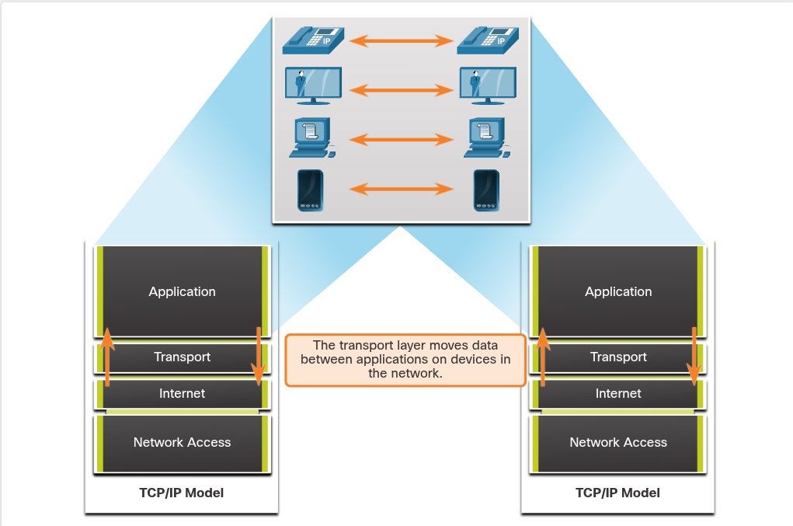
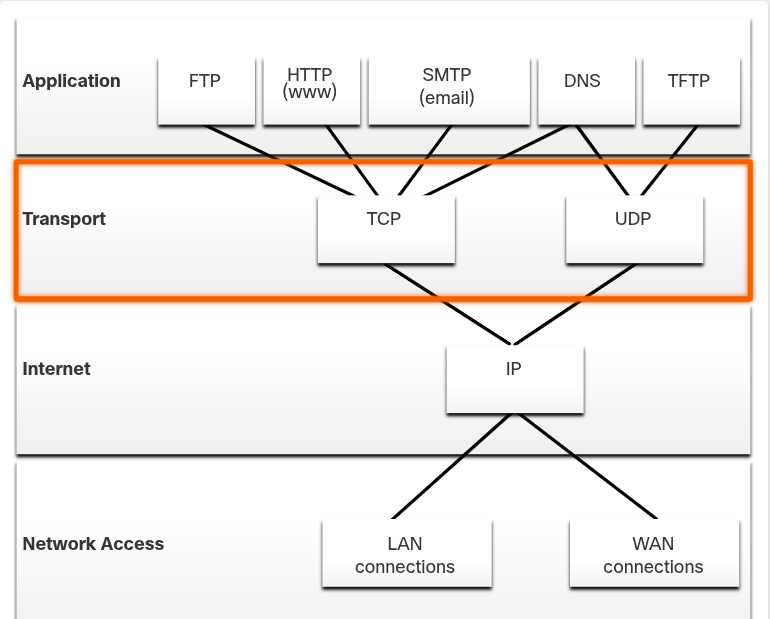
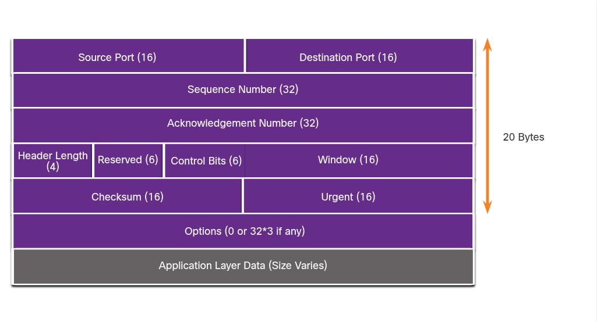
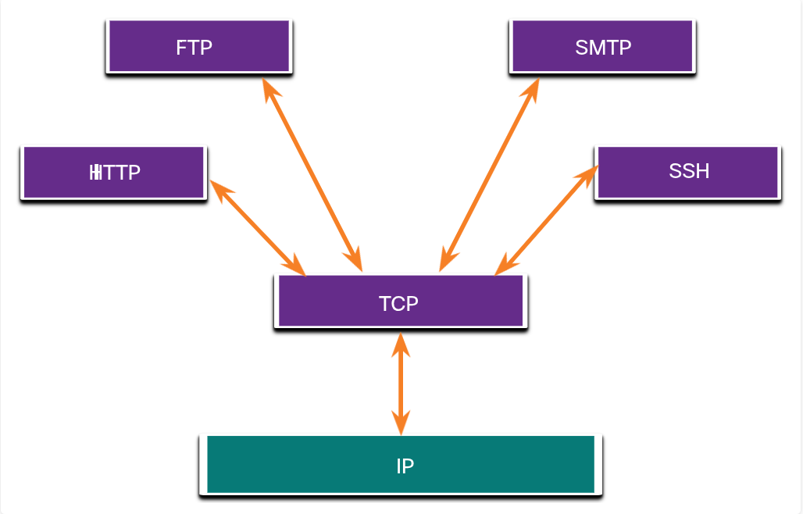
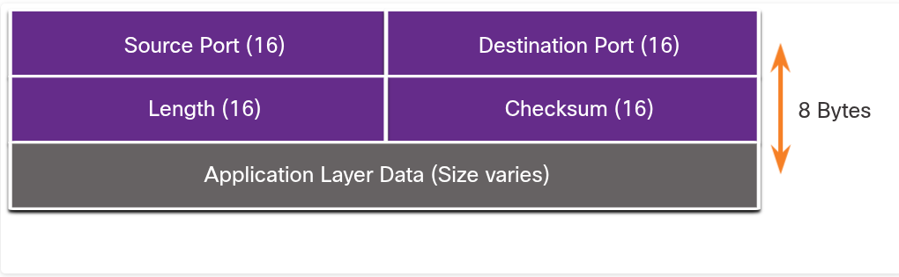
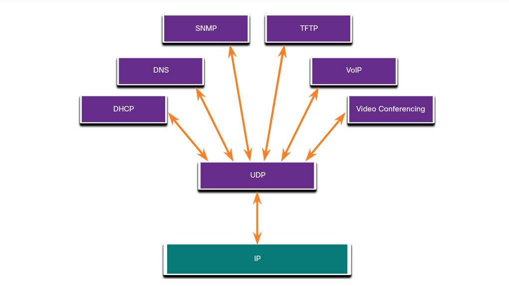
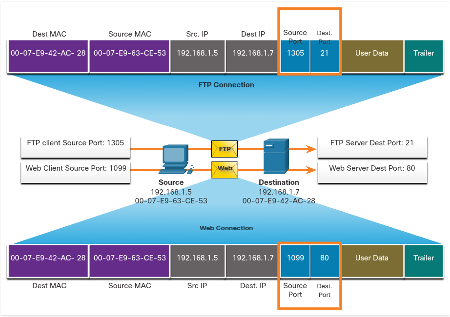
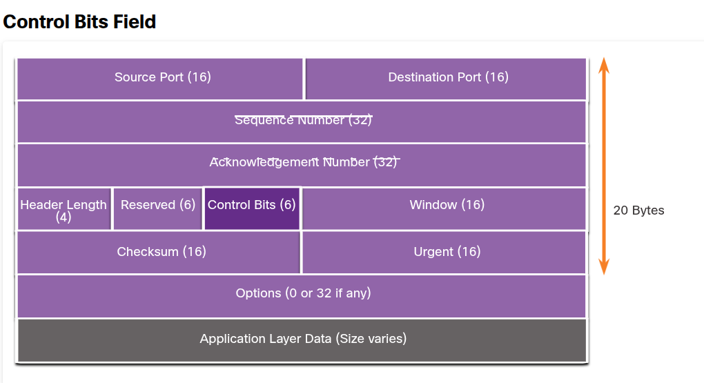
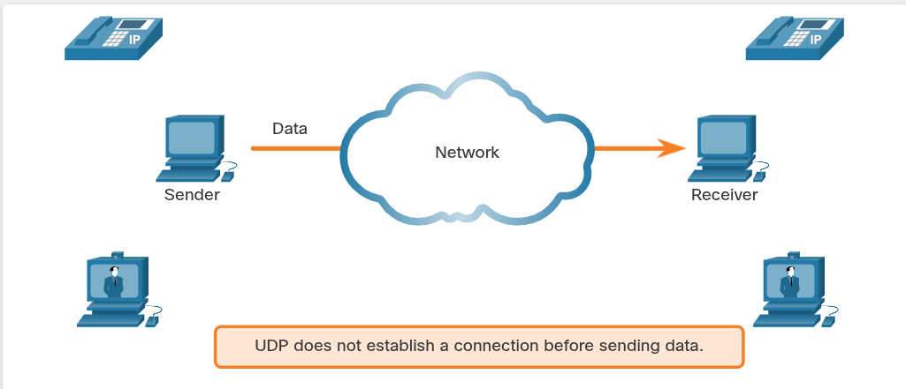

## 14.1. Transportation of Data

### 14.1.1 Role of the Transport Layer

- Layerul de transport face legătura între **application layer** și layerele inferioare responsabile de transmisia în rețea.
- Rolul lui: mută datele **între aplicații** de pe device-uri diferite din rețea.
- **Nu are nicio cunoștință** despre: tipul host-ului destinație, tipul de media pe care circulă datele, calea (path) parcursă, congestia de pe link sau mărimea rețelei.
- Include două protocoale: **TCP** și **UDP**.

### 14.1.2 Transport Layer Responsibilities

Cele 5 responsabilități (tab-urile din capturzałe tale — reține denumirile exact așa cum apar, pică des la grilă):

#### 1. Tracking Individual Conversations

- La transport layer, fiecare set de date care circulă între o aplicație sursă și una destinație se numește **conversație** și e urmărită **separat**.
- E responsabilitatea transport layer-ului să mențină și să urmărească aceste conversații multiple simultan.
- Un host poate avea **mai multe aplicații** care comunică simultan prin rețea (ex: pagini web multiple).
- Majoritatea rețelelor au o limitare a cantității de date ce poate încăpea într-un singur pachet → de aceea datele trebuie **împărțite în bucăți gestionabile**.

#### 2. Segmenting Data and Reassembling Segments

- E responsabilitatea transport layer-ului să împartă datele aplicației în **blocuri de mărime potrivită**.
- În funcție de protocolul de transport folosit, aceste blocuri se numesc **segmente** (TCP) sau **datagrame** (UDP).
- Transport layer-ul folosește **blocuri diferite pentru fiecare conversație** (ex: Multiple Web Pages, Instant Messaging, Online Video Chatting — toate au blocurile lor separate).
- Scopul: blocuri mai mici → mai ușor de gestionat și transportat.

#### 3. Add Header Information

- Protocolul de transport **adaugă informații de header** la fiecare bloc de date — date binare organizate în mai multe câmpuri.
- Valorile din aceste câmpuri permit protocoalelor de transport să realizeze funcții diferite în gestionarea comunicării.
- Ex: header-ul este folosit de host-ul destinatar pentru a **reasambla blocurile** într-un flux de date complet, pentru aplicația din application layer.
- Transport layer-ul se asigură că, chiar dacă rulează **mai multe aplicații pe același device**, fiecare aplicație primește **datele corecte**.

#### 4. Identifying the Applications

- Transport layer-ul trebuie să poată **separa și gestiona** comunicații multiple cu cerințe de transport diferite.
- Pentru a trimite fluxurile de date către aplicațiile corecte, transport layer-ul identifică aplicația țintă folosind un identificator numit **port number**.
- Fiecare proces software care are nevoie de acces la rețea primește un **port number unic** pentru acel host.

#### 5. Conversation Multiplexing

- Trimiterea unui singur tip de date (ex: un video streaming) ca **un singur flux complet** de comunicare ar putea consuma tot bandwidth-ul disponibil.
- Asta ar **împiedica alte conversații** să aibă loc simultan, și ar face **error recovery și retransmisia** datelor deteriorate mai dificilă.
- Transport layer-ul folosește **segmentare și multiplexare** pentru a permite ca diferite conversații de comunicare să fie **interleaved** (intercalate) pe aceeași rețea.
- Se poate face **error checking** pe datele din segment, pentru a determina dacă segmentul a fost alterat în timpul transmisiei.

### 14.1.3 Transport Layer Protocols

- **IP** se ocupă doar de structura, adresarea și rutarea pachetelor — **nu specifică** cum are loc livrarea/transportul.
- Protocoalele de transport specifică **cum se transferă mesajele** între host-uri și gestionează cerințele de fiabilitate ale unei conversații.
- Diferite aplicații au diferite cerințe de fiabilitate → de aceea TCP/IP oferă **două** protocoale de transport (TCP și UDP).

### 14.1.4 TCP (Transmission Control Protocol)

- TCP e **reliable, full-featured** — asigură că **toate** datele ajung la destinație.
- **Notă cheie:** TCP împarte datele în **segmente**.
- Analogie: ca trimiterea de colete urmărite (tracked) de la sursă la destinație.
- TCP oferă reliability și flow control prin aceste operații de bază:
    - Numerotează și urmărește segmentele trimise către un host/aplicație specific(ă)
    - Confirmă (acknowledge) datele primite
    - Retransmite datele neconfirmate după un anumit timp
    - Secvențiază datele care ar putea ajunge în ordine greșită
    - Trimite datele la o rată eficientă, acceptabilă pentru receiver
- Pentru a menține starea conversației, TCP **stabilește o conexiune** între sender și receiver → de aceea TCP e **connection-oriented**.

### 14.1.5 UDP (User Datagram Protocol)

- UDP e mai simplu decât TCP — **nu oferă** reliability și flow control → are **mai puține câmpuri** în header.
- Pentru că nu gestionează reliability/flow control, datagramele UDP sunt procesate **mai rapid** decât segmentele TCP.
- **Notă cheie:** UDP împarte datele în **datagrame** (numite tot "segmente" uneori).
- UDP e **connectionless** (nu necesită conexiune stabilită) și **stateless** (nu urmărește informația trimisă/primită între client-server).
- UDP = **best-effort delivery protocol** — nu există acknowledgment că datele au ajuns la destinație.
- Analogie: ca trimiterea unei scrisori normale, neînregistrate — sender-ul nu știe dacă receiver-ul e disponibil, iar poșta nu urmărește/nu informează dacă scrisoarea nu ajunge.

### 14.1.6 The Right Transport Layer Protocol for the Right Application

- **UDP** e preferat când: pierderea unor date e tolerabilă, dar **întârzierile nu sunt acceptabile** → cere overhead mai mic pe rețea.
    - Exemplu: **VoIP** — acknowledgment-urile și retransmisia ar încetini livrarea și ar face conversația inacceptabilă.
    - Aplicații **request-and-reply** cu date minime, unde retransmisia se poate face rapid → ex: **DNS** (dacă clientul nu primește răspuns într-un timp predeterminat, trimite din nou cererea).
    - Video live: dacă 1-2 segmente nu ajung → distorsiune momentană, posibil nesesizabilă. Dacă s-ar aștepta retransmisii, stream-ul ar fi întârziat/degradat → de asta se preferă "best media possible" în locul reliability.
- **TCP** e folosit când e important ca **toate** datele să ajungă și să fie procesate în ordinea corectă.
    - Exemple: **baze de date, browsere web, clienți de email** — datele trimise trebuie să ajungă complete și needitate; date lipsă pot corupe comunicarea.
    - Exemplu: accesarea informațiilor bancare — trebuie garantat că toată informația e trimisă și primită corect.
- Developerii de aplicații aleg protocolul potrivit în funcție de cerințe. Video-ul poate fi trimis fie pe TCP, fie pe UDP. Aplicațiile de streaming audio/video stocat folosesc de regulă **TCP** (pentru buffering, bandwidth probing, congestion control).

### Continuare 14.1.6 (imaginea 8)

- Video/voce **real-time** folosesc de obicei UDP, dar pot folosi și TCP, sau ambele — ex: o aplicație de videoconferință poate folosi UDP by default, dar din cauză că multe firewall-uri blochează UDP, poate trimite și peste TCP.
- Aplicațiile de streaming audio/video **stocat** folosesc TCP — ex: dacă rețeaua nu mai suportă bandwidth-ul necesar, apare mesajul **"buffering..."** cât timp TCP reface stream-ul; playback-ul reia când segmentele sunt în ordine și bandwidth-ul minim e restabilit.

#### Tabel rezumativ UDP vs TCP (de reținut sigur, pică des)

| **Categorie**          | **UDP**                                                                                                                              | **TCP**                                                                                                                |
| ---------------------- | ------------------------------------------------------------------------------------------------------------------------------------ | ---------------------------------------------------------------------------------------------------------------------- |
| **Exemple aplicații**  | VoIP (IP Telephony), DNS (Domain Name Resolution)                                                                                    | SMTP/IMAP (Email), HTTP/HTTPS (World Wide Web)                                                                         |
| **Proprietăți cerute** | - Fast - Low overhead - Nu necesită acknowledgements - Nu retransmite date pierdute - Livrează datele pe măsură ce ajung | - Reliable - Confirmă datele (acknowledges) - Retransmite date pierdute - Livrează date în ordine secvențială |

---

## 14.2. TCP Overview

### 14.2.1 TCP Features

Pe lângă funcțiile de bază de segmentare și reasamblare a datelor, TCP oferă și aceste 4 servicii:

- **Establishes a Session** — TCP e connection-oriented; negociază și stabilește o conexiune **permanentă** (sesiune) între dispozitivul sursă și cel destinație **înainte** de a trimite orice trafic. Prin stabilirea sesiunii, dispozitivele negociază cantitatea de trafic ce poate fi trimisă la un moment dat, iar comunicarea dintre cele două poate fi gestionată îndeaproape.

- **Ensures Reliable Delivery** — un segment poate deveni corupt sau se poate pierde complet în timpul transmisiei. TCP se asigură că **fiecare segment** trimis de sursă ajunge la destinație.

- **Provides Same-Order Delivery** — rețelele pot oferi rute multiple cu rate de transmisie diferite, așa că datele pot ajunge în ordine greșită. Prin numerotarea și secvențierea segmentelor, TCP se asigură că segmentele sunt reasamblate în **ordinea corectă**.

- **Supports Flow Control** — host-urile au resurse limitate (memorie, putere de procesare). Când TCP observă că aceste resurse sunt suprasolicitate, poate cere aplicației sursă să **reducă rata** fluxului de date, reglând cantitatea de date trimisă. Asta previne necesitatea retransmisiei atunci când resursele host-ului destinatar sunt copleșite.

_Pentru mai multe detalii: RFC 793._

### 14.2.2 TCP Header

- TCP este un protocol **stateful** — ține evidența stării sesiunii de comunicare. Pentru asta, TCP înregistrează ce informație a trimis și ce informație a fost confirmată (acknowledged).

- Sesiunea stateful **începe** cu stabilirea sesiunii și **se termină** cu terminarea sesiunii.

- Un segment TCP adaugă **20 bytes (160 bits)** overhead când încapsulează datele application layer.

### Structura Header-ului TCP (20 bytes)

| Câmp                   | Dimensiune                    |
| ---------------------- | ----------------------------- |
| Source Port            | 16 biți                       |
| Destination Port       | 16 biți                       |
| Sequence Number        | 32 biți                       |
| Acknowledgement Number | 32 biți                       |
| Header Length          | 4 biți                        |
| Reserved               | 6 biți                        |
| Control Bits           | 6 biți                        |
| Window                 | 16 biți                       |
| Checksum               | 16 biți                       |
| Urgent                 | 16 biți                       |
| Options                | 0 sau 32*3 biți (dacă există) |
| Application Layer Data | dimensiune variabilă          |

### 14.2.3 TCP Header Fields — cele 10 câmpuri

| Câmp                      | Descriere                                                                                               |
| ------------------------- | ------------------------------------------------------------------------------------------------------- |
| **Source Port**           | câmp de **16 biți**, identifică aplicația sursă prin număr de port                                      |
| **Destination Port**      | câmp de **16 biți**, identifică aplicația destinație prin număr de port                                 |
| **Sequence Number**       | câmp de **32 biți**, folosit pentru scopuri de **reasamblare a datelor**                                |
| **Acknowledgment Number** | câmp de **32 biți**, indică faptul că datele au fost primite și **următorul byte așteptat** de la sursă |
| **Header Length**         | câmp de **4 biți**, cunoscut ca **"data offset"**, indică lungimea header-ului segmentului TCP          |
| **Reserved**              | câmp de **6 biți**, rezervat pentru uz viitor                                                           |
| **Control bits**          | câmp de **6 biți**, include coduri de biți (**flags**) care indică scopul și funcția segmentului TCP    |
| **Window Size**           | câmp de **16 biți**, indică numărul de bytes ce poate fi acceptat la un moment dat                      |
| **Checksum**              | câmp de **16 biți**, folosit pentru **error checking** al header-ului segmentului și al datelor         |
| **Urgent**                | câmp de **16 biți**, indică dacă datele conținute sunt **urgente**                                      |

### 14.2.4 Applications that use TCP

- TCP e un exemplu bun despre cum diferite layere din suita TCP/IP au roluri specifice.
- TCP se ocupă de **toate** sarcinile legate de: împărțirea fluxului de date în segmente, asigurarea fiabilității, controlul fluxului de date, și reordonarea segmentelor.
- TCP eliberează aplicația de gestionarea acestor sarcini — aplicațiile trimit pur și simplu fluxul de date către transport layer și folosesc serviciile TCP.
- Aplicații care folosesc TCP (din diagramă): **FTP, HTTP, SMTP, SSH**.
- Toate aceste aplicații comunică cu **TCP**, care la rândul lui comunică cu **IP**.

---

## 14.3. UDP Overview

### 14.3.1 UDP Features

- UDP este un protocol **best-effort**, lightweight, care oferă aceeași segmentare și reasamblare a datelor ca TCP, dar **fără** reliability și flow control.
- UDP e atât de simplu încât e de obicei descris prin ceea ce **nu** face, comparativ cu TCP.

#### Cele 4 caracteristici UDP:

- **Data is reconstructed in the order that it is received** (datele sunt reconstruite în ordinea în care sunt primite — nu sunt reordonate)

- **Any segments that are lost are not resent** (segmentele pierdute nu sunt retrimise)

- **There is no session establishment** (nu se stabilește nicio sesiune)

- **The sending is not informed about resource availability** (sender-ul nu e informat despre disponibilitatea resurselor)

### 14.3.2 UDP Header

- UDP e un protocol **stateless** — nici clientul, nici serverul nu urmăresc starea sesiunii de comunicare.
- Dacă e nevoie de reliability când se folosește UDP, aceasta trebuie gestionată de **aplicație**.
- Una dintre cele mai importante cerințe pentru livrarea video/voce live este ca datele să continue să curgă **rapid**. Aplicațiile de video și voce live pot tolera pierderi minore de date fără efect notabil → sunt perfect potrivite pentru UDP.
- Blocurile de comunicare în UDP se numesc **datagrame** sau **segmente**. Sunt trimise ca **best effort** de către transport layer.
- Header-ul UDP e mult mai simplu decât cel TCP — are doar **4 câmpuri** și necesită **8 bytes (64 biți)**.

#### Structura Header-ului UDP (8 bytes)

| Câmp                   | Dimensiune           |
| ---------------------- | -------------------- |
| Source Port            | 16 biți              |
| Destination Port       | 16 biți              |
| Length                 | 16 biți              |
| Checksum               | 16 biți              |
| Application Layer Data | dimensiune variabilă |

### 14.3.3 UDP Header Fields - cele 4 câmpuri (**important pentru descrieri!**)

| Câmp                 | Descriere                                                                                  |
| -------------------- | ------------------------------------------------------------------------------------------ |
| **Source Port**      | câmp de 16 biți, folosit pentru a identifica aplicația sursă prin număr de port            |
| **Destination Port** | câmp de 16 biți, folosit pentru a identifica aplicația destinație prin număr de port       |
| **Length**           | câmp de 16 biți, indică **lungimea header-ului datagramei UDP**                            |
| **Checksum**         | câmp de 16 biți, folosit pentru **error checking** al header-ului și datelor din datagramă |

### 14.3.4 Applications that use UDP

Trei tipuri de aplicații potrivite pentru UDP:

1. **Live video and multimedia applications** — pot tolera pierderi de date, dar necesită întârziere minimă/deloc. Exemple: **VoIP** și **live streaming video**.
2. **Simple request and reply applications** — aplicații cu tranzacții simple, unde un host trimite o cerere și poate sau nu poate primi un răspuns. Exemple: **DNS** și **DHCP**.
3. **Applications that handle reliability themselves** — comunicări unidirecționale unde flow control, error detection, acknowledgments și error recovery nu sunt necesare, sau pot fi gestionate de aplicație. Exemple: **SNMP** și **TFTP**.

- Diagrama arată aplicațiile care folosesc UDP → acestea comunică cu **UDP**, care la rândul lui comunică cu **IP**.
- **Notă importantă:** deși DNS și SNMP folosesc UDP by default, ambele pot folosi și **TCP**. DNS va folosi TCP dacă cererea sau răspunsul DNS depășesc **512 bytes** (ex: un răspuns DNS cu multe rezoluții de nume). Similar, în anumite situații, administratorul de rețea poate configura SNMP să folosească TCP.

---

## 14.4. Port Numbers

### 14.4.1 Multiple Separate Communications

- Indiferent de tipul de date transportate, atât **TCP** cât și **UDP** folosesc **numere de port**.
- Protocoalele de transport TCP și UDP folosesc numerele de port pentru a gestiona conversații multiple, simultane.
- Câmpurile din header-ul TCP/UDP identifică un **source port** și un **destination port** (fiecare 16 biți).
- **Source port number** — asociat cu aplicația originară de pe host-ul local.
- **Destination port number** — asociat cu aplicația destinație de pe host-ul remote.
- Exemplu: când un host inițiază o cerere de pagină web, **source port-ul e generat dinamic** de host pentru a identifica unic conversația. Fiecare cerere generată de un host va folosi un source port dinamic diferit → asta permite ca **mai multe conversații** să aibă loc simultan.
- **Destination port number** identifică tipul de serviciu cerut de la serverul destinație — ex: dacă clientul specifică portul 80, serverul știe că se cer servicii web.
- Un server poate oferi **mai multe servicii simultan** — ex: web services pe portul 80, în timp ce oferă FTP connection establishment pe portul 21.

### 14.4.2 Socket Pairs

- Porturile source și destination sunt plasate în **segment**. Segmentele sunt apoi încapsulate într-un pachet IP, care conține adresele IP sursă și destinație.
- Combinația dintre **adresa IP sursă + port sursă**, sau **adresa IP destinație + port destinație**, se numește **socket**.
- Exemplu din figură: PC-ul cere simultan servicii **FTP** și **web** de la serverul destinație:
    - FTP client Source Port: **1305** → FTP Server Dest Port: **21**
    - Web Client Source Port: **1099** → Web Server Dest Port: **80**
- Socket-ul unui client ar putea arăta așa: `192.168.1.5:1099` (unde 1099 e source port-ul).
- Socket-ul de pe un server web ar putea fi: `192.168.1.7:80`.
- Împreună, aceste două socket-uri formează un **socket pair**: `192.168.1.5:1099, 192.168.1.7:80`.
- Socket-urile permit ca **mai multe procese** de pe un client să se distingă între ele, iar **mai multe conexiuni** către un server să fie distinse între ele.
- **Source port number** acționează ca o **adresă de retur** pentru aplicația care a inițiat cererea. Transport layer-ul ține evidența acestui port și a aplicației care a inițiat cererea, astfel încât atunci când un răspuns e returnat, acesta poate fi redirecționat către aplicația corectă.

### 14.4.3 Port Number Groups

- **IANA** (Internet Assigned Numbers Authority) e organizația de standarde responsabilă cu alocarea porturilor pe 16 biți.
- 16 biți → range de porturi de la **0 la 65535**.
- IANA a împărțit range-ul în **3 grupuri**:

|Grup Port|Range|Descriere|
|---|---|---|
|**Well-known Ports**|0 – 1,023|Rezervate pentru servicii/aplicații comune sau populare (browsere web, clienți email, remote access). Faptul că sunt definite well-known ports pentru aplicații server comune permite clienților să identifice ușor serviciul necesar.|
|**Registered Ports**|1,024 – 49,151|Alocate de IANA unei entități solicitante, pentru procese/aplicații specifice. Sunt în principal aplicații individuale pe care un user le-a ales să le instaleze, nu aplicații comune care ar primi well-known port. Ex: Cisco a înregistrat portul **1812** pentru procesul de autentificare al serverului RADIUS.|
|**Private și/sau Dynamic Ports**|49,152 – 65,535|Cunoscute și ca **ephemeral ports**. OS-ul clientului le alocă de obicei dinamic când e inițiată o conexiune către un serviciu. Portul dinamic e apoi folosit pentru a identifica aplicația client în timpul comunicării.|

- **Notă:** unele OS-uri client pot folosi registered port numbers în loc de dynamic port numbers pentru alocarea source ports.

#### Well-Known Port Numbers (tabel important — pică des!)

|Port|Protocol|Aplicație|
|---|---|---|
|20|TCP|File Transfer Protocol (FTP) - Data|
|21|TCP|File Transfer Protocol (FTP) - Control|
|22|TCP|Secure Shell (SSH)|
|23|TCP|Telnet|
|25|TCP|Simple Mail Transfer Protocol (SMTP)|
|53|UDP, TCP|Domain Name System (DNS)|
|67|UDP|Dynamic Host Configuration Protocol (DHCP) - Server|
|68|UDP|Dynamic Host Configuration Protocol - Client|
|69|UDP|Trivial File Transfer Protocol (TFTP)|
|80|TCP|Hypertext Transfer Protocol (HTTP)|
|110|TCP|Post Office Protocol version 3 (POP3)|
|143|TCP|Internet Message Access Protocol (IMAP)|
|161|UDP|Simple Network Management Protocol (SNMP)|
|443|TCP|Hypertext Transfer Protocol Secure (HTTPS)|

- **Notă importantă:** unele aplicații pot folosi și TCP, și UDP. Ex: DNS folosește UDP când clienții trimit cereri către un server DNS. Totuși, comunicarea **între doi servere DNS** folosește întotdeauna **TCP**.

### 14.4.4 The netstat Command

- Conexiunile TCP neexplicate pot reprezenta o **amenințare majoră de securitate** — pot indica faptul că ceva sau cineva e conectat la host-ul local.
- **Netstat** e un utilitar de rețea important, folosit pentru a verifica conexiunile TCP active pe un host aflat în rețea.
- Comanda: **`netstat`** — listează protocoalele folosite, adresa locală și numerele de port, adresa externă (foreign) și numerele de port, și starea conexiunii.
- Exemplu output: `C:\> netstat` → afișează coloane: **Proto, Local Address, Foreign Address, State** (ex: ESTABLISHED).
- Implicit, comanda `netstat` încearcă să rezolve adresele IP către nume de domenii și numerele de port către aplicații well-known.
- Opțiunea **`-n`** poate fi folosită pentru a afișa adresele IP și numerele de port în **formă numerică** (fără rezolvare).

---

## 14.5. TCP Communication Process

### 14.5.1 TCP Server Processes

- Fiecare proces de aplicație care rulează pe un server e configurat să folosească un **număr de port** — alocat automat sau configurat manual de un administrator de sistem.
- Un server **nu poate avea** două servicii alocate pe același port number, în cadrul acelorași servicii de transport layer. Ex: un host care rulează o aplicație web server și una de file transfer nu pot fi ambele configurate pe același port, cum ar fi TCP port 80.
- O aplicație server activă, alocată pe un port specific, e considerată **open (deschisă)** — adică transport layer-ul acceptă și procesează segmente adresate către acel port. Orice cerere de client venită către socket-ul corect e acceptată, iar datele sunt trimise către aplicația server.
- Pot exista **mai multe porturi deschise simultan** pe un server, câte unul pentru fiecare aplicație server activă.

#### Cele 5 tab-uri (Clients Sending TCP Requests etc.)

**1. Clients Sending TCP Requests**

- Client 1 cere servicii web, iar Client 2 cere serviciu de email, de la **același server**.

**2. Request Destination Ports**

- Client 1 cere servicii web folosind well-known destination port **80 (HTTP)**, iar Client 2 cere serviciu de email folosind well-known port **25 (SMTP)**.

**3. Request Source Ports**

- Cererile clienților **generează dinamic** un source port number. În acest caz, Client 1 folosește source port **49152**, iar Client 2 folosește source port **51152**.

**4. Response Destination Ports**

- Când serverul răspunde la cererile clienților, **inversează** porturile destinație și sursă ale cererii inițiale. Răspunsul serverului la cererea web are acum destination port **49152**, iar răspunsul de email are destination port **51152**.

**5. Response Source Ports**

- **Source port-ul** din răspunsul serverului este **destination port-ul original** din cererile inițiale.
- Ex: HTTP response — Source Port **80**, Destination Port **49152**. SMTP Response — Source Port **25**, Destination Port **51152**.

### 14.5.2 TCP Connection Establishment

- În TCP, host-ul client stabilește conexiunea cu serverul folosind procesul **three-way handshake**.
- Cele 3 pași (tab-uri): **Step 1. SYN** / **Step 2. ACK and SYN** / **Step 3. ACK** — (textul detaliat al fiecărui pas nu apare complet în captura ta; dacă îmi trimiți continuarea, o adaug).

### 14.5.3 Session Termination

- Pentru a închide o conexiune, trebuie setat flag-ul de control **Finish (FIN)** în header-ul segmentului.
- Pentru a termina **fiecare sesiune TCP unidirecțională**, se folosește un handshake în două sensuri, format dintr-un segment **FIN** și unul de **Acknowledgment (ACK)**.
- Prin urmare, pentru a termina o **singură conversație** suportată de TCP, sunt necesare **4 schimburi** (exchanges) pentru a încheia ambele sesiuni.
- **Fie clientul, fie serverul** poate iniția terminarea.
- În exemplu, termenii "client" și "server" sunt folosiți doar pentru simplitate — dar **orice două host-uri** cu o sesiune deschisă pot iniția procesul de terminare.
- Cei 4 pași (tab-uri): **Step 1. FIN** / **Step 2. ACK** / **Step 3. FIN** / **Step 4. ACK** — (la fel, textul detaliat al fiecărui pas nu apare complet în captura ta).

### 14.5.4 TCP Three-way Handshake Analysis

- Host-urile mențin starea (state), urmăresc fiecare segment de date dintr-o sesiune și schimbă informații despre ce date au fost primite, folosind informația din **header-ul TCP**.
- TCP e un protocol **full-duplex**, unde fiecare conexiune reprezintă **două sesiuni de comunicare unidirecționale**.
- Pentru a stabili conexiunea, host-urile realizează un **three-way handshake**. Bit-ii de control din header-ul TCP indică progresul și starea conexiunii.

#### Funcțiile three-way handshake (**important, pică des!**):

1. **Stabilește** că dispozitivul destinație e prezent în rețea.
2. **Verifică** că dispozitivul destinație are un serviciu activ și acceptă cereri pe numărul de port destinație pe care clientul inițiator intenționează să-l folosească.
3. **Informează** dispozitivul destinație că clientul sursă intenționează să stabilească o sesiune de comunicare pe acel număr de port.

- După ce comunicarea e completă, sesiunile sunt închise, iar conexiunea e terminată. Mecanismele de conexiune și sesiune permit **funcția de reliability** a TCP.

### Control Bits Field (continuare 14.5.4)

- Cei 6 biți din câmpul Control Bits al header-ului segmentului TCP sunt cunoscuți și ca **flags**. Un flag e un bit setat fie **on**, fie **off**.

#### Cele 6 control bits flags (**foarte important, sigur pică!**):

|Flag|Descriere|
|---|---|
|**URG**|Urgent pointer field significant|
|**ACK**|Acknowledgment flag — folosit în stabilirea conexiunii și terminarea sesiunii|
|**PSH**|Push function|
|**RST**|Resetează conexiunea când apare o eroare sau un timeout|
|**SYN**|Synchronize sequence numbers — folosit în stabilirea conexiunii|
|**FIN**|No more data from sender — folosit în terminarea sesiunii|

---

## 14.6. Reliability and Flow Control

### 14.6.1 TCP Reliability - Guaranteed and Ordered Delivery

- TCP e protocolul mai bun pentru unele aplicații pentru că, spre deosebire de UDP, **retrimite pachetele pierdute** și **numerotează** pachetele pentru a indica ordinea corectă înainte de livrare.
- TCP ajută și la menținerea fluxului de pachete astfel încât dispozitivele să nu devină **suprasolicitate (overloaded)**.
- Uneori segmentele TCP nu ajung la destinație, alteori pot ajunge **în ordine greșită**. Pentru ca mesajul original să fie înțeles de destinatar, toate datele trebuie primite și reasamblate în ordinea originală.
- **Sequence numbers** sunt alocate în header-ul fiecărui pachet pentru a realiza acest lucru. **Sequence number-ul reprezintă primul byte de date** al segmentului TCP.
- La setarea sesiunii, se stabilește un **Initial Sequence Number (ISN)** — reprezintă valoarea de start a byte-ilor transmiși către aplicația receptoare. Pe măsură ce datele sunt transmise în timpul sesiunii, sequence number-ul e incrementat cu numărul de byte-i transmiși. Această urmărire a byte-ilor de date permite ca fiecare segment să fie **identificat și confirmat (acknowledged) unic**. Segmentele lipsă pot fi astfel identificate.
- **ISN nu începe de la 1**, ci e efectiv un **număr aleator** — asta pentru a preveni anumite tipuri de atacuri malițioase. Pentru simplitate, în acest capitol se folosește un ISN de 1 în exemple.

#### TCP Segments Are Reordered at the Destination

- Diferite segmente pot lua rute diferite prin rețea.
- Procesul TCP receptor plasează datele dintr-un segment într-un **buffer de recepție**. Segmentele sunt apoi puse în ordinea de secvență corectă și trimise la application layer când sunt reasamblate.
- Orice segmente care ajung cu sequence numbers **out of order** sunt reținute pentru procesare ulterioară. Apoi, când sosesc segmentele cu byte-ii lipsă, acestea sunt procesate în ordine.

### 14.6.3 TCP Reliability - Data Loss and Retransmission

- Indiferent cât de bine e proiectată o rețea, **pierderea de date apare ocazional**. TCP oferă metode de gestionare a acestor pierderi, printre care un mecanism de **retransmitere a segmentelor** pentru date neconfirmate.
- **Sequence (SEQ) number** și **acknowledgement (ACK) number** sunt folosite împreună pentru a confirma primirea byte-ilor de date conținuți în segmentele transmise.
    - **SEQ number** identifică primul byte de date din segmentul transmis.
    - TCP folosește **ACK number**-ul trimis înapoi către sursă pentru a indica **următorul byte** pe care receiverul îl așteaptă. Asta se numește **expectational acknowledgement**.
- **Înainte de îmbunătățirile ulterioare**, TCP putea confirma doar următorul byte așteptat. Exemplu (host A trimite segmente 1-10 către host B; ajung toate, mai puțin 3 și 4):
    - Host B răspunde cu acknowledgment specificând că următorul segment așteptat e segmentul **3**.
    - Host A **nu are idee** dacă alte segmente au ajuns sau nu → host A va **retrimite segmentele 3 până la 10**.
    - Dacă toate segmentele retransmise ajung cu succes, segmentele 5-10 ar fi **duplicate** → asta poate duce la **delays, congestion și inefficiencies**.

#### Selective Acknowledgment (SACK)

- Sistemele de operare de azi folosesc de obicei o caracteristică opțională TCP numită **selective acknowledgment (SACK)**, negociată în timpul three-way handshake.
- Dacă ambele host-uri suportă SACK, receiver-ul poate confirma explicit **care segmente (bytes)** au fost primite, inclusiv segmente discontinue. Host-ul sender trebuie astfel să retrimită **doar datele lipsă**.
- Exemplu: host A trimite segmentele 1-10 către host B; ajung toate, mai puțin 3 și 4:
    - Host B poate confirma că a primit segmentele 1 și 2 (**ACK 3**), și confirmă selectiv segmentele 5-10 (**SACK 5-10**).
    - Host A trebuie doar să **retrimită segmentele 3 și 4**.

**Notă:** TCP trimite de obicei ACK-uri pentru fiecare al doilea pachet, dar alți factori (dincolo de scopul acestui topic) pot altera acest comportament.

- TCP folosește **timere** pentru a ști cât timp să aștepte înainte de a retrimite un segment.

### 14.6.5 TCP Flow Control - Window Size and Acknowledgments

- TCP oferă și mecanisme pentru **flow control**. Flow control = cantitatea de date pe care destinația o poate primi și procesa în mod fiabil.
- Flow control ajută la menținerea fiabilității transmisiei TCP prin ajustarea ratei fluxului de date între sursă și destinație, pentru o sesiune dată.
- Pentru asta, header-ul TCP include un câmp de 16 biți numit **window size**.

#### Concepte cheie (**foarte important!**):

- **Window size** determină numărul de byte-i ce pot fi trimiși **înainte** de a se aștepta un acknowledgment.
- **Acknowledgment number** = numărul următorului byte așteptat.
- Window size = numărul de byte-i pe care dispozitivul destinație al unei sesiuni TCP îi poate accepta și procesa **la un moment dat**.
- Exemplu: PC B are window size inițial de **10,000 bytes**. Începând cu primul byte (byte 1), ultimul byte pe care PC A îl poate trimite fără a primi un acknowledgment e byte-ul **10,000**. Asta se numește **send window** al PC A.
- Window size e inclus în **fiecare segment TCP**, astfel încât destinația poate modifica window size-ul oricând, în funcție de disponibilitatea buffer-ului.
- **Initial window size** e stabilit în timpul three-way handshake. Dispozitivul sursă trebuie să limiteze numărul de byte-i trimiși către destinație pe baza window size-ului destinației. Doar după ce sursa primește un acknowledgment că byte-ii au fost primiți, poate continua să trimită mai multe date pentru sesiune.
- În practică, destinația **nu așteaptă** ca toți byte-ii din window size să fie primiți înainte de a răspunde cu un acknowledgment.

#### Sliding Windows

- Exemplu: PC A primește un acknowledgment cu ACK number **2,921** (următorul byte așteptat) → send window-ul PC A se **incrementează cu 2,920 bytes** → window-ul se schimbă de la 10,000 la **12,920**. PC A poate acum trimite până la alte 10,000 bytes către PC B, atâta timp cât nu depășește noul send window de 12,920.
- O destinație care trimite acknowledgments pe măsură ce procesează byte-ii primiți, și ajustarea continuă a send window-ului sursei, se numește **sliding windows**.
- Dacă disponibilitatea spațiului de buffer al destinației scade, aceasta poate **reduce window size-ul** pentru a informa sursa să reducă numărul de byte-i pe care ar trebui să-i trimită fără a primi un acknowledgment.

**Notă:** Dispozitivele de azi folosesc protocolul **sliding windows**. Receiver-ul trimite de obicei un acknowledgment după fiecare **două segmente** primite (numărul poate varia). Avantajul sliding windows e că permite sender-ului să transmită continuu segmente, atâta timp cât receiver-ul confirmă segmentele anterioare.

### 14.6.6 TCP Flow Control - Maximum Segment Size (MSS)

- **MSS** = partea din câmpul options al header-ului TCP care specifică **cantitatea maximă de date, în bytes**, pe care un dispozitiv o poate primi într-un singur segment TCP.
- Mărimea MSS **nu include** header-ul TCP.
- MSS e de obicei inclus în timpul **three-way handshake**.
- Un **MSS comun** este de **1,460 bytes** când se folosește IPv4.
- Un host determină valoarea câmpului său MSS **scăzând** header-ele IP și TCP din **Ethernet MTU** (Maximum Transmission Unit).
- Pe o interfață Ethernet, MTU implicit e **1500 bytes**. Scăzând header-ul IPv4 de **20 bytes** și header-ul TCP de **20 bytes**, mărimea implicită MSS va fi **1460 bytes**.

#### Diagrama (Ethernet frame breakdown):

|Ethernet|IPv4|TCP|Payload|FCS|
|---|---|---|---|---|
|—|20 bytes|20 bytes|**1460 bytes (MSS)**|—|
|Total: **1500 bytes** (Ethernet MTU / IP MTU)|||||

### 14.6.7 TCP Flow Control - Congestion Avoidance

- Când apare **congestie** în rețea, aceasta duce la **eliminarea pachetelor** (discarding) de către router-ul suprasolicitat.
- Când pachetele care conțin segmente TCP nu ajung la destinație, ele rămân **neconfirmate (unacknowledged)**.
- Determinând rata la care segmentele TCP sunt trimise dar neconfirmate, sursa poate **presupune un anumit nivel de congestie** în rețea.
- Oricând apare congestie, va avea loc **retransmisia** segmentelor TCP pierdute de la sursă. Dacă retransmisia nu e controlată corect, retransmisia suplimentară poate face congestia **și mai rea**.
- Nu doar pachete noi cu segmente TCP sunt introduse în rețea, dar și **efectul de feedback** al segmentelor TCP retransmise, care fuseseră pierdute, va adăuga la congestie.
- Pentru a evita și controla congestia, TCP folosește mai multe **mecanisme de gestionare a congestiei, timere și algoritmi**.
- Dacă sursa determină că segmentele TCP fie nu sunt confirmate, fie nu sunt confirmate **la timp**, atunci poate **reduce numărul de byte-i** pe care îi trimite înainte de a primi un acknowledgment.
- Exemplu: PC A simte congestie și, prin urmare, reduce numărul de byte-i pe care îi trimite înainte de a primi un acknowledgment de la PC B.

#### Detaliu important de reținut:

- **Sursa este cea care reduce** numărul de byte-i neconfirmați pe care îi trimite, **nu** window size-ul determinat de destinație (acestea sunt lucruri diferite!).

---

## 14.7. UDP Communication

### 14.7.1 UDP Low Overhead versus Reliability

- UDP e perfect pentru comunicații care trebuie să fie **rapide**, cum ar fi VoIP.
- **UDP nu stabilește o conexiune** înainte de a trimite date.
- UDP oferă **low overhead data transport** deoarece are un **header mic** și **niciun trafic de management al rețelei**.

### 14.7.2 UDP Datagram Reassembly

- La fel ca segmentele TCP, atunci când datagramele UDP sunt trimise către o destinație, de multe ori iau **căi diferite** și ajung în ordine greșită.
- **UDP nu urmărește sequence numbers** așa cum face TCP. UDP **nu are nicio metodă** de a reordona datagramele în ordinea lor de transmisie.
- Prin urmare, UDP pur și simplu **reasamblează datele în ordinea în care au fost primite** și le trimite către aplicație. Dacă secvența datelor e importantă pentru aplicație, **aplicația** trebuie să identifice secvența corectă și să determine cum trebuie procesate datele.

#### UDP: Connectionless and Unreliable (din diagramă)

- **Datagramele out-of-order nu sunt re-ordonate.**
- **Datagramele pierdute nu sunt re-trimise.**

### 14.7.3 UDP Server Processes and Requests

- La fel ca aplicațiile bazate pe TCP, aplicațiile server bazate pe UDP primesc numere de port **well-known** sau **registered**.
- Când aceste aplicații/procese rulează pe un server, acceptă datele potrivite cu numărul de port alocat.
- Când UDP primește o datagramă destinată unuia dintre aceste porturi, **trimite datele aplicației** către aplicația corespunzătoare, pe baza numărului de port.

#### Exemplu din diagramă (UDP Server Listening for Requests):

- **Client 1** trimite o **DNS request** → primită pe **Port 53**.
- **Client 2** trimite o **RADIUS request** → primită pe **Port 1812**.

**Notă:** serverul **RADIUS** (Remote Authentication Dial-in User Service) oferă servicii de autentificare, autorizare și contabilizare (accounting) pentru gestionarea accesului utilizatorilor. Funcționarea RADIUS e dincolo de scopul acestui curs.

### 14.7.4 UDP Client Processes

- La fel ca la TCP, comunicarea client-server e inițiată de o aplicație client care cere date de la un proces server.
- Procesul client UDP selectează **dinamic** un număr de port din range-ul de port numbers și îl folosește ca **source port** pentru conversație.
- **Destination port**-ul e de obicei numărul de port **well-known** sau **registered** alocat procesului server.
- După ce un client a selectat porturile source și destination, **aceeași pereche de porturi** e folosită în header-ul **tuturor** datagramelor din tranzacție.
- Pentru datele care se întorc de la server către client, numerele de port source și destination din header-ul datagramei sunt **inversate**.

#### Cele 5 tab-uri (exemplu: două host-uri cerând servicii DNS și RADIUS)

**1. Clients Sending UDP Requests**

- Client 1 trimite o cerere **DNS**, în timp ce Client 2 cere servicii de autentificare **RADIUS** de la același server.

**2. UDP Request Destination Ports**

- Client 1 trimite o cerere DNS folosind well-known destination port **53**, în timp ce Client 2 cere servicii RADIUS folosind registered destination port **1812**.

**3. UDP Request Source Ports**

- Cererile clienților generează dinamic numere de source port. Client 1 folosește source port **49152**, iar Client 2 folosește source port **51152**.

**4. UDP Response Destination**

- Când serverul răspunde la cererile clienților, **inversează** porturile destination și source ale cererii inițiale. Răspunsul serverului la cererea DNS are acum destination port **49152**, iar răspunsul RADIUS are acum destination port **51152**.

**5. UDP Response Source Ports**

- **Source port-urile** din răspunsul serverului sunt **destination port-urile originale** din cererile inițiale.
- Ex: Server DNS Response — Source Port **53**, Destination Port **49152**. Server RADIUS Response — Source Port **1812**, Destination Port **51152**.

