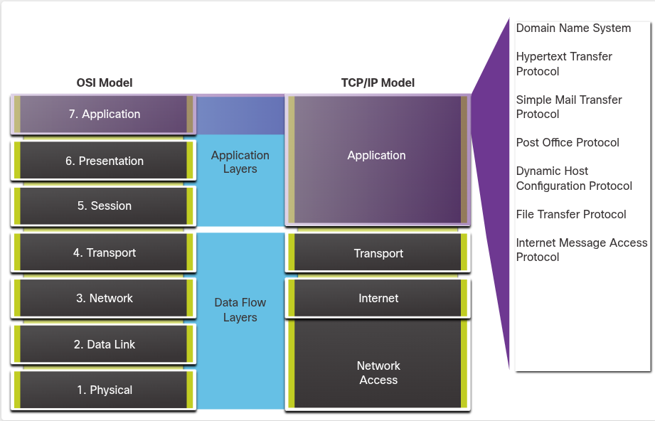
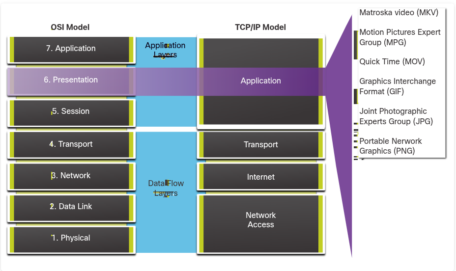
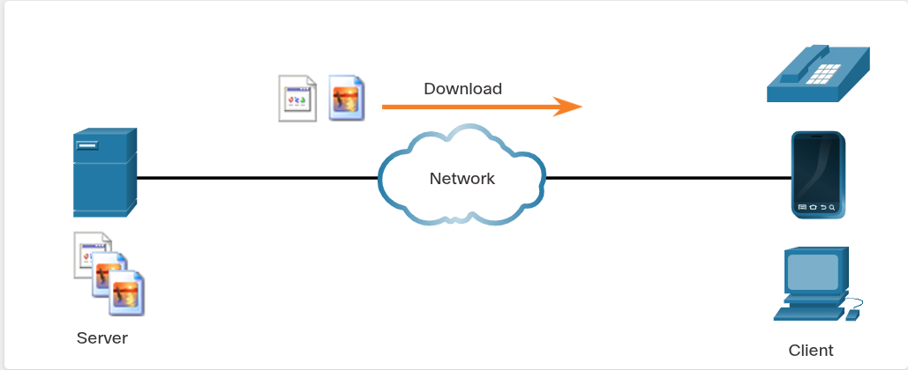
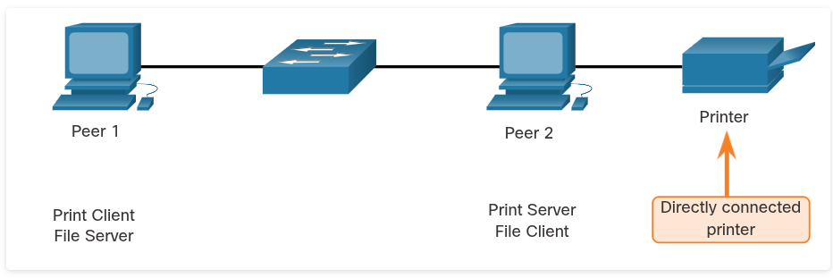
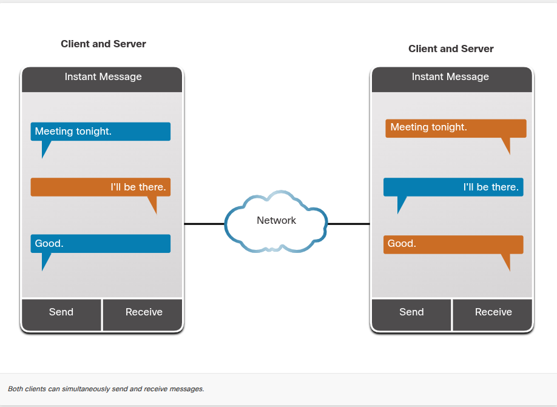
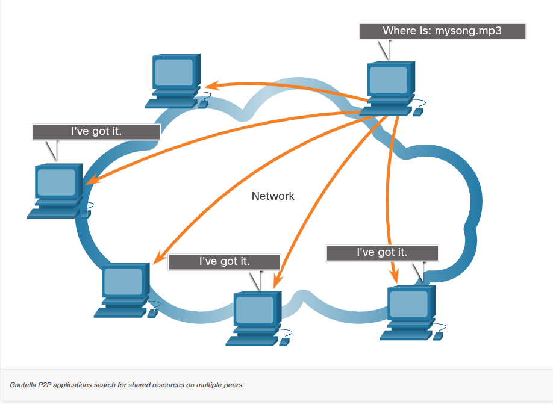

## **15.1** Application, Presentation, Session (client-server, peer-to-peer, protocoale)

### 15.1.1 Application Layer

- În modelele **OSI** și **TCP/IP**, application layer e stratul cel mai apropiat de utilizatorul final.

- E stratul care oferă **interfața** dintre aplicațiile folosite pentru comunicare și rețeaua subiacentă prin care sunt transmise mesajele.

- Protocoalele application layer sunt folosite pentru a **schimba date** între programe care rulează pe host-urile sursă și destinație.

- Pe baza modelului TCP/IP, **cele trei straturi superioare** ale modelului OSI (application, presentation, session) definesc funcțiile application layer-ului din TCP/IP.

- Există multe protocoale application layer, și noi protocoale sunt mereu dezvoltate. Cele mai cunoscute: **HTTP, FTP, TFTP, IMAP, DNS**.




### 15.1.2 Presentation and Session Layer

#### Presentation Layer — 3 funcții principale:

1. **Formatting/presenting data** — formatează datele de pe dispozitivul sursă într-un format compatibil pentru recepționare de către dispozitivul destinație.
2. **Compressing data** — comprimă datele într-un mod ce poate fi decomprimat de dispozitivul destinație.
3. **Encrypting data** — criptează datele pentru transmisie și le decriptează la primire.

- Presentation layer **formatează datele** pentru application layer și stabilește **standarde pentru formatele de fișiere**.
- Standarde cunoscute pentru **video**: **MKV** (Matroska Video), **MPG** (Motion Picture Experts Group), **MOV** (QuickTime Video).
- Formate cunoscute pentru **imagini grafice**: **GIF** (Graphics Interchange Format), **JPG** (Joint Photographic Experts Group), **PNG** (Portable Network Graphics).

#### Session Layer

- Așa cum sugerează numele, funcțiile de la session layer **creează și mențin dialoguri** între aplicațiile sursă și destinație.
- Session layer gestionează **schimbul de informații** pentru a: iniția dialoguri, a le menține active, și a **restarta sesiuni** care sunt întrerupte sau inactive pentru o perioadă lungă de timp.





### 15.1.3 TCP/IP Application Layer Protocols

- Protocoalele application TCP/IP specifică **formatul** și **informația de control** necesară pentru multe funcții comune de comunicare pe internet.
- Protocoalele application layer sunt folosite atât de dispozitivul sursă, cât și de cel destinație, în timpul unei sesiuni de comunicare.
- Pentru ca o comunicare să reușească, protocoalele application layer implementate pe host-ul sursă și cel destinație **trebuie să fie compatibile**.

#### Cele 5 tab-uri (**foarte important — porturi + descrieri, sigur pică la grile!**)

**1. Name System**

**DNS - Domain Name System (or Service)**

- **TCP, UDP 53**
- Translatează nume de domeniu (ex: cisco.com) în adrese IP.

**2. Host Config**

**BOOTP - Bootstrap Protocol**

- **UDP client 68, server 67**
- Permite unei stații de lucru diskless (fără disc) să-și descopere propria adresă IP, adresa IP a unui server BOOTP din rețea, și un fișier care trebuie încărcat în memorie pentru a porni mașina (boot).
- BOOTP este în curs de a fi **înlocuit de DHCP**.

**DHCP - Dynamic Host Configuration Protocol**

- **UDP client 68, server 67**
- Alocă dinamic adrese IP, care pot fi **refolosite** când nu mai sunt necesare.

**3. Email**

**SMTP - Simple Mail Transfer Protocol**

- **TCP 25**
- Permite clienților să **trimită** email către un mail server.
- Permite serverelor să trimită email către alte servere.

**POP3 - Post Office Protocol**

- **TCP 110**
- Permite clienților să **recupereze** email de pe un mail server.
- **Descarcă** email-ul pe aplicația de email locală a clientului.

**IMAP - Internet Message Access Protocol**

- **TCP 143**
- Permite clienților să **acceseze** email-ul stocat pe un mail server.
- **Menține** email-ul pe server.

**4. File Transfer**

**FTP - File Transfer Protocol**

- **TCP 20 și 21**
- Stabilește reguli care permit unui utilizator de pe un host să acceseze și să transfere fișiere către/de la alt host, prin rețea.
- FTP e un protocol de livrare de fișiere **reliable, connection-oriented, și acknowledged**.

**TFTP - Trivial File Transfer Protocol**

- **UDP client 69**
- Un protocol simplu, **connectionless**, de transfer de fișiere cu livrare **best-effort, unacknowledged**.
- Folosește **mai puțin overhead** decât FTP.

**5. Web**

**HTTP - Hypertext Transfer Protocol**

- **TCP 80, 8080**
- Un set de reguli pentru schimbul de text, imagini grafice, sunet, video și alte fișiere multimedia pe World Wide Web.

**HTTPS - HTTP Secure**

- **TCP, UDP 443**
- Browser-ul folosește criptare pentru a securiza comunicațiile HTTP.
- **Autentifică** website-ul la care browser-ul tău se conectează.

---

Tabel-recapitulare rapidă porturi (foarte probabil la grile):

|Protocol|Port|Transport|
|---|---|---|
|DNS|53|TCP, UDP|
|BOOTP/DHCP|67 (server), 68 (client)|UDP|
|SMTP|25|TCP|
|POP3|110|TCP|
|IMAP|143|TCP|
|FTP|20-21|TCP|
|TFTP|69|UDP|
|HTTP|80, 8080|TCP|
|HTTPS|443|TCP, UDP|

---

## **15.2** Peer-to-Peer

### 15.2.1 Client-Server Model

- În modelul **client/server**, dispozitivul care cere informația se numește **client**, iar dispozitivul care răspunde la cerere se numește **server**.
- Clientul e o combinație de hardware/software pe care oamenii o folosesc pentru a accesa direct resursele stocate pe server.
- Procesele client și server sunt considerate a fi la **application layer**.
- Clientul **inițiază schimbul** cerând date de la server, care răspunde trimițând unul sau mai multe fluxuri de date către client.
- Protocoalele application layer descriu **formatul** cererilor și răspunsurilor dintre clienți și servere. Pe lângă transferul propriu-zis de date, acest schimb poate necesita și **autentificarea utilizatorului** și **identificarea unui fișier de date** ce trebuie transferat.
- Exemplu: serviciul de email al unui ISP — clientul de email de pe un calculator personal trimite o cerere către serverul de email al ISP-ului pentru orice mail necitit. Serverul răspunde trimițând mail-ul cerut către client.
- Transferul de date de la client către server se numește **upload**, iar de la server către client se numește **download**.





### 15.2.2 Peer-to-Peer Networks

- În modelul de rețea **peer-to-peer (P2P)**, datele sunt accesate de la un dispozitiv peer **fără** folosirea unui server dedicat.
- Modelul P2P implică **două părți**: **rețele P2P** și **aplicații P2P**. Ambele au caracteristici similare, dar în practică funcționează destul de diferit.
- Într-o **rețea P2P**, două sau mai multe calculatoare sunt conectate printr-o rețea și pot **partaja resurse** (ex: printere, fișiere) **fără** a avea un server dedicat.
- Fiecare dispozitiv final conectat (numit **peer**) poate funcționa **atât ca server, cât și ca client**. Un calculator poate să-și asume rolul de server pentru o tranzacție, în timp ce servește simultan ca client pentru alta. **Rolurile de client și server sunt stabilite per cerere (per request basis)**.
- Pe lângă partajarea de fișiere, o astfel de rețea ar permite utilizatorilor să activeze **jocuri în rețea** sau să **partajeze o conexiune la internet**.
- Într-un schimb peer-to-peer, **ambele dispozitive sunt considerate egale** în procesul de comunicare.
- Exemplu: **Peer 1** are fișiere partajate cu **Peer 2** și poate accesa imprimanta partajată conectată direct la Peer 2 pentru a printa fișiere. **Peer 2** partajează imprimanta conectată direct cu Peer 1, în timp ce accesează fișierele partajate de pe Peer 1.





### 15.2.3 Peer-to-Peer Applications

- O **aplicație P2P** permite unui dispozitiv să acționeze **atât ca client, cât și ca server**, în cadrul aceleiași comunicări.
- În acest model, **fiecare client e un server**, și **fiecare server e un client**.
- Aplicațiile P2P necesită ca fiecare dispozitiv final să ofere o **interfață de utilizator** și să ruleze un **serviciu de fundal (background service)**.
- Unele aplicații P2P folosesc un **sistem hibrid** — unde partajarea resurselor e **descentralizată**, dar indecșii (indexes) care indică locațiile resurselor sunt stocați într-un **director centralizat**.
- Într-un sistem hibrid, fiecare peer accesează un **server index** pentru a obține locația unei resurse stocate pe alt peer.




### 15.2.4 Common P2P Applications

- Cu aplicațiile P2P, fiecare calculator din rețea care rulează aplicația poate acționa ca **client sau server** pentru celelalte calculatoare din rețea care rulează de asemenea aplicația.

#### Rețele P2P comune:

- **BitTorrent**
- **Direct Connect**
- **eDonkey**
- **Freenet**
- Unele aplicații P2P se bazează pe protocolul **Gnutella**, unde fiecare utilizator partajează **fișiere întregi** cu alți utilizatori. Software-ul client compatibil Gnutella permite utilizatorilor să se conecteze la serviciile Gnutella prin internet, și să localizeze și acceseze resurse partajate de alți peers Gnutella. Multe aplicații client Gnutella disponibile: **µTorrent, BitComet, DC++, Deluge, emule**.

#### Continuare (BitTorrent)

- Multe aplicații P2P permit utilizatorilor să **partajeze bucăți** din multe fișiere unii cu alții, în același timp.
- Clienții folosesc un **fișier torrent** pentru a localiza alți utilizatori care au bucățile de care au nevoie, astfel încât să se poată conecta direct la ei.
- Acest fișier conține și informații despre **calculatoarele tracker**, care țin evidența utilizatorilor ce dețin bucăți specifice din anumite fișiere.
- Clienții cer bucăți de la **mai mulți utilizatori simultan** — acest lucru se numește **swarm**, iar tehnologia se numește **BitTorrent**.
- BitTorrent are propriul client, dar există și mulți alți clienți BitTorrent, printre care **uTorrent, Deluge, qBittorrent**.





---
## **15.3** Web and Email Protocols (HTTP, HTTPS, SMTP, POP3, IMAP)


### 15.3.1 Hypertext Transfer Protocol and Hypertext Markup Language

- Există protocoale specifice application layer, proiectate pentru utilizări comune precum navigarea web și email-ul.
- Când o adresă web sau **URL** (Uniform Resource Locator) e introdusă într-un browser, browser-ul stabilește o conexiune cu **serviciul web**. Serviciul web rulează pe serverul care folosește protocolul **HTTP**.
- **URL-urile** și **URI-urile** (Uniform Resource Identifiers) sunt numele pe care majoritatea oamenilor le asociază cu adresele web.
- Exemplu folosit: `http://www.cisco.com/index.html`
- Procesul e explicat în **4 pași** (Step 1-4) — dacă îmi trimiți conținutul detaliat al fiecărui pas, îl adaug aici.


### 15.3.2 HTTP and HTTPS

- **HTTP** e un protocol **request/response**. Când un client (de obicei un web browser) trimite o cerere către un web server, HTTP specifică **tipurile de mesaje** folosite pentru acea comunicare.

#### Cele 3 tipuri comune de mesaje (**important, pică des!**):

- **GET** — o cerere de client pentru date. Un client (web browser) trimite mesajul GET către web server pentru a cere pagini HTML.
- **POST** — încarcă (uploads) fișiere de date către web server, cum ar fi datele dintr-un formular.
- **PUT** — încarcă resurse sau conținut către web server, cum ar fi o imagine.

#### Exemplu din diagramă:

- Client → HTTP Request către HTTP Server, folosind un URL de tipul `http://www.cisco.com/`.
- Mesajul de cerere conține: `Host: www.cisco.com` + `GET /index.html HTTP/1.1` — unde `www.cisco.com` reprezintă **fully qualified domain name**.
- Deși HTTP e remarcabil de flexibil, **nu e un protocol securizat**. Mesajele de cerere trimit informația către server în **plaintext**, care poate fi interceptată și citită. Răspunsurile serverului (de obicei pagini HTML) sunt de asemenea **necriptate**.
- Pentru comunicare securizată pe internet, se folosește protocolul **HTTP Secure (HTTPS)**. HTTPS folosește **autentificare și criptare** pentru a securiza datele în timp ce circulă între client și server.
- HTTPS folosește **același proces** de request-response client-server ca HTTP, dar fluxul de date e **criptat** cu **Transport Layer Security (TLS)** sau predecesorul lui, **Secure Socket Layer (SSL)**, înainte de a fi transportat prin rețea.
 


### 15.3.3 Email Protocols

- Unul dintre serviciile principale oferite de un ISP e **hosting-ul de email**.
- Pentru a rula pe un calculator sau alt dispozitiv final, email-ul necesită **mai multe aplicații și servicii**.
- Email-ul e o metodă **store-and-forward** de trimitere, stocare și recuperare a mesajelor electronice printr-o rețea. Mesajele de email sunt stocate în **baze de date pe mail servers**.
- Clienții de email comunică cu mail servere pentru a trimite și primi email. Mail serverele comunică cu **alte mail servere** pentru a transporta mesaje de la un domeniu la altul.
- Un client de email **nu comunică direct** cu un alt client de email la trimiterea unui email. În schimb, **ambii clienți se bazează pe mail server** pentru a transporta mesajele.
- Email suportă **3 protocoale separate** pentru funcționare: **SMTP**, **POP**, și **IMAP**.
    - Procesul de application layer care **trimite** mail folosește **SMTP**.
    - Un client **recuperează** email folosind unul dintre cele două protocoale application layer: **POP** sau **IMAP**.

#### Exemplu din diagramă (flux email între ISP-uri):

- **Sender** → router → **ISP A Mail Server** (comunicare prin **SMTP**)
- **ISP A** ↔ **ISP B** (comunicare între mail servere prin **SMTP**)
- **ISP B Mail Server** → router → **Recipient** (comunicare prin **IMAP sau POP3**)
 


### 15.3.4 SMTP, POP, and IMAP

- **SMTP** — explică rolul de trimitere (push) a mail-ului, portul 25, cum funcționează comunicarea client→server și server→server.

- **POP** — explică faptul că descarcă email-ul local și de obicei îl șterge de pe server (versiunea POP3), portul 110.

- **IMAP** — explică faptul că păstrează email-ul pe server și sincronizează mai multe dispozitive, portul 143.
 
 ---
## **15.4** IP Addressing Services (DNS, DHCP)


### 15.4.1 Domain Name System

- Există protocoale specifice application layer proiectate să faciliteze obținerea adreselor pentru dispozitivele din rețea.
- Aceste servicii sunt esențiale pentru că ar fi foarte consumator de timp să reținem adrese IP în loc de URL-uri, sau să configurăm manual toate dispozitivele dintr-o rețea medie/mare.
- În rețelele de date, dispozitivele sunt etichetate cu **adrese IP numerice** pentru a trimite și primi date prin rețele. **Numele de domeniu** au fost create pentru a converti adresa numerică într-un nume simplu, recognoscibil.
- Pe internet, **fully-qualified domain names (FQDNs)**, cum ar fi `http://www.cisco.com`, sunt mult mai ușor de reținut pentru oameni decât `198.133.219.25`, care e adresa numerică reală a acelui server.
- Dacă Cisco decide să schimbe adresa numerică a `www.cisco.com`, e **transparent pentru utilizator**, deoarece numele de domeniu rămâne același. Noua adresă e pur și simplu legată de numele de domeniu existent, iar conectivitatea e menținută.
- Protocolul **DNS** definește un serviciu automatizat care potrivește numele de resurse cu adresa de rețea numerică necesară. Include formatul pentru **queries (interogări), responses (răspunsuri) și data**.
- Comunicările protocolului DNS folosesc **un singur format**, numit **message**. Acest format de mesaj e folosit pentru toate tipurile de: cereri client, răspunsuri server, mesaje de eroare, și transferul de informații de resource record între servere.


### 15.4.2 DNS Message Format

- Serverul DNS stochează diferite tipuri de **resource records** folosite pentru a rezolva nume. Aceste records conțin **numele, adresa și tipul de record**.

#### Tipuri de record (**important, pică des!**):

- **A** — o adresă IPv4 a unui dispozitiv final.
- **NS** — un authoritative name server.
- **AAAA** — o adresă IPv6 a unui dispozitiv final (pronunțat "quad-A").
- **MX** — un mail exchange record.
- Când un client face o interogare, procesul de server DNS se uită mai întâi la **propriile records** pentru a rezolva numele. Dacă nu poate rezolva numele folosind records-urile stocate, **contactează alte servere** pentru a rezolva numele.
- După ce se găsește o potrivire și e returnată către serverul original solicitant, serverul **stochează temporar** adresa numerotată în eventualitatea în care același nume e cerut din nou.
- Serviciul de client DNS pe PC-uri Windows stochează de asemenea nume rezolvate anterior în memorie. Comanda **`ipconfig /displaydns`** afișează toate intrările DNS din cache.
- DNS folosește **același format de mesaj** între servere, format din: **question, answer, authority și additional information**, pentru toate tipurile de cereri client și răspunsuri server, mesaje de eroare, și transferul de informații de resource record.

#### Tabel — secțiunile mesajului DNS (**important!**):

|Secțiune mesaj DNS|Descriere|
|---|---|
|**Question**|Întrebarea pentru name server|
|**Answer**|Resource Records care răspund la întrebare|
|**Authority**|Resource Records care indică spre o autoritate|
|**Additional**|Resource Records care conțin informații suplimentare|


### 15.4.3 DNS Hierarchy

- Protocolul DNS folosește un **sistem ierarhic** pentru a crea o bază de date ce oferă rezolvare de nume. DNS folosește **nume de domeniu** pentru a forma ierarhia.
- Structura de denumire e împărțită în **zone mici, gestionabile**. Fiecare server DNS menține un **fișier de bază de date specific** și e responsabil doar de gestionarea mapărilor nume-la-IP pentru acea porțiune mică din întreaga structură DNS.
- Când un server DNS primește o cerere pentru o traducere de nume care **nu e** în zona sa DNS, serverul **redirecționează cererea** către alt server DNS din zona corespunzătoare pentru traducere.
- DNS e **scalabil** deoarece rezolvarea de hostname e răspândită pe mai multe servere.

#### Top-level domains (**exemple pică des**):

- **.com** — o afacere sau industrie
- **.org** — o organizație non-profit
- **.au** — Australia
- **.co** — Columbia

### 15.4.4 The nslookup Command

- Când se configurează un dispozitiv de rețea, sunt furnizate una sau mai multe **adrese DNS Server** pe care clientul DNS le poate folosi pentru rezolvarea numelor. De obicei, **ISP-ul furnizează adresele** pentru serverele DNS de folosit.
- Când o aplicație de utilizator cere să se conecteze la un dispozitiv remote după nume, clientul DNS solicitant **interoghează name server-ul** pentru a rezolva numele într-o adresă numerică.
- Sistemele de operare ale calculatoarelor au și un utilitar numit **Nslookup**, care permite utilizatorului să **interogheze manual** name serverele pentru a rezolva un anumit hostname. Acest utilitar poate fi folosit și pentru **troubleshooting** probleme de rezolvare de nume și pentru verificarea stării curente a name serverelor.
- Când comanda **`nslookup`** e emisă, e afișat serverul DNS implicit configurat pentru host-ul tău. Numele unui host sau domeniu poate fi introdus la prompt-ul **nslookup**. Utilitarul Nslookup are multe opțiuni disponibile pentru testare și verificare extinsă a procesului DNS.

Exemplu:

```
C:\Users> nslookup
Default Server: dns-sj.cisco.com
```


### 15.4.6 Dynamic Host Configuration Protocol

- **DHCP** pentru serviciul IPv4 **automatizează alocarea** adreselor IPv4, măștilor de subrețea, gateway-urilor și altor parametri de rețea IPv4. Aceasta se numește **adresare dinamică**.
- Alternativa la adresarea dinamică e **adresarea statică**. Folosind adresarea statică, administratorul de rețea introduce manual informația de adresă IP pe host-uri.
- Când un host se conectează la rețea, **serverul DHCP e contactat**, și se cere o adresă. Serverul DHCP alege o adresă dintr-un range de adrese configurat numit **pool**, și o alocă (o **închiriază - leases**) host-ului.
- Pe rețele mari, sau unde populația de utilizatori se schimbă frecvent, **DHCP e preferat** pentru alocarea de adrese. Utilizatori noi pot apărea și au nevoie de conexiuni; alții pot avea calculatoare noi care trebuie conectate. În loc să folosească adresare statică pentru fiecare conexiune, e mai eficient să ai adrese IPv4 alocate automat folosind DHCP.
- DHCP poate aloca adrese IP pentru o perioadă configurabilă de timp, numită **lease period (perioadă de închiriere)**. Perioada de lease e o setare DHCP importantă. Când perioada de lease expiră, sau serverul DHCP primește un mesaj **DHCPRELEASE**, adresa e returnată în pool-ul DHCP pentru refolosire.
- Utilizatorii se pot muta liber de la o locație la alta și pot re-stabili ușor conexiuni de rețea prin DHCP.
- Diverse tipuri de dispozitive pot fi servere DHCP. Serverul DHCP în majoritatea rețelelor medii-mari e de obicei un **server PC dedicat, local**. La rețelele de acasă, serverul DHCP e de obicei localizat pe **router-ul local** care conectează rețeaua de acasă la ISP.


### 15.4.7 DHCP Operation

- Cum arată în figură, când un dispozitiv configurat IPv4/DHCP pornește sau se conectează la rețea, clientul **broadcast-ează** un mesaj **DHCP discover (DHCPDISCOVER)** pentru a identifica serverele DHCP disponibile în rețea.
- Un server DHCP răspunde cu un mesaj **DHCP offer (DHCPOFFER)**, care oferă o închiriere (lease) către client. Mesajul de offer conține: **adresa IPv4 și masca de subrețea** ce urmează a fi alocate, **adresa IPv4 a serverului DNS**, și **adresa IPv4 a gateway-ului implicit**. Mesajul de lease include și **durata lease-ului**.

#### Cei 4 pași DHCP (**foarte important, sigur pică!**):

1. **DHCPDISCOVER** (client → server, broadcast)
2. **DHCPOFFER** (server → client)
3. **DHCPREQUEST** (client → server)
4. **DHCPACK** (server → client)

- Clientul poate primi **mai multe mesaje DHCPOFFER** dacă există mai mult de un server DHCP în rețeaua locală. Prin urmare, trebuie să aleagă între ele, și trimite un mesaj **DHCP request (DHCPREQUEST)** care identifică serverul explicit și oferta de lease pe care clientul o acceptă.
- Presupunând că adresa IPv4 cerută de client, sau oferită de server, e încă disponibilă, serverul returnează un mesaj **DHCP acknowledgment (DHCPACK)** care confirmă clientului că lease-ul a fost finalizat.
- Dacă oferta nu mai e validă, serverul selectat răspunde cu un mesaj **DHCP negative acknowledgment (DHCPNAK)**. Dacă e returnat un mesaj DHCPNAK, atunci procesul de selecție trebuie să înceapă din nou cu un nou mesaj DHCPDISCOVER transmis. După ce clientul are lease-ul, trebuie să fie **reînnoit înainte de expirarea lease-ului** printr-un alt mesaj DHCPREQUEST.
- Serverul DHCP se asigură că toate adresele IP sunt **unice** (aceeași adresă IP nu poate fi alocată simultan la două dispozitive de rețea diferite). Majoritatea ISP-urilor folosesc DHCP pentru a aloca adrese clienților lor.
- **DHCPv6** are un set de mesaje similar cu cele pentru DHCPv4. Mesajele DHCPv6 sunt: **SOLICIT, ADVERTISE, INFORMATION REQUEST, și REPLY**.

---

## **15.5** File Sharing Services (SMB, FTP)


### 15.5.1 File Transfer Protocol

- **Nivelul OSI:** Funcționează la nivelul Aplicație (Layer 7) și folosește un model client-server.
    
- **Operațiunile:** Este folosit exclusiv pentru a trage (_pull_ / download) și a împinge (_push_ / upload) date către un server.
    
- **Dubla conexiune (Cel mai testat concept):** FTP este special pentru că folosește protocolul **TCP** și deschide **două porturi diferite** pentru a funcționa:
    
    - **Portul TCP 21 (Control):** Aceasta este prima conexiune. Pe aici circulă doar "discuția" dintre client și server (comenzile de logare, cererile și răspunsurile).
    - **Portul TCP 20 (Date):** Aceasta este a doua conexiune, folosită strict pentru a muta fișierul propriu-zis de la o sursă la alta. Se creează doar atunci când transferi efectiv informația.


### 15.5.2 Server Message Block

- **Scopul principal:** Este un protocol client/server de tip _cerere-răspuns (request-response)_. Nu doar că transferă fișiere, dar gestionează și descrie structura resurselor partajate în rețea (directoare, fișiere, imprimante, porturi seriale).
    
- **Conexiunea pe termen lung (Diferența cheie față de FTP):** Acest detaliu apare foarte des în comparații! Spre deosebire de FTP (care trage sau împinge un fișier independent), SMB stabilește o conexiune pe **termen lung** cu serverul. Odată conectat, utilizatorul poate accesa, deschide și edita resursele de pe server ca și cum ar fi direct pe hard disk-ul său local.
    
- **SAMBA (Interoperabilitatea):** SMB este protocolul de bază pentru partajarea de fișiere în mediul Microsoft/Windows (folosind direct protocoale TCP/IP și DNS). Însă, dacă vezi o întrebare la examen despre cum un sistem **Linux sau UNIX** poate partaja fișiere cu o rețea Microsoft, răspunsul corect pe care trebuie să îl bifezi este **SAMBA** (versiunea de SMB pentru aceste sisteme de operare).
    
- **Suport extins:** Reține pur și simplu că și sistemele Apple Macintosh suportă partajarea de resurse folosind protocolul SMB.

