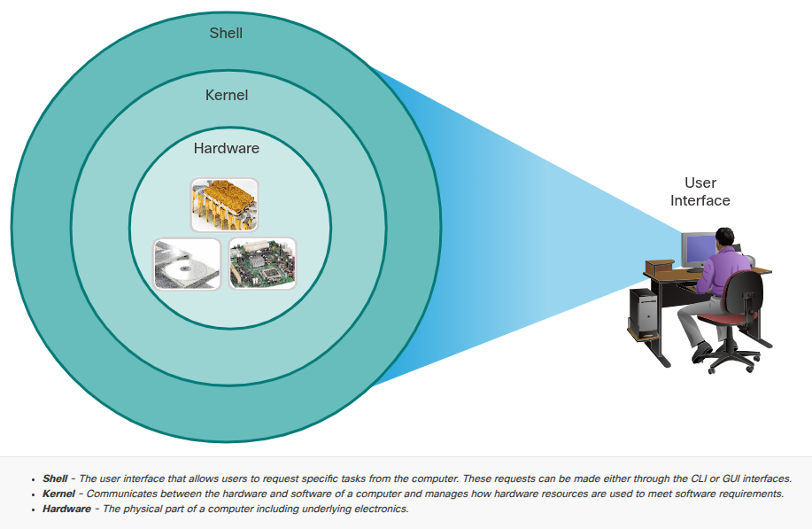
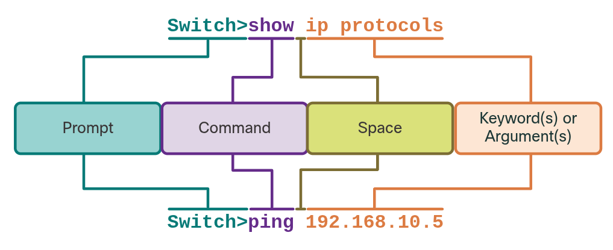

## 2.1 Cisco IOS Access

### 2.1.1 Operating Systems



Toate end devices și network devices au nevoie de un **sistem de operare (OS)**.

**Structura unui OS — 3 straturi (din diagrama concentrică):**

| Strat                   | Rol                                                                                                                                     |
| ----------------------- | --------------------------------------------------------------------------------------------------------------------------------------- |
| **Hardware** (interior) | Partea fizică a calculatorului, inclusiv electronica de bază                                                                            |
| **Kernel** (mijloc)     | Comunică între hardware și software, gestionează cum sunt folosite resursele hardware pentru a satisface cerințele software-ului        |
| **Shell** (exterior)    | **Interfața utilizatorului** care permite cereri de task-uri specifice către calculator — aceste cereri se fac prin **CLI** sau **GUI** |

**Cele 2 moduri de interacțiune cu shell-ul:**
- **CLI** (Command-Line Interface) — interfață text, bazată pe comenzi
- **GUI** (Graphical User Interface) — interfață grafică

#### Despre CLI:
- Utilizatorul interacționează **direct** cu sistemul, într-un mediu **text-based**, introducând comenzi la un **command prompt**
- Sistemul execută comanda, adesea oferind output textual
- **CLI necesită foarte puțin overhead** ca să opereze (eficient, resurse minime)
- **Dar** — cere ca utilizatorul să **cunoască structura de comenzi** care controlează sistemul (nu e intuitiv ca un GUI, trebuie să știi exact ce comenzi să scrii)

### 2.1.2 GUI

- Cisco IOS = sistemul de operare folosit pe echipamentele Cisco profesionale (routere/switch-uri). Acesta este accesat de obicei prin **CLI** pentru stabilitate și funcționalitate completă spre deosebire de routerele de acasă, care folosesc **firmware** configurat printr-un **GUI web-based**.

### 2.1.3 Purpose of an OS

- Network OS (Cisco IOS) funcționează pe aceleași principii ca un PC OS, dar prin CLI comenzile de la tastatură înlocuiesc click-urile de mouse. Versiunea de IOS depinde de device și de funcționalitățile dorite, și poate fi actualizată pentru capabilități noi.

### 2.1.4 Access Methods

- Terminal emulation programs = software-ul folosit pentru a te conecta la un device Cisco, fie prin consolă (serial), fie prin SSH/Telnet (rețea). 
- Exemple comune (nu menționate explicit în text, dar utile de știut din experiență practică): **PuTTY, SecureCRT, Tera Term**.

---

## 2.2 IOS Navigation

### 2.2.1 Primary Command Modes

- Cisco IOS separă accesul de management în **2 moduri de comandă** (security feature) CLI-ul oferă control mai precis decât GUI, de asta se folosește pentru configurare.

---
#### 1. User EXEC Mode

- Capabilități **limitate**  util pentru operații de bază
- Permite doar un **număr limitat de comenzi de monitorizare**
- **NU permite** execuția de comenzi care ar schimba configurația device-ului
- **Prompt-ul se termină cu `>`**
- Numit adesea și **"view-only" mode**

---
#### 2. Privileged EXEC Mode

- Pentru a executa comenzi de configurare, trebuie să accesezi acest mod
- Modurile de configurare superioare (ex: **global configuration mode**) pot fi accesate **doar din Privileged EXEC**
- **Prompt-ul se termină cu `#`**
- Permite acces la **toate comenzile și feature-urile**  orice comandă de monitorizare + comenzi de configurare/management

---

**Tabel de reținut clar (esențial, sigur apare la quiz):**

|Mode|Acces|Prompt (Switch)|Prompt (Router)|
|---|---|---|---|
|**User EXEC**|Comenzi limitate de monitorizare ("view-only")|`Switch>`|`Router>`|
|**Privileged EXEC**|Toate comenzile + configurare/management|`Switch#`|`Router#`|

---

### 2.2.2 Configuration Mode and Subconfiguration Modes

**Global Configuration Mode:**

- Pentru a configura device-ul, trebuie mai întâi să intri în **global configuration mode** ("global config mode")
- De aici se fac schimbări care afectează **operarea device-ului ca întreg**
- **Prompt:** se termină cu `(config)#` → ex: `Switch(config)#`
- Se accesează **înainte** de orice alt mod de configurare specific

**Din global config mode → poți intra în subconfiguration modes**, fiecare pentru o parte/funcție specifică a device-ului.

---

#### Cele 2 subconfiguration modes comune:

|Mode|Rol|Prompt|
|---|---|---|
|**Line Configuration Mode**|Configurează accesul: **console, SSH, Telnet, sau AUX**|`Switch(config-line)#`|
|**Interface Configuration Mode**|Configurează un **port de switch** sau **interfață de rețea a routerului**|`Switch(config-if)#`|

---
### 2.2.3 Video - IOS CLI Primary Command Mode

#### Vezi video

---
### 2.2.4 Navigate Between IOS Modes

**Comenzile esențiale de navigare** (astea sunt CRITICE, apar sigur la quiz și le vei folosi constant în practică):

#### Între User EXEC ↔ Privileged EXEC
- **`enable`** — trece din User EXEC în Privileged EXEC (`Switch>` → `Switch#`)
- **`disable`** — trece înapoi din Privileged EXEC în User EXEC
- **Notă importantă:** Privileged EXEC mode e uneori numit și **"enable mode"**

#### Între Privileged EXEC ↔ Global Configuration
- **`configure terminal`** — intră în global config mode (`Switch#` → `Switch(config)#`)
- **`exit`** — te întoarce la Privileged EXEC

#### Între Global Config ↔ Subconfiguration modes
- **`line [tip] [număr]`** — ex: `line console 0` → intră în line configuration mode
- **`interface [tip] [număr]`** — ex: `interface FastEthernet 0/1` → intră în interface configuration mode
- **`exit`** — din orice subconfiguration mode, te întoarce **un nivel mai sus** în ierarhie

---

**Comenzi speciale de "ieșire rapidă":**

| Comandă      | Efect                                                                                                        |
| ------------ | ------------------------------------------------------------------------------------------------------------ |
| **`end`**    | Din **orice** subconfiguration mode → direct în **Privileged EXEC** (sare peste toate nivelele intermediare) |
| **`Ctrl+Z`** | **Aceeași funcție** ca `end` — shortcut de tastatură                                                         |
| **`exit`**   | Te mută **un singur nivel mai sus** în ierarhie (nu sare direct la Privileged EXEC)                          |

---

**Exemple din text (foarte utile de memorat vizual):**

```
Switch(config)# line console 0
Switch(config-line)# exit
Switch(config)#
```

→ `exit` din line config te duce înapoi la global config (un nivel mai sus)

```
Switch(config-line)# end
Switch#
```

→ `end` sare direct la Privileged EXEC, indiferent din ce subconfiguration mode ești

```
Switch(config-line)# interface FastEthernet 0/1
Switch(config-if)#
```

→ Poți sări **direct** dintr-un subconfiguration mode în altul (aici: line → interface), fără să treci prin global config

---
### 2.2.5 Video - Navigate Between IOS Modes

## Vezi video

---
### 2.2.6 A Note About Syntax Checker Activities

- **Syntax Checker** = strict, cere comanda completă exact cum e scrisă. 
- **Packet Tracer** = flexibil, acceptă abrevieri, mai apropiat de un router/switch real.

---

## 2.3 The Command Structure

### 2.3.1 Basic IOS Command Structure



- Fiecare comandă IOS are un **format/sintaxă specific** și poate sa fie executată **doar în modul corect**. Structura generală: **comandă + keyword(s)/argument(s) potrivite**.

**Cele 4 componente ale unei comenzi** (din diagramă):

| Componentă                    | Rol                 | Exemplu 1 (`show ip protocols`) | Exemplu 2 (`ping 192.168.10.5`) |
| ----------------------------- | ------------------- | ------------------------------- | ------------------------------- |
| **Prompt**                    | Indică modul curent | `Switch>`                       | `Switch>`                       |
| **Command**                   | Acțiunea de bază    | `show`                          | `ping`                          |
| **Space**                     | Separator           | (spațiu)                        | (spațiu)                        |
| **Keyword(s) or Argument(s)** | Detaliile comenzii  | `ip protocols`                  | `192.168.10.5`                  |

**Explicație simplă:**
- **Keyword** = opțiune fixă, din lista "meniului" IOS-ului (ex: `ip protocols` e o opțiune predefinită pentru comanda `show`)
- **Argument** = valoare pe care **tu** o alegi/introduci (ex: o adresă IP specifică pentru `ping`)

---

### 2.3.2 IOS Command Syntax Check

- O comandă poate necesita unul sau mai multe argumente. Ca să știi ce keywords/arguments sunt necesare, te uiți la **sintaxa comenzii**  pattern-ul/formatul care trebuie respectat.

#### Convențiile de notație (esențiale, sigur apar la quiz):

| Convenție                    | Descriere                                                        |
| ---------------------------- | ---------------------------------------------------------------- |
| **boldface** (text îngroșat) | Comenzi și keywords introduse **literal, exact cum sunt scrise** |
| _italics_ (text cursiv)      | **Argumente** pentru care **tu** furnizezi valoarea              |
| `[x]` — paranteze pătrate    | Element **opțional** (keyword sau argument)                      |
| `{x}` — acolade              | Element **obligatoriu** (keyword sau argument)                   |
| `[x {y\|z}]`                 | acolade + bară verticală în paranteze pătrate                    |

**Exemple concrete de citire a sintaxei:**

1. **`ping ip-address`**
    - `ping` = comanda (boldface, literal)
    - `ip-address` = argument (italic, tu furnizezi adresa)
    - Exemplu real: `ping 10.10.10.5`
2. **`traceroute ip-address`**
    - Similar: `traceroute` = comanda, `ip-address` = argument definit de tine
    - Exemplu real: `traceroute 192.168.254.254`
3. **`description string`**
    - `description` = comandă (folosită să identifici scopul unei interfețe)
    - `string` = argument (textul tău descriptiv)
    - Exemplu: `description Connects to the main headquarter office switch`

---
### 2.3.3 IOS Help Features

- **Context-sensitive help (`?`)** = te ajută să **descoperi** ce comenzi/opțiuni există. 
- **Command syntax check** = **validează** automat ce ai scris deja, și te anunță dacă ai greșit ceva.

---

### 2.3.4 Video - Context Sensitive Help and Command Syntax Check

## Vezi video

---

### 2.3.5 Hot Keys and Shortcuts

CLI-ul IOS oferă **hot keys și shortcuts** pentru configurare/monitorizare/troubleshooting mai ușoare.

**Concept important - abrevierea comenzilor:**

- Comenzile și keywords pot fi **scurtate la minimul de caractere** care le identifică **unic**
- Exemplu: `configure` → poți scrie `conf` (funcționează, e unic)
- **Dar** `con` **NU funcționează** — pentru că mai multe comenzi încep cu "con" (ambiguu)

#### Cele mai importante shortcuts de reținut (nu memora tot tabelul, doar esențialul):

|Tastă|Ce face|
|---|---|
|**Tab**|Completează automat o comandă parțială|
|**Ctrl+C**|Iese din orice mod de configurare → revine la Privileged EXEC|
|**Ctrl+Z**|Iese din orice mod de configurare → revine la Privileged EXEC (la fel ca `end`, deja știi asta din 2.2.4)|
|**Ctrl+Shift+6**|Break sequence universal — oprește DNS lookups, traceroute, ping etc.|
|**Up Arrow / Ctrl+P**|Recheamă comanda anterioară din istoric|
|**Down Arrow / Ctrl+N**|Merge la comanda următoare din istoric|
|**Ctrl+A**|Cursor la începutul liniei|
|**Ctrl+E**|Cursor la finalul liniei|

**Notă importantă:** tasta **Delete** nu e recunoscută de structura de comenzi IOS (deși normal șterge caracterul din dreapta cursorului) — folosește **Backspace** sau **Ctrl+D** în schimb.

#### Când output-ul e prea lung - prompt `--More--`:

| Tastă                                | Efect                                         |
| ------------------------------------ | --------------------------------------------- |
| **Enter**                            | Afișează linia următoare                      |
| **Space Bar**                        | Afișează ecranul următor                      |
| **Orice altă tastă** (excepție: `y`) | Oprește afișarea, revine la promptul anterior |

---

**Idee centrală de reținut pentru quiz (cele mai probabile de testat):**

- **Tab** = auto-completare
- **Ctrl+C / Ctrl+Z** = ieșire din config mode → Privileged EXEC
- **Ctrl+Shift+6** = break/stop pentru comenzi în desfășurare (ping, traceroute, DNS lookup)
- Comenzile pot fi **abreviate**, dar trebuie să rămână **unice** (ex: `conf` merge, `con` nu merge)

---

## 2.4 Basic Device Configuration

### 2.4.1 Device Names

Prima comandă de configurare pe orice device ar trebui să fie setarea unui **hostname** unic. Default, toate device-urile au un nume din fabrică (ex: switch-ul Cisco = "Switch").

**De ce contează:** dacă toate switch-urile rămân cu numele default, nu poți identifica device-ul corect — mai ales când te conectezi remote prin SSH, hostname-ul confirmă că ești pe device-ul corect.

**Reguli de nume (naming guidelines) - de reținut:**

- Începe cu o **literă**
- **Fără spații**
- Se termină cu literă sau cifră
- Folosește doar **litere, cifre și cratime (-)**
- **Sub 64 caractere**

```Cisco CLI
Switch# configure terminal
Switch(config)# hostname Sw-Floor-1
Sw-Floor-1(config)#
```

---
### 2.4.2 Password Guidelines

**De ce contează:** parolele slabe/ghicibile = cea mai mare problemă de securitate pentru organizații.

**Reguli pentru parole puternice:**

- Peste **8 caractere**
- Combinație de **litere mari/mici, cifre, caractere speciale**
- **Nu refolosi** aceeași parolă pe toate device-urile
- Evită **cuvinte comune** (ușor de ghicit)

**Notă importantă:** în laboratoarele acestui curs se folosesc parole simple ca **`cisco`** sau **`class`** sunt slabe intenționat, doar pentru scop didactic, **niciodată** în producție reală.

---
### 2.4.3 Configure Passwords

#### Securizarea User EXEC (acces prin consolă):

```
Sw-Floor-1# configure terminal
Sw-Floor-1(config)# line console 0
Sw-Floor-1(config-line)# password cisco
Sw-Floor-1(config-line)# login
Sw-Floor-1(config-line)# end
```

- **`line console 0`** — intri în line config pentru consolă (0 = prima/singura interfață de consolă)
- **`password cisco`** — setezi parola
- **`login`** — activezi cerința de parolă la acces

#### Securizarea Privileged EXEC (cel mai important — acces complet la device):

```
Sw-Floor-1(config)# enable secret class
```

- **`enable secret`** — comanda pentru a proteja Privileged EXEC (acces total la device)

#### Securizarea VTY lines (acces remote SSH/Telnet):

```
Sw-Floor-1(config)# line vty 0 15
Sw-Floor-1(config-line)# password cisco
Sw-Floor-1(config-line)# login
```

- **VTY** (Virtual Terminal) = liniile pentru acces remote
- Multe switch-uri Cisco suportă **până la 16 linii VTY** (numerotate **0-15**)
- **`line vty 0 15`** = configurezi toate cele 16 linii simultan

**De reținut clar (3 puncte de securizat, apar sigur la quiz):**

| Ce securizezi       | Comandă mod                | Comandă parolă       |
| ------------------- | -------------------------- | -------------------- |
| User EXEC (consolă) | `line console 0`           | `password` + `login` |
| Privileged EXEC     | (direct din global config) | `enable secret`      |
| VTY (remote acces)  | `line vty 0 15`            | `password` + `login` |

---

### 2.4.4 Encrypt Passwords

**Problema:** fișierele `startup-config` și `running-config` afișează parolele **în plaintext** — risc de securitate dacă cineva are acces la ele.

**Soluția:**

```
Sw-Floor-1(config)# service password-encryption
```

- Criptează **toate parolele necriptate** din fișierul de configurare
- **Important:** criptează parolele doar **în fișierul de config**, NU parolele trimise prin rețea (asta e treaba altor protocoale, ex SSH)
- Verifici cu **`show running-config`** — vei vedea parolele ca text criptat (ex: `7 094F471A1A0A`)

---

### 2.4.5 Banner Messages

**De ce contează:** pe lângă parole, ai nevoie de un **banner** — un mesaj legal care declară că doar personalul autorizat poate accesa device-ul. Important **legal** — în unele sisteme juridice, nu poți urmări penal un intrus dacă nu exista o notificare vizibilă.

**Comanda:**

```
Sw-Floor-1(config)# banner motd #Authorized Access Only#
```

- **`banner motd`** = "message of the day"
- **`#`** = **delimiting character** — marchează începutul și sfârșitul mesajului
- Poate fi orice caracter, atât timp cât **nu apare în mesaj**
- Banner-ul apare la **toate încercările ulterioare** de acces, până e eliminat

---
## 2.5 Save Configurations

### 2.5.1 Configuration Files

Aici e conceptul cheie al secțiunii, pe care sigur îl știi deja din experiența ta cu switch-uri/routere Cisco:
- **startup-config** - stocat în **NVRAM**, se încarcă la boot, persistă la power-off
- **running-config** - stocat în **RAM**, config-ul activ, se pierde la restart

Comenzi:
- `show running-config` - vezi config-ul curent din RAM
- `show startup-config` - vezi ce s-ar încărca la următorul boot
- `copy running-config startup-config` - salvezi running → startup (altfel modificările se pierd la reboot)

---

### 2.5.2 Alter the Running Configuration

Practic, ce faci dacă strici ceva în running-config:

- Dacă **nu ai salvat** încă: `reload` te readuce la ultimul startup-config salvat (dar dă downtime scurt, pentru că device-ul repornește; la reload, IOS te întreabă dacă vrei să salvezi schimbările — răspunzi `n`/`no` ca să le arunci)
- Dacă **ai salvat deja** greșit în startup-config: `erase startup-config` (șterge din NVRAM) → confirmi cu Enter → apoi `reload` ca să încarce config-ul default din fabrică

Diferența esențială între cele două scenarii: dacă schimbarea proastă e doar în RAM, un simplu reload te scapă; dacă a ajuns și în NVRAM, trebuie s-o ștergi explicit înainte de reload.

---

### 2.5.4 Capture Configuration to a Text File

Asta e un truc practic pentru backup manual (fără TFTP server), folosind PuTTY:

1. Deschizi PuTTY, mergi la **Session → Logging**
2. Selectezi **"All session output"**, alegi un nume de fișier (ex. `MySwitchLogs`)
3. Te conectezi (SSH/Telnet/Serial) și rulezi `show running-config` sau `show startup-config` — tot ce apare în terminal se salvează în fișierul text
4. Dezactivezi logging-ul (**Session logging → None**) când ai terminat

Pentru restaurare: intri în **global config mode** pe switch și pur și simplu copy-paste textul din fișier direct în terminal — liniile sunt interpretate ca și comenzi.

---

## 2.6 Ports and Addresses

### 2.6.1 IP Addresses

Aici e recapitulare rapidă pentru tine, cu doar câteva nuanțe de reținut din formularea CCNA:

- **IPv4**: dotted decimal, 4 octeți (0-255), plus **subnet mask** (32-bit) care separă porțiunea de rețea de cea de host
- **Default gateway**: IP-ul routerului folosit pentru trafic către rețele externe (exemplul din curs: adresă 192.168.1.10, mască 255.255.255.0, gateway 192.168.1.1 — clasic /24)
- **IPv6**: 128 biți, notație hexazecimală, grupuri de 4 cifre hex separate prin `:`, case-insensitive

### 2.6.2 Interfaces and Ports

Punctul important de reținut din secțiunea asta (poate singurul lucru care merită subliniat, restul fiind cablu-uri copper/fiber/wireless pe care le știi):

- **Switch-urile Layer 2 nu au nevoie de adresă IP** ca să funcționeze — fac forwarding pe MAC address, nu pe IP
- Totuși, pentru management la distanță (SSH/Telnet), switch-ul are o **SVI (Switch Virtual Interface)** — o interfață virtuală, fără hardware fizic asociat
- SVI-ul default "din fabrică" e **VLAN1** — asta explică de ce, atunci când configurezi IP pe un switch, intri pe `interface vlan 1` și nu pe un port fizic

---

## 2.7. Configure IP Addressing

### 2.7.1 Manual IP Address Configuration for End Devices

Doar procedura Windows: Control Panel → Network Sharing Center → Change adapter settings → click dreapta pe adaptor → Properties → Local Area Connection Properties. De acolo introduci manual IP, mască, gateway. Recapitulare pură, nimic tehnic nou.

### 2.7.2 Automatic IP Address Configuration for End Devices

- **DHCP** elimină configurarea manuală pe fiecare device (IP, mască, gateway, DNS) — reduce și riscul de duplicate de adrese
- Pe Windows: bifezi **"Obtain an IP address automatically"** + **"Obtain DNS server address automatically"**
- **Notă utilă**: pentru IPv6, echivalentul e **DHCPv6** și **SLAAC** (Stateless Address Autoconfiguration) — asta e o mențiune care poate nu ai întâlnit-o explicit până acum, chiar dacă concepte similare (autoconfigurare) probabil le știi din alte contexte

### 2.7.4 Switch Virtual Interface Configuration

Aici e configurarea practică, legată direct de 2.6.2 (SVI pe VLAN1). Secvența de comenzi:

```
Sw-Floor-1# configure terminal
Sw-Floor-1(config)# interface vlan 1
Sw-Floor-1(config-if)# ip address 192.168.1.20 255.255.255.0
Sw-Floor-1(config-if)# no shutdown
Sw-Floor-1(config-if)# exit
Sw-Floor-1(config)# ip default-gateway 192.168.1.1
```

Puncte de reținut:

- `interface vlan 1` — intri în config-ul SVI-ului (nu e interfață fizică)
- `ip address ... ...` — IP + mască pe SVI
- `no shutdown` — **obligatoriu**, altfel interfața virtuală rămâne administrativ dezactivată
- `ip default-gateway` — comandă **globală** (nu sub interfață!), necesară ca switch-ul să știe pe unde trimite trafic către alte rețele

---
## 2.8 Verify Connectivity

## Vezi videouri
