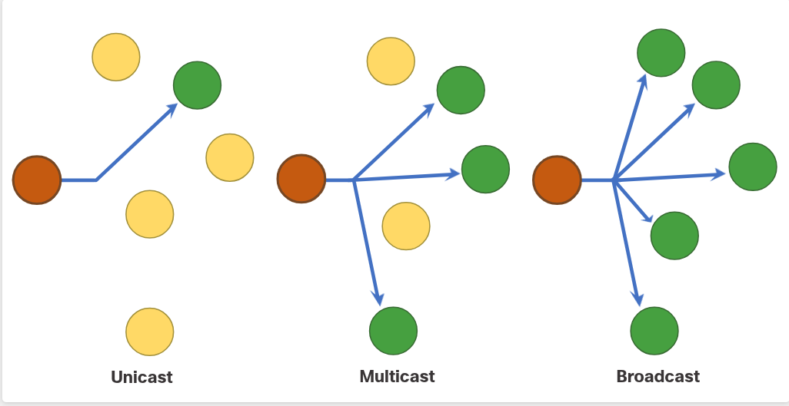
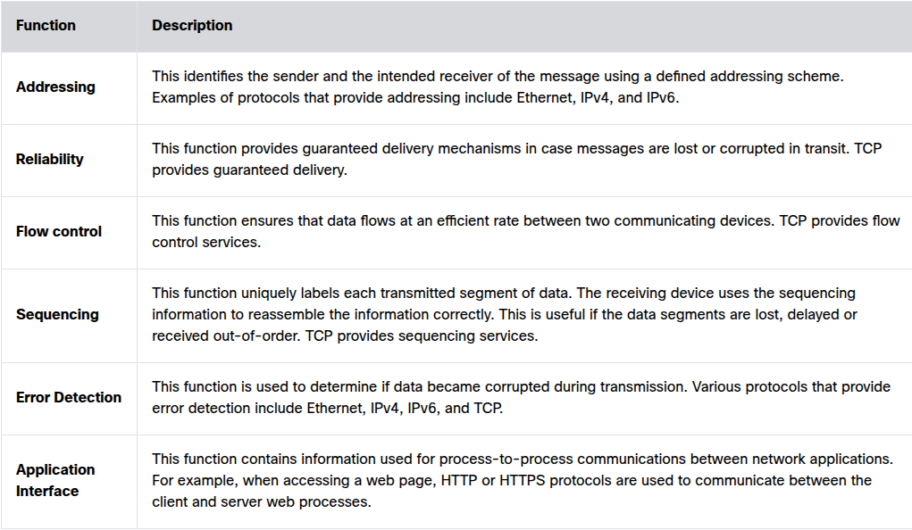
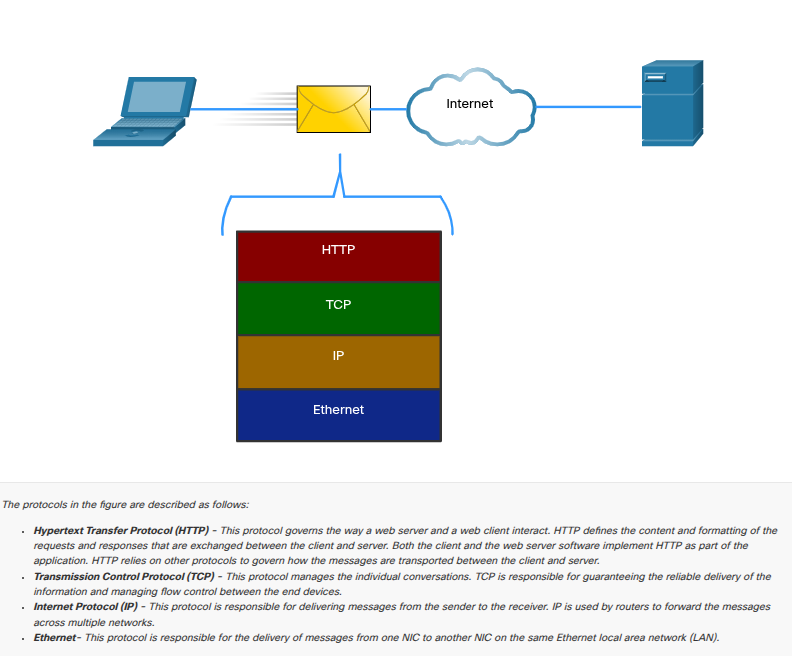
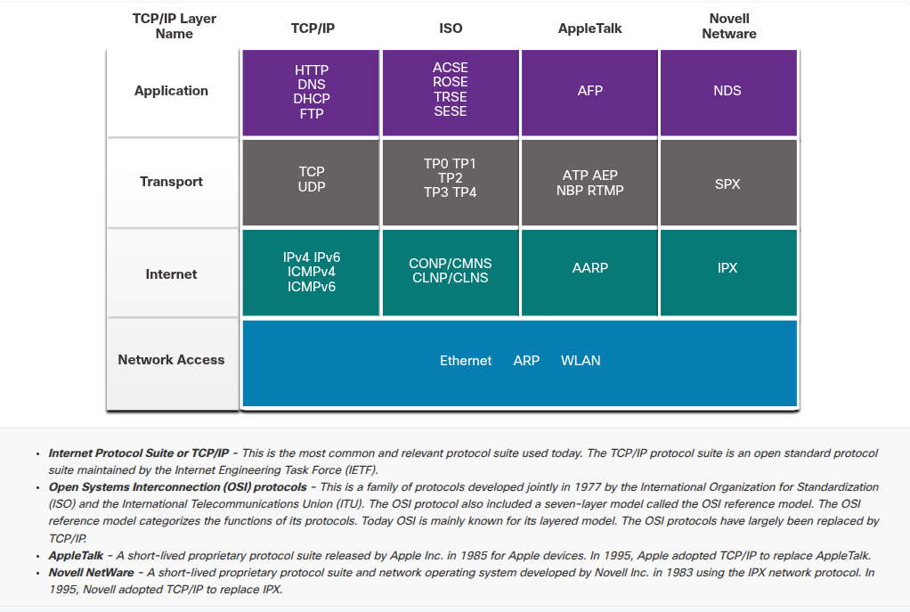
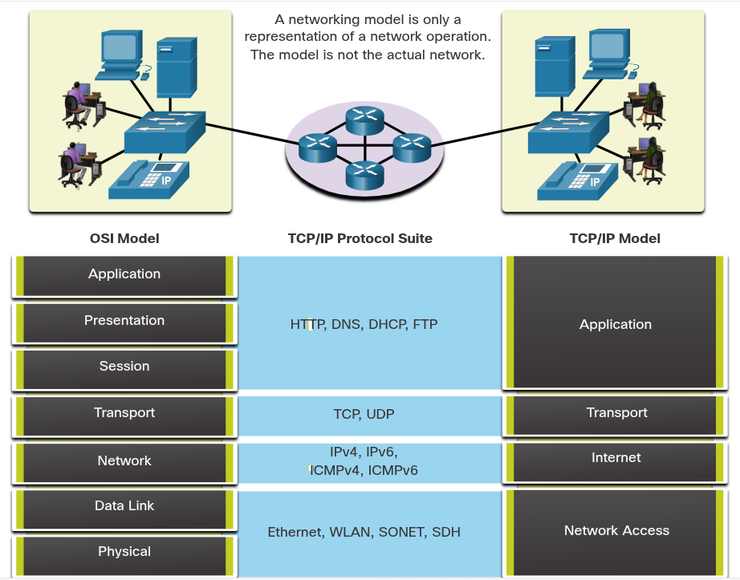
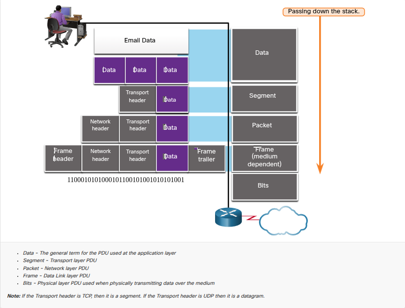
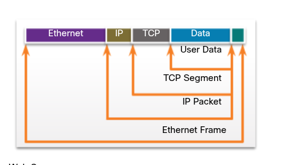

## 3.1 The Rules

### 3.1.1 Video - Devices in a Bubble

### Vezi video-ul!

### 3.1.2 Communications Fundamentals

Orice comunicare (om sau device) are 3 elemente de bază:

- **Message source** (sender) — cine trimite
- **Message destination** (receiver) — cine primește și interpretează
- **Channel** — media prin care circulă mesajul

### 3.1.3 Communication Protocols

- Analogie: trimiterea unui mesaj (față-în-față sau prin rețea) e guvernată de **protocoale** = reguli specifice tipului de comunicare folosit — similar cu trimiterea unei scrisori, care are propriile convenții (adresă, plic, timbru) diferite de un apel telefonic.

### 3.1.4 Rule Establishment

Exemplu concret din curs — un mesaj neformat corect e greu de citit:
> "humans communication between govern rules..."

vs. formatat corect:
> "Rules govern communication between humans..."

Protocoalele trebuie să acopere:
- Sender și receiver identificați
- Limbaj și gramatică comună
- Viteză și timing al livrării
- Cerințe de confirmare/acknowledgment

### 3.1.5 Network Protocol Requirements

Cele 5 cerințe comune ale protocoalelor de rețea (asta e practic outline-ul pentru restul secțiunii 3.1):
- Message encoding
- Message formatting and encapsulation
- Message size
- Message timing
- Message delivery options

### 3.1.6 Message Encoding

- **Encoding** = conversia informației într-o formă acceptabilă pentru transmisie; 
- **decoding** = procesul invers, la destinație.

### 3.1.7 Message Formatting and Encapsulation

- Mesajul trebuie să respecte un format/structură specific, în funcție de tipul de mesaj și canalul folosit. 
- Asta e conceptul care stă la baza **encapsulării** (headere adăugate la fiecare nivel OSI/TCP-IP), pe care o vei aprofunda la 3.6.

### 3.1.8 Message Size

- Mesajele mari trebuie **împărțite în bucăți mai mici** pentru transmisie eficientă (segmentare). 
- Analog cu o conversație lungă care se transmite în propoziții, nu tot dintr-o suflare.

### 3.1.9 Message Timing

Trei componente:

- **Flow Control** — gestionarea ratei de transmisie (dacă cineva vorbește prea repede, mesajul nu se înțelege; protocoalele negociază rata de transfer)
- **Response Timeout** — cât timp aștepți un răspuns înainte să reacționezi (repeți întrebarea sau continui)
- **Access method** — când poate un device să transmită; dacă două device-uri transmit simultan → **coliziune** → ambele trebuie să se oprească și să reîncerce (concept fundamental pentru Ethernet/CSMA-CD, pe care sigur îl cunoști)

### 3.1.10 Message Delivery Options

Trei tipuri de livrare:

- **Unicast** — către un singur device
- **Multicast** — către un grup de device-uri
- **Broadcast** — către toate device-urile

**Notă importantă**: implicit, un switch trimite pachetele multicast pe **toate porturile** (cu excepția celui de intrare), dar doar host-urile care sunt membre ale grupului multicast **procesează** efectiv pachetul — restul îl ignoră la nivel de interpretare, deși switch-ul nu filtrează.

### 3.1.11 A Note About the Node Icon

Doar convenție vizuală: în diagrame, device-urile sunt reprezentate ca **noduri** (cercuri) — sursa e portocalie, destinațiile active sunt verzi, cele neafectate rămân galbene.



---

## 3.2 Protocols

### 3.2.1 Network Protocol Overview

Tabel cu 4 tipuri de protocoale:

|Tip|Exemple|
|---|---|
|**Network Communications Protocols**|IP, TCP, HTTP|
|**Network Security Protocols**|SSH, SSL, TLS|
|**Routing Protocols**|OSPF, BGP|
|**Service Discovery Protocols**|DHCP, DNS|

### 3.2.2 Network Protocol Functions

Exemplu vizual simplu: un mesaj cu header **IP** + **Data** traversează mai multe device-uri (routere), iar fiecare device de pe traseu "înțelege" headerul IPv4 și poate face forward pe baza lui — ideea fiind că protocolul comun (IPv4) permite tuturor device-urilor din cale să interpreteze și să proceseze mesajul consistent.



### 3.2.3 Protocol Interaction

Cel mai important concept din 3.2 — stiva de protocoale implicată când un device face o cerere HTTP către un web server:

HTTP     ← guvernează formatul cererii/răspunsului web (conținut)
TCP      ← gestionează conversația individuală, livrare fiabilă, flow control
IP       ← livrează mesajul de la sender la receiver, folosit de routere pentru forwarding
Ethernet ← livrează mesajul de la un NIC la altul, în cadrul aceluiași LAN



---

## 3.3 Protocol Suits

### 3.3.1 Network Protocol Suites

**Protocol suite** = grup de protocoale inter-relaționate, necesare pentru o funcție de comunicare completă. Vizualizate ca un **stack** (layers): straturile de jos se ocupă de mutarea datelor pe rețea, straturile de sus se ocupă de conținutul mesajului.

Analogia din curs (comunicare față-în-față, pe 3 straturi):

- **Content layer** (sus) — ce se spune efectiv
- **Rules layer** (mijloc) — limbaj comun, reguli de conversație
- **Physical layer** (jos) — vocile, sunetul propriu-zis


### 3.3.2 Evolution of Protocol Suites

Punct important: au existat mai multe protocol suites concurente în istorie, dar azi practic doar una contează:

| Suite                    | Status                                                                                                                       |
| ------------------------ | ---------------------------------------------------------------------------------------------------------------------------- |
| **TCP/IP**               | dominant azi, standard deschis, întreținut de IETF                                                                           |
| **OSI**                  | model pe 7 straturi, protocoalele OSI au fost înlocuite de TCP/IP (dar modelul de referință OSI a rămas influent conceptual) |
| **AppleTalk**            | scurtă durată de viață, Apple a trecut la TCP/IP în 1995                                                                     |
| **Novell NetWare (IPX)** | scurtă durată de viață, Novell a trecut la TCP/IP în 1995                                                                    |


### 3.3.3 TCP/IP Protocol Example

Exemplu concret HTTP request: **HTTP** (application) → **TCP** (transport) → **IP** (internet) → **Ethernet** (network access). Notă: **nu există protocoale TCP/IP proprii la network access layer** — acolo se folosesc standardele existente (Ethernet, WLAN, celular).


### 3.3.4 TCP/IP Protocol Suite — harta completă

Asta e diagrama de referință, utilă pentru tine ca recapitulare/verificare, cu tot ce ai văzut deja plus câteva completări:

**Application Layer:**

- Name System: DNS
- Host Config: DHCPv4, DHCPv6, SLAAC
- Email: SMTP, POP3, IMAP
- File Transfer: FTP, SFTP, TFTP
- Web: HTTP, HTTPS, REST

**Transport Layer:**

- Connection-oriented: **TCP**
- Connectionless: **UDP**

**Internet Layer:**

- IP: IPv4, IPv6, NAT
- Messaging: ICMPv4, ICMPv6, ICMPv6 ND
- Routing: OSPF, EIGRP, BGP

**Network Access Layer:**

- Address Resolution: **ARP**
- Data Link: Ethernet, WLAN

Cele două note pe care merită să pui accent (poate mai puțin evidente decât restul, pe care sigur le știi deja din experiența ta cu OSPF/rutare):

- **ARP** e clasificat aici la **Network Access Layer** (echivalent OSI Layer 2), NU la Internet Layer — motivul dat explicit de curs: scopul principal al ARP e să descopere adresa **MAC** (Layer 2) a destinației, chiar dacă lucrează cu adrese IP ca input. Alte surse îl pun la Layer 3, dar convenția din acest curs e Layer 2.
- **TCP vs UDP**: 
	- TCP = conexiune fiabilă, confirmată (acknowledged); 
	- UDP = fără confirmare de livrare, mai rapid dar "best-effort"


---

## 3.4 Standards Organizations

### 3.4.1 Open Standards

Analogie: la fel cum anvelopele auto respectă standarde comune indiferent de producător, protocoalele de rețea au nevoie de **standarde deschise** ca să funcționeze între producători diferiți. Fără ele, un router de la un vendor n-ar putea comunica cu unul de la altul.

Beneficii standarde deschise:

- Interoperabilitate
- Competiție și inovație
- Previn monopolul unei singure companii

### 3.4.2 Internet Standards

- Doar enumerare de organizații — aici practic cursul listează logo-urile, deci conținutul relevant e lista de organizații implicate în dezvoltarea internetului. Cea vizibilă în imaginea ta e **Internet Society (ISOC)**. 
- De obicei sub ea urmează (probabil ai mai mult conținut dincolo de ce ai trimis, cu diagrama completă): IAB, IETF, IRTF, ICANN, IANA — organizații ierarhice care se ocupă de standardizarea protocoalelor de internet (RFC-uri) și alocarea adreselor IP/nume de domenii.

### 3.4.3 Electronic and Communications Standards

Patru organizații relevante pentru standardele electronice/comunicații (nu neapărat pentru internet ca atare, ci pentru transmisia fizică a semnalelor):

- **IEEE** — cea mai relevantă pentru tine: **802.3 Ethernet** și **802.11 WLAN** sunt standarde IEEE
- **EIA** — cabluri, conectori, rack-uri de 19 inch
- **TIA** — echipamente radio, turnuri celulare, VoIP, comunicații prin satelit
- **ITU-T** — compresie video, IPTV, DSL


---

## 3.5 Reference Models

### 3.5.1 The Benefits of Using a Layered Model

Beneficiile unui model pe straturi:

- Ajută la **proiectarea protocoalelor** (fiecare strat are informații și interfețe bine definite față de straturile vecine)
- Susține **competiția** — vendori diferiți pot construi produse compatibile
- **Izolează schimbările** — o modificare la un strat nu afectează celelalte straturi
- Oferă **limbaj comun** pentru a descrie funcțiile de rețea

Există două modele folosite: **OSI Reference Model** (7 straturi) și **TCP/IP Reference Model** (4 straturi).




### 3.5.2 The OSI Reference Model

Modelul OSI descrie **ce** trebuie făcut la fiecare strat, nu **cum** — deci e un model conceptual, nu neapărat o implementare directă. Cele 7 straturi:

| #   | Strat        | Funcție                                                          |
| --- | ------------ | ---------------------------------------------------------------- |
| 7   | Application  | comunicare process-to-process                                    |
| 6   | Presentation | reprezentare comună a datelor                                    |
| 5   | Session      | organizează dialogul, gestionează schimbul de date               |
| 4   | Transport    | segmentare, transfer, reasamblare pentru comunicații individuale |
| 3   | Network      | schimb de date între end devices identificate                    |
| 2   | Data Link    | schimb de frame-uri pe media comună                              |
| 1   | Physical     | transmisie de biți (mecanic, electric, procedural)               |
**Notă importantă**: straturile OSI se referă de obicei prin **număr** (Layer 1, Layer 2 etc.), nu doar prin nume — spre deosebire de TCP/IP, unde se folosesc doar numele. Asta explică de ce în conversațiile tehnice auzi constant "Layer 2 switch", "Layer 3 routing" etc.


### 3.5.3 The TCP/IP Protocol Model

TCP/IP e un **model de protocol** (nu doar de referință) fiindcă descrie efectiv funcțiile implementate în stiva reală TCP/IP:

|#|Strat|Funcție|
|---|---|---|
|4|Application|reprezintă datele către utilizator, encoding, dialog control|
|3|Transport|comunicare între device-uri prin rețele diverse|
|2|Internet|determină cea mai bună cale prin rețea|
|1|Network Access|controlează hardware-ul și media|

Notă: standardele TCP/IP sunt discutate public și definite prin **RFC-uri** (Request for Comments), scrise de ingineri de rețea și trimise spre comentarii altor membri IETF — deci procesul e deschis, nu impus de un singur vendor.

### 3.5.4 OSI and TCP/IP Model Comparison

Mapare directă între cele două modele — asta e diagrama de referință pe care o vei folosi constant:

```
OSI                    TCP/IP
7 Application    ┐
6 Presentation   ├──►  Application
5 Session        ┘
4 Transport      ──►  Transport
3 Network        ──►  Internet
2 Data Link      ┐
1 Physical       ├──►  Network Access
```

Puncte cheie de reținut (cele mai relevante mapări, pe care probabil le folosești deja intuitiv din experiența cu OSPF și VLAN-uri):

- **OSI Layer 3 (Network)** = **TCP/IP Internet Layer** — aici se întâmplă rutarea (IP, OSPF pe care le cunoști)
- **OSI Layer 4 (Transport)** = **TCP/IP Transport Layer** — livrare ordonată/fiabilă între hosturi finale
- **TCP/IP nu specifică protocoale exacte** la Network Access — doar descrie "handoff"-ul de la Internet Layer către protocoalele fizice; de-asta Layer 1+2 din OSI rămân relevante separat, chiar dacă TCP/IP le combină într-un singur strat
- Application layer în TCP/IP **combină** straturile 5-6-7 din OSI (Session, Presentation, Application)


---

## 3.6 Data Encapsulation

### 3.6.1 Segmenting Messages

De ce nu se trimite tot mesajul dintr-o bucată: ar bloca link-urile pentru mult timp, iar dacă un link pică în timpul transmisiei, tot mesajul trebuie retransmis integral.

**Segmentare** = împărțirea unui stream de date în bucăți mai mici (fiecare devine un pachet IP separat, trimis individual — analog cu trimiterea unei scrisori lungi ca serie de cărți poștale individuale). Segmentele pentru aceeași destinație pot merge pe **căi diferite**.

Două beneficii:

- **Viteză crescută** — mai multe conversații pot fi interleaved pe același link (**multiplexare**), fără să blocheze canalul cu un singur stream masiv
- **Eficiență crescută** — dacă un segment se pierde, retransmiți doar acel segment, nu tot mesajul


### 3.6.2 Sequencing

Provocarea: dacă împarți mesajul în bucăți, ele pot ajunge **out-of-order**. Analogie: o scrisoare de 100 de pagini trimisă în 100 de plicuri separate, care pot ajunge amestecate — fiecare plic are nevoie de un **număr de secvență** ca receptorul să le poată reasambla corect.

**TCP este responsabil pentru sequencing** — asta e o legătură directă cu ce știi deja despre TCP fiind connection-oriented/fiabil (spre deosebire de UDP, care nu oferă asta).


### 3.6.3 Protocol Data Units (PDU)

Conceptul central al secțiunii — la fiecare strat, datele primesc un nume diferit de PDU, pe măsură ce coboară prin stivă (encapsulare):

|Strat TCP/IP|Nume PDU|
|---|---|
|Application|**Data**|
|Transport|**Segment**|
|Internet|**Packet**|
|Network Access|**Frame**|
|Physical|**Bits**|




### 3.6.4 Encapsulation Example

Procesul de encapsulare merge **top-down** (de sus în jos prin stivă). La fiecare strat, informația de la stratul superior devine pur și simplu "data" în cadrul protocolului curent — de exemplu, segmentul TCP devine "data" în interiorul pachetului IP.



pornesti de la verde si daugi pana la mov.
### 3.6.5 De-encapsulation Example

Procesul invers, la receptor: **de-encapsulation** = eliminarea progresivă a header-elor pe măsură ce datele urcă prin stivă, de la Physical către Application — fiecare strat "dezbracă" header-ul propriu adăugat de peer-ul corespunzător de la sursă, până rămâne doar payload-ul original (Email Data, în exemplul de mai sus).


incepi de la mov si scoti pana la verde

---

## 3.7 Data Access

### 3.7.1 Addresses

Fiecare strat are propriul tip de adresare/informație:

|Strat|Info|
|---|---|
|Physical|timing și sincronizare biți|
|Data Link|adrese fizice sursă/destinație|
|Network|adrese logice sursă/destinație|
|Transport|numere de port (proces) sursă/destinație|
|Upper Layers|date de aplicație encodate|

Distincție esențială:

- **Network layer addresses** (IP) — livrează pachetul de la sursa **originală** la destinația **finală**, indiferent dacă sunt pe aceeași rețea sau pe rețele diferite
- **Data link layer addresses** (MAC) — livrează frame-ul de la un NIC la altul, doar **pe aceeași rețea**

### 3.7.2 Layer 3 Logical Address

IP-ul (Layer 3) conține **Source IP** și **Destination IP**, care rămân **neschimbate** pe tot parcursul călătoriei pachetului (de la sursa originală la destinația finală), indiferent prin câte routere trece.

Structura unei adrese IP:

- **Network portion** (prefix) — partea din stânga, identifică rețeaua
- **Host portion** — restul, identifică device-ul specific

### 3.7.3 Devices on the Same Network

Când sursa și destinația sunt pe **aceeași rețea** (aceeași porțiune network din IP): PC1 (192.168.1.110) → FTP Server (192.168.1.9), ambele pe 192.168.1.x.

### 3.7.4 Role of the Data Link Layer Addresses — Same IP Network

Deoarece sunt pe aceeași rețea, frame-ul Ethernet e trimis **direct** — MAC sursă = PC1, MAC destinație = FTP Server direct, fără intermediari la nivel L2.

### 3.7.5 / 3.7.6 Devices on a Remote Network — Role of Network Layer Addresses

Acum PC1 (192.168.1.110) comunică cu Web Server (172.16.1.99) — **rețele diferite**. Aici e punctul critic:

**IP-urile sursă/destinație rămân aceleași pe tot traseul** (192.168.1.110 → 172.16.1.99), dar **adresele MAC se schimbă la fiecare hop**:

- PC1 → R1: MAC sursă = PC1, MAC destinație = **R1** (nu web server-ul!)

### 3.7.7 Role of the Data Link Layer Addresses — Different IP Networks

Motivul: dacă destinația nu e pe aceeași rețea, frame-ul **nu poate fi trimis direct** la ea — trebuie trimis către **default gateway** (router). Deci:

- **Source MAC** = mereu device-ul care trimite (PC1)
- **Destination MAC** = MAC-ul **următorului hop** (default gateway), nu al destinației finale

R1 primește frame-ul, **elimină** header-ul L2 vechi, îl **re-încapsulează** cu un header L2 nou (MAC sursă = R1, MAC destinație = R2 sau web server, în funcție de topologie) și îl trimite mai departe.

### 3.7.8 Data Link Addresses — sinteza vizuală

Acesta e conceptul central, memorabil ca regulă generală:

**IP-urile (L3) rămân constante** de la capăt la capăt.  
**MAC-urile (L2) se schimbă la fiecare hop** — router-ul face de fiecare dată "decapsulare L2 → forwarding decision bazat pe IP destinație → re-încapsulare L2 nouă" pe interfața de ieșire.