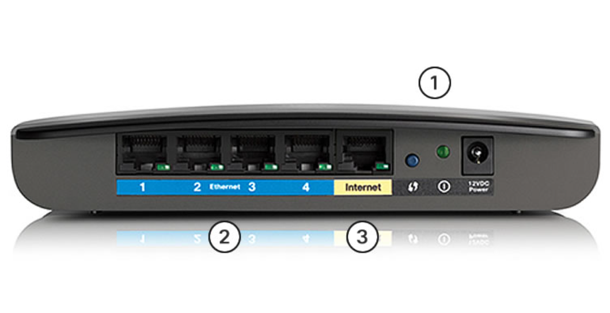
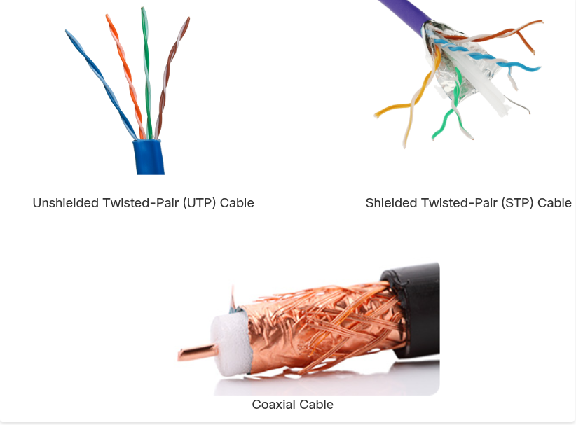
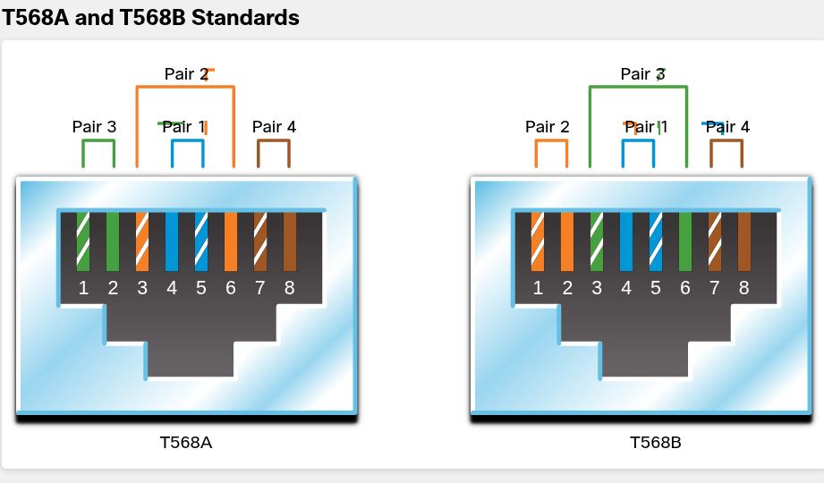

## 4.1 Purpose of the Physical Layer

### 4.1.1 The Physical Connection

- înainte să existe orice comunicare în rețea, trebuie să existe o **conexiune fizică**, fie prin cablu (wired), fie prin unde radio (wireless).

Câteva detalii care se pretează la întrebări tricky:

- **NIC (Network Interface Card)** — cardul care conectează dispozitivul la rețea. Ethernet NIC = wired, WLAN NIC = wireless.
- Un dispozitiv poate avea **unul sau ambele tipuri** de NIC. Exemplu clasic de capcană: "o imprimantă de rețea are de obicei doar Ethernet NIC" (nu WLAN), pe când un tablet/smartphone are de obicei **doar WLAN NIC**.
- În imaginea cu routerul wireless: cele 3 componente sunt antenele (integrate), porturile switch Ethernet (1-4), și portul Internet (WAN) — separat vizual (galben) de porturile LAN (albastre). Asta e o capcană frecventă: te întreabă care port e diferit și de ce.

### 4.1.2 The Physical Layer

Layer-ul fizic din OSI:

- Ia un **frame complet** de la data link layer
- Îl **codifică** ca semnale (electrice, optice, sau radio) care se transmit pe mediu
- La destinație, procesul e invers: semnalele sunt **preluate, reconstruite în biți**, apoi urcate ca frame complet la data link layer

---

## 4.2. Physical Layer Characteristics

#### 4.2.1 Physical Layer Standards

Reține distincția cheie, apare des la quiz:

- **TCP/IP standards** → implementate în **software**, guvernate de **IETF**
- **Physical layer standards** → implementate în **hardware**, guvernate de mai multe organizații: ISO, TIA/EIA, ITU, ANSI, IEEE, FCC/ETSI

#### 4.2.2 Physical Components

Cele **3 arii funcționale** ale standardelor physical layer — memorează-le exact, deseori apar ca "which THREE":

1. **Physical Components** (hardware: NIC-uri, conectori, cabluri)
2. **Encoding**
3. **Signaling**

#### 4.2.3 Encoding

- Encoding = conversia unui șir de biți într-un **cod predefinit** (pattern predictibil)
- **Manchester encoding**: tranziție de la low→high = bit 1, high→low = bit 0 (tranziția e la mijlocul perioadei de bit) — folosit în **10 Mbps Ethernet** (10BASE-T)
- Pentru rate mai mari: 100BASE-TX → **4B/5B**, 1000BASE-T → **8B/10B**

#### 4.2.4 Signaling

- Signaling = metoda prin care se generează semnalul fizic (electric/optic/radio) ce reprezintă 1 și 0
- Diferă pe fiecare tip de mediu: **copper** (electric), **fiber-optic** (optic), **wireless** (radio)

#### 4.2.5 Bandwidth

Cea mai frecventă capcană din tot modulul: **bandwidth ≠ viteza la care circulă biții**. Biții circulă mereu cam la viteza electricității/luminii, indiferent dacă ai 10Mbps sau 100Mbps. Bandwidth = **câți biți** trec într-o unitate de timp, nu cât de repede "aleargă" un bit individual.

Unități (memorează progresia ×1000): bps → Kbps → Mbps → Gbps → Tbps

#### 4.2.6 Bandwidth Terminology — aici sunt cele mai tricky întrebări din 4.2

Trei termeni ușor de confundat între ei:

| Termen         | Definiție                                                             | Observație cheie                      |
| -------------- | --------------------------------------------------------------------- | ------------------------------------- |
| **Latency**    | timpul (+ întârzieri) pentru ca datele să ajungă de la punctul A la B |                                       |
| **Throughput** | rata reală de transfer a biților, măsurată pe o perioadă de timp      | de obicei **mai mic** decât bandwidth |
| **Goodput**    | throughput minus overhead (headere, acknowledgments, retransmisii)    | e **cel mai mic** dintre toate        |

---

## 4.3 Copper Cabling

### 4.3.1 Characteristics of Copper Cabling

Avantaje cablu de cupru: ieftin, ușor de instalat, rezistență electrică mică.  
Dezavantaje: limitat de **distanță** și **interferență**.

Cei doi "dușmani" ai semnalului pe cupru — capcană clasică e să-i confunzi:

| Problemă                                                                                                                   | Ce e                         | Contra-măsură                                       |
| -------------------------------------------------------------------------------------------------------------------------- | ---------------------------- | --------------------------------------------------- |
| **EMI/RFI** (interferență electromagnetică/radio) — vine din exterior (motoare electrice, lumini fluorescente, unde radio) | distorsionează semnalul      | **shielding** (ecranare metalică) + împământare     |
| **Crosstalk** — vine din interiorul cablului, un fir "ascultă" câmpul magnetic al firului vecin                            | semnal parazit între perechi | **răsucirea firelor** (twisting) — anulează efectul |
#### 4.3.2 Types of Copper Cabling

Trei tipuri: **UTP, STP, Coaxial**.

#### 4.3.3 UTP (Unshielded Twisted-Pair)

- Cel mai comun tip de mediu de rețea
- **4 perechi** de fire răsucite, cod de culori
- Conector: **RJ-45**
- Twisting-ul singur oferă protecție (parțială) la interferență — fără shielding metalic

#### 4.3.4 STP (Shielded Twisted-Pair)

- Combină **shielding** (contra EMI/RFI) + **twisting** (contra crosstalk) — deci ambele tehnici, nu doar una
- Folosește tot conector **RJ-45**
- Mai scump și mai greu de instalat decât UTP
- Capcană: dacă shielding-ul nu e **împământat corect**, poate acționa ca o **antenă** și capta semnale nedorite — deci shielding prost făcut poate fi chiar contraproductiv

#### 4.3.5 Coaxial Cable

- Numele vine de la faptul că cei doi conductori împart **aceeași axă**
- Structură (de reținut ordinea, de la interior spre exterior): conductor de cupru → izolație plastică → împletitură de cupru/folie metalică (al doilea conductor + shield) → manta exterioară
- Conectori: **BNC, N-type, F-type**
- Deși UTP a înlocuit coaxialul în Ethernet modern, coaxialul e încă folosit la:
    - **instalații wireless** (leagă antena de echipamentul radio)
    - **cable internet** (ultima porțiune până la client, restul rețelei fiind fibră optică)

---

## 4.4 UTP Cabling

#### 4.4.1 Properties of UTP Cabling

UTP nu are shielding metalic — se bazează exclusiv pe **efectul de cancellation**:

- Firele dintr-o pereche sunt răsucite → câmpurile lor magnetice sunt opuse → se anulează reciproc, anulând și EMI/RFI extern
- Fiecare pereche colorată e răsucită cu **un număr diferit de răsuciri per metru** — asta întărește efectul de cancellation între perechi

#### 4.4.2 UTP Cabling Standards and Connectors

- Standardul comercial pentru cablare LAN: **TIA/EIA-568** (definește tipuri de cablu, lungimi, conectori, terminare, testare)
- **IEEE** definește caracteristicile electrice și clasifică pe categorii

Categorii — foarte des întrebate, memorează exact:

| Categorie | Viteză/Uz                                      |
| --------- | ---------------------------------------------- |
| Cat 3     | inițial voce, apoi date                        |
| Cat 5     | 100 Mbps (Fast Ethernet)                       |
| Cat 5e    | 1000 Mbps — **minim acceptabil azi**           |
| Cat 6     | 10 Gbps — **recomandat pentru instalații noi** |
| Cat 7     | 10 Gbps                                        |
| Cat 8     | 40 Gbps                                        |
#### 4.4.3 Straight-through și Crossover — capitolul cel mai tricky din tot modulul 4

Tabelul de mai jos e exact genul de lucru pus la "match the cable type with the standard/application":

| Tip cablu            | Standard                             | Aplicație                                                                 |
| -------------------- | ------------------------------------ | ------------------------------------------------------------------------- |
| **Straight-through** | ambele capete T568A SAU ambele T568B | conectează host↔switch/hub (**dispozitive diferite**)                     |
| **Crossover**        | un capăt T568A, celălalt T568B       | conectează dispozitive **similare** (switch↔switch, PC↔PC, router↔router) |
| **Rollover**         | Cisco proprietar                     | PC (serial) ↔ port consolă router/switch                                  |

---

## 4.5 Fiber-Optic Cabling

#### 4.5.1 Properties of Fiber-Optic Cabling

Fibra optică transmite date pe **distanțe mai mari** și la **bandwidth mai mare** decât orice alt mediu de rețea. Punct cheie: e **complet imună la EMI/RFI** (nu doar "mai puțin afectată" — complet imună, pentru că transmite lumină, nu electricitate).

Biții sunt codificați ca **impulsuri de lumină**. Cablul acționează ca un "waveguide" (light pipe).

#### 4.5.2 Types of Fiber Media

Două tipuri — foarte des puse la comparație directă:

| Caracteristică         | Single-Mode Fiber (SMF)                          | Multimode Fiber (MMF)                                 |
| :--------------------- | :----------------------------------------------- | :---------------------------------------------------- |
| **Sursă de lumină**    | laser                                            | LED                                                   |
| **Diametrul miezului** | mic, un singur fascicul urmează un traseu direct | mai mare, multiple raze de lumină/moduri de propagare |
| **Distanță**           | mare (long-haul, provideri)                      | mai mică                                              |
| **Cost**               | mai scump                                        | mai ieftin                                            |
| **Uz tipic**           | rețele de lungă distanță, backbone provider      | enterprise, distanțe scurte-medii în clădiri          |

#### 4.5.3 Fiber-Optic Cabling Usage

Patru industrii de utilizare — de reținut ca listă "which FOUR":

1. **Enterprise Networks** — backbone, interconectare infrastructură
2. **FTTH** (Fiber-to-the-Home) — broadband always-on pentru case/afaceri mici
3. **Long-Haul Networks** — conectare țări/orașe (provideri)
4. **Submarine Cable Networks** — cabluri submarine transoceanice

#### 4.5.4 Fiber-Optic Connectors

Tipuri de conectori: **ST, SC, LC (Simplex), LC Duplex Multimode**. Diferă prin dimensiuni și metoda de cuplare.

Detaliu util: unele switch-uri/routere folosesc porturi cu **SFP** (Small Form-factor Pluggable) — transceiver modular care acceptă diverse tipuri de conectori fiber.

#### 4.5.5 Fiber Patch Cords

Cod de culoare pe mantaua cablului — capcană clasică de memorat exact:

- **Galben** = single-mode
- **Portocaliu (sau aqua)** = multimode

#### 4.5.6 Fiber versus Copper — cel mai testat subcapitol, tabel de memorat

| Criteriu                     | UTP               | Fiber-Optic            |
| ---------------------------- | ----------------- | ---------------------- |
| Bandwidth                    | 10 Mb/s – 10 Gb/s | 10 Mb/s – **100 Gb/s** |
| Distanță                     | scurtă (1-100 m)  | lungă (1-100.000 m)    |
| Imunitate EMI/RFI            | scăzută           | **completă**           |
| Imunitate pericole electrice | scăzută           | **completă**           |
| Cost cablu+conectori         | cel mai mic       | **cel mai mare**       |
| Skill instalare necesar      | cel mai mic       | **cel mai mare**       |
| Precauții de siguranță       | cele mai mici     | **cele mai mari**      |

---

## 4.6 Wireless Media

#### 4.6.1 Properties of Wireless Media

Wireless transmite semnale electromagnetice (radio sau microunde). Cele **4 limitări** — apar aproape sigur ca "which FOUR are limitations of wireless":

1. **Coverage area** — materialele de construcție și terenul limitează acoperirea
2. **Interference** — telefoane fără fir, unele lumini fluorescente, cuptoare cu microunde
3. **Security** — nu necesită acces fizic la mediu → oricine în rază poate "asculta"
4. **Shared medium** — WLAN e **half-duplex** (doar un dispozitiv transmite/primește la un moment dat), deci bandwidth-ul e împărțit între toți utilizatorii

#### 4.6.2 Types of Wireless Media

Patru standarde — tabel de reținut exact (IEEE-ul e frecvent cerut la match):

| Standard      | IEEE     | Acoperire/Uz        | Detaliu cheie                                                                           |
| ------------- | -------- | ------------------- | --------------------------------------------------------------------------------------- |
| **Wi-Fi**     | 802.11   | WLAN                | folosește **CSMA/CA** (nu CSMA/CD!) — dispozitivul ascultă canalul înainte să transmită |
| **Bluetooth** | 802.15   | WPAN                | 1-100m, pairing între dispozitive                                                       |
| **WiMAX**     | 802.16   | broadband wireless  | topologie **point-to-multipoint**                                                       |
| **Zigbee**    | 802.15.4 | low-data, low-power | IoT, baterie de lungă durată (light switches, senzori medicali)                         |
#### 4.6.3 Wireless LAN

Un WLAN are nevoie de:

- **Wireless Access Point (AP)** — concentrează semnalele wireless și le leagă la infrastructura de cablu existentă
- **Wireless NIC adapters** — pe fiecare host