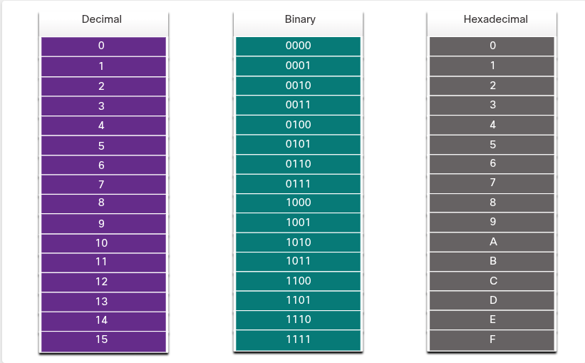

## 5.1 Binary Number System

#### 5.1.1 Binary and IPv4 Addresses

- **Binary** = sistem cu doar 2 cifre (biți): **0 și 1**
- **Decimal** = sistem cu 10 cifre: 0-9
- O adresă IPv4 = **32 de biți**, împărțiți în **4 octeți** (fiecare octet = **8 biți = 1 byte**), separați prin punct

#### 5.1.3 Binary Positional Notation

Ideea centrală: fiecare poziție dintr-un număr are o **valoare pozițională** = radix (bază) ridicat la puterea poziției.

**Pentru zecimal (radix = 10):**  
Poziții (dreapta→stânga): 10⁰, 10¹, 10², 10³ → valori: 1, 10, 100, 1000

**Pentru binar (radix = 2):**  
Poziții (dreapta→stânga), pe un octet de 8 biți:

| Poziție | 2⁷      | 2⁶     | 2⁵     | 2⁴     | 2³    | 2²    | 2¹    | 2⁰    |
| ------- | ------- | ------ | ------ | ------ | ----- | ----- | ----- | ----- |
| Valoare | **128** | **64** | **32** | **16** | **8** | **4** | **2** | **1** |

**Asta trebuie memorat pe de rost, fără să calculezi** — apare la fiecare conversie: 128-64-32-16-8-4-2-1.

Regulă de reținut: **n⁰ = 1** întotdeauna (nu 0!) — capcană frecventă la calcul rapid.

#### Exemplu de conversie (Binary → Decimal)

`11000000` → aliniezi bit cu valoarea pozițională, aduni doar unde e **1**:

|128|64|32|16|8|4|2|1|
|---|---|---|---|---|---|---|---|
|1|1|0|0|0|0|0|0|

128 + 64 = **192**

Al doilea exemplu din curs, ca să exersezi singur logica înainte să mergem mai departe: `10101000` → ce rezultat obții? (spune-mi tu calculul, verificăm împreună — cursul zice că răspunsul e 168, hai să vedem dacă-ți iese și ție din poziții).

### 5.1.5 Convert Binary to Decimal — exemplu complet pe o adresă

Adresa binară: `11000000.10101000.00001011.00001010`

|Octet|Binar|Decimal|
|---|---|---|
|1|11000000|128+64 = **192**|
|2|10101000|128+32+8 = **168**|
|3|00001011|8+2+1 = **11**|
|4|00001010|8+2 = **10**|

Rezultat: **192.168.11.10**

Verificare pe activitatea ta (5.1.6): bit pattern `0 0 0 1 0 0 1 0` → 16+2 = **18** ✓ corect calculat.

#### 5.1.7-5.1.8 Decimal to Binary Conversion — logica de "scădere"

Algoritmul, capcană sigură la un exercițiu inversat față de ce ai exersat până acum:

Pentru fiecare poziție, de la 128 spre 1:

- **Dacă numărul rămas ≥ valoarea poziției** → pui **1**, scazi valoarea poziției din număr
- **Dacă nu** → pui **0**, treci mai departe

Exemplu din curs — al treilea octet = **10**:

- 10 ≥ 128? Nu → 0
- 10 ≥ 64? Nu → 0
- 10 ≥ 32? Nu → 0
- 10 ≥ 16? Nu → 0
- 10 ≥ 8? Da → **1**, rămâne 10-8=2
- 2 ≥ 4? Nu → 0
- 2 ≥ 2? Da → **1**, rămâne 2-2=0
- 0 ≥ 1? Nu → 0

Rezultat: `00001010` ✓ (asta e exact octetul 4 pe care l-ai calculat mai devreme, 10 → 00001010)

**Shortcut util** pe care-l dă și cursul: pentru numere mici, poți "vedea" direct combinația fără să scazi pas cu pas. Ex: 10 = 8+2, deci direct 1 la poziția 8 și 1 la poziția 2. Foarte util pentru viteză la examen.

Verificare pe activitatea ta (5.1.9): 221 → bits `1 1 0 1 1 1 0 1` = 128+64+16+8+4+1 = **221** ✓ corect.

#### 5.1.11 IPv4 Addresses — sumar conceptual

Trei moduri de a privi aceeași adresă IP:

1. **Dotted Decimal**: `192.168.10.10` — formatul pe care-l vezi tu, om
2. **Octets**: cele 4 secțiuni separate prin punct
3. **32-bit Address**: forma reală pe care o "vede" routerul/PC-ul — un singur șir continuu de 32 de biți

---

## 5.2 Hexadecimal Number System

#### 5.2.1 Hexadecimal and IPv6 Addresses

Hex = sistem în **baza 16** — cifre **0-9** + literele **A-F** (A=10, B=11, C=12, D=13, E=14, F=15).

Motivul pentru care hex e util: **1 cifră hex = exact 4 biți** — deci e mult mai compact decât să scrii biți individuali, dar rămâne ușor de convertit (spre deosebire de zecimal, care nu se aliniază curat pe puteri ale lui 2).

**IPv6** — detalii memorabile, foarte des testate:

- Adresă IPv6 = **128 biți** (față de 32 biți la IPv4)
- Format: **8 grupuri** de câte 4 cifre hex, separate prin `:` → `x:x:x:x:x:x:x:x`
- Fiecare grup de 4 cifre hex = **16 biți** = un **"hextet"** (termen neoficial, analog cu "octet" la IPv4)
- IPv6 **nu e case-sensitive** — poți scrie hex cu litere mari sau mici

#### 5.2.3 Decimal to Hexadecimal Conversion

Procedeu în 3 pași (trece prin binar ca etapă intermediară — asta e cheia):

1. Convertești decimalul la binar pe 8 biți
2. Împarți binarul în **2 grupuri de câte 4 biți**, de la dreapta
3. Convertești fiecare grup de 4 biți în cifra hex corespunzătoare

Exemplu din curs: **168** → binar `10101000` → grupuri `1010` și `1000` → `1010`=A, `1000`=8 → **A8**

#### 5.2.4 Hexadecimal to Decimal Conversion

Invers, tot prin binar:

1. Fiecare cifră hex → grup de 4 biți
2. Concatenezi grupurile într-un octet de 8 biți
3. Convertești octetul binar în decimal (exact procedeul din 5.1.5)

Exemplu din curs: **D2** → D=`1101`, 2=`0010` → concatenat `11010010` → 128+64+16+2 = **210**