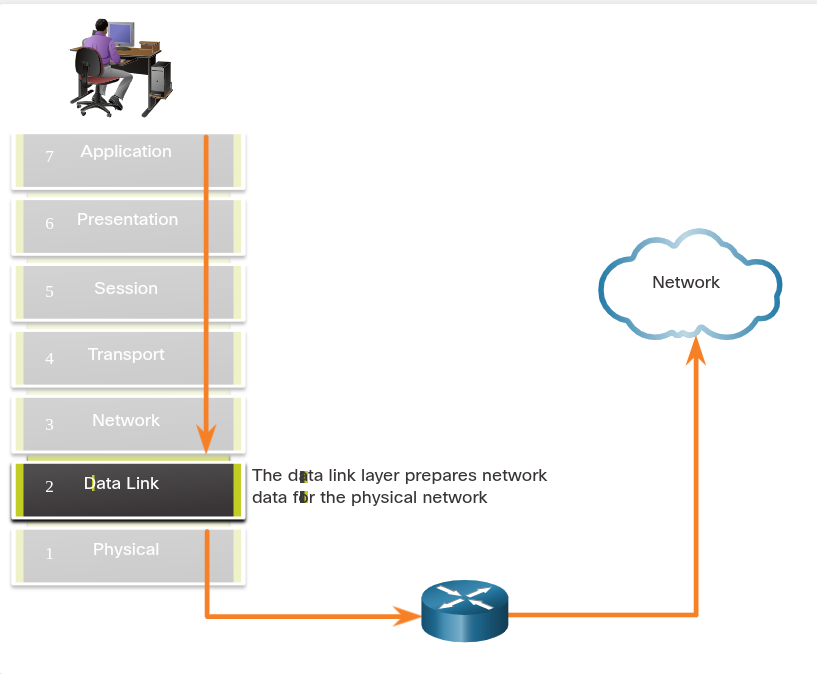
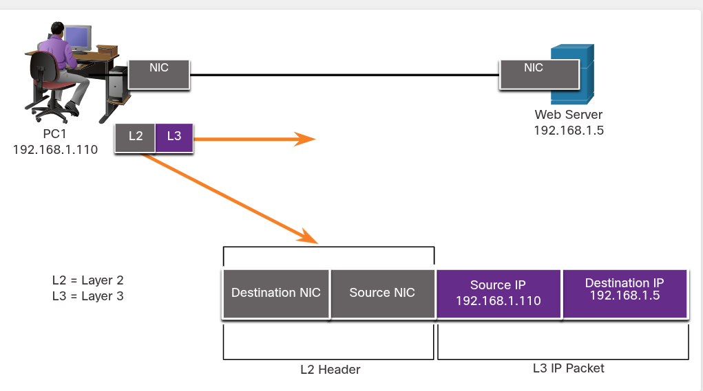
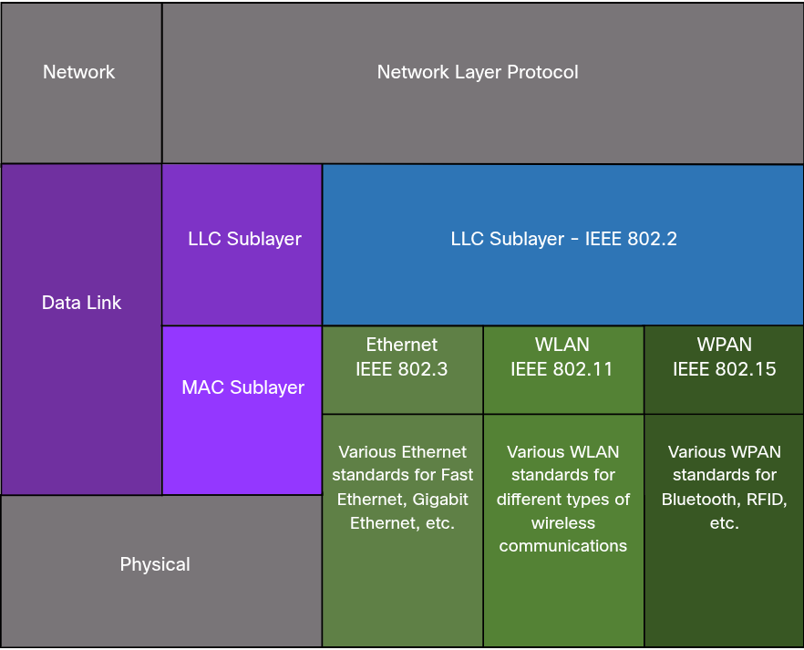
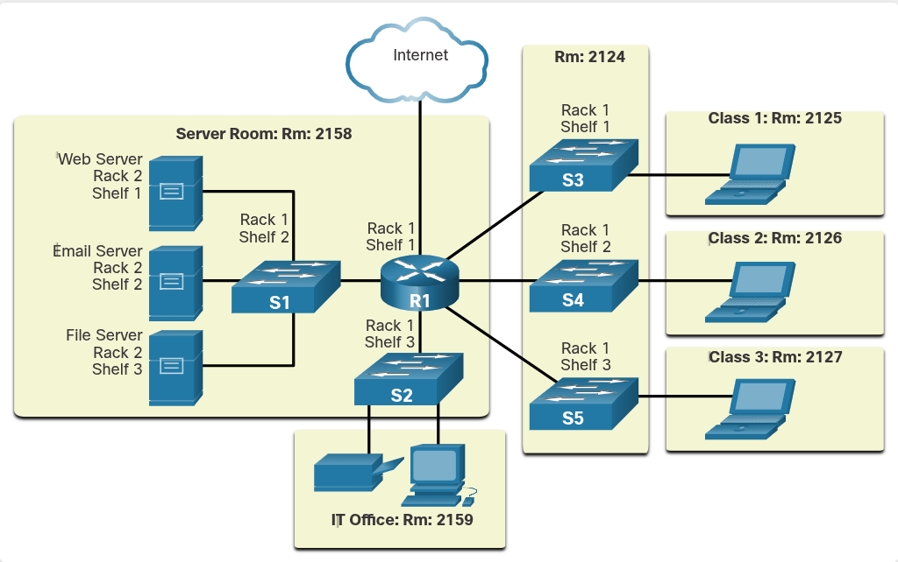
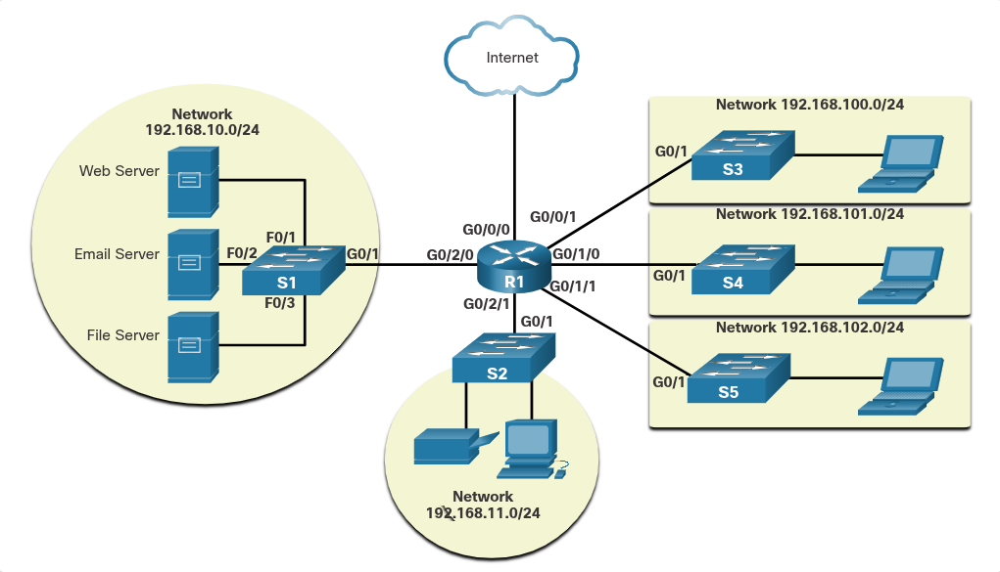
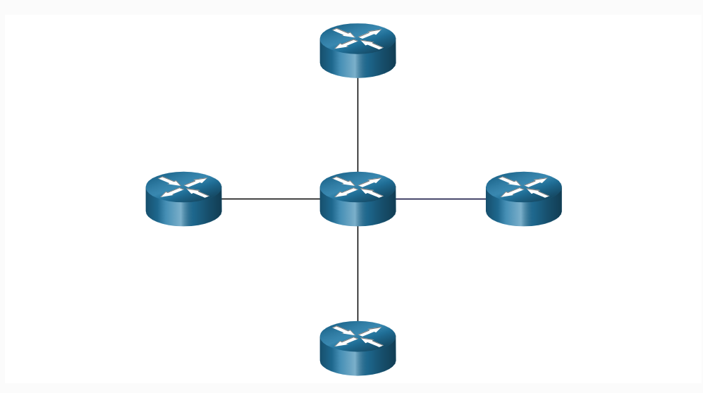
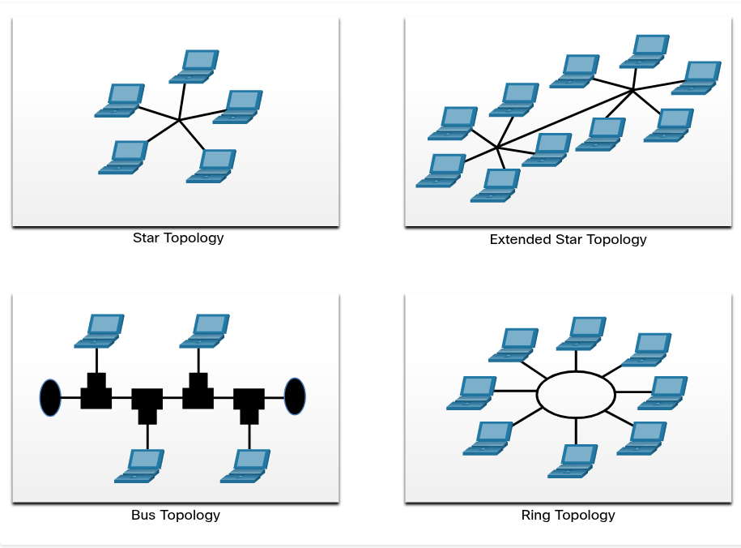
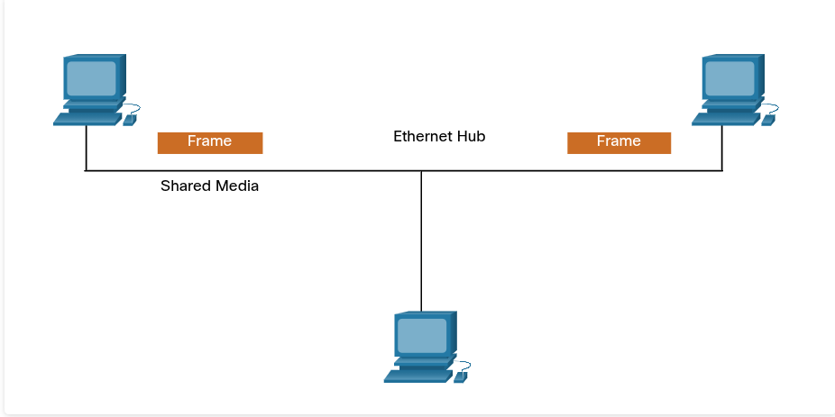
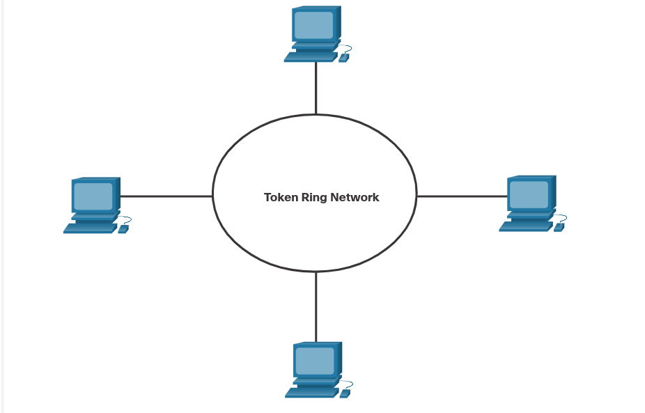

## 6.1. Purpose of the Data Link Layer

### 6.1.1 The Data Link Layer

- Data Link Layer este **Layer 2** din OSI.
- are rolul de face comunicarea NIC-to-NIC.
- **NIC = Network Interface Card** (placă de rețea). Este componenta hardware (fizică) dintr-un dispozitiv care îi permite să se conecteze la o rețea.

- Ce face concret:
	- **Permite layerelor de sus să acceseze mediul** - protocoale de sus (IP) nu știu deloc ce tip de mediu se folosește dedesubt (cablu, fibră, wireless), astfel data link layer ascunde acest detaliu.
	- **Ia pachete de Layer 3** (IPv4/IPv6) și le **încapsulează în frame-uri de Layer 2**.
	- Controlează **cum sunt plasate și primite** datele pe mediu.
	- **Schimbă frame-uri** între noduri, peste mediul de rețea.
	- La recepție: **dezîncapsulează** și direcționează pachetul către protocolul corect de sus
	- Face **detectare de erori** și **respinge frame-urile corupte**

#### Concept de "node"

Un **node** = orice dispozitiv care poate primi, crea, stoca sau transmite date pe traseul de comunicare. Poate fi:

- **end device** (laptop, telefon)
- **intermediary device** (switch Ethernet)

### 6.1.2 IEEE 802 LAN/MAN Data Link Sublayers

- Data link layer se împarte în **2 sublayere**:
	1. LLC (Logical Link Control) - IEEE 802.2
		- Face legătura între **software-ul de rețea** (layerele de sus) și **hardware-ul** de dedesubt
		- Ia datele de la Layer 3 (pachet IPv4/IPv6) și adaugă **informație de control Layer 2**
		- identifică **ce protocol Layer 3** e folosit în frame, asta permite ca **mai multe protocoale L3** (IPv4 și IPv6) să folosească **aceeași interfață și mediu** fizic, fără conflict

	2. MAC (Media Access Control) - IEEE 802.3, 802.11, sau 802.15
		- Implementat **în hardware**.
		- Controlează **NIC-ul** direct. Trimiterea/primirea de date pe mediul LAN/MAN.
		- Oferă **adresare Layer 2**.
		-  Face **încapsulare de date**, cu 3 funcții specifice:
		    1. **Frame delimiting** — marchează începutul/sfârșitul frame-ului (sincronizare între emițător și receptor)
		    2. **Addressing** — adresă sursă + destinație pentru transportul frame-ului
		    3. **Error detection** — trailer folosit ca să detecteze erori de transmisie
		- Oferă și **acces la mediu (media access control)** — gestionează cine transmite când, pe un mediu **shared/half-duplex**

### 6.1.3 Providing Access to Media

- Ideea centrală: **fiecare "hop" de-a lungul traseului poate avea o tehnologie diferită de Layer 2**, deci pachetul e reîncapsulat de fiecare dată când trece prin alt tip de mediu.

- #### Exemple de medii, contrast important:

	- **Ethernet LAN** — de obicei mulți hosturi **contend** pentru accesul la mediu (adică se "ceartă"/concurează pentru mediu, riscă coliziuni) → aici e nevoie de **MAC sublayer** ca să gestioneze accesul
	
	- **Serial links** — de obicei conexiune **directă între 2 dispozitive** (ex. router-router), fără concurență → **nu** au nevoie de tehnicile MAC de acces la mediu

- Ce face un router la fiecare hop — 4 pași, foarte testați ca ordine:
	1. - **Acceptă** un frame de pe mediu
	2. **De-încapsulează** frame-ul (scoate pachetul din el)
	3. **Re-încapsulează** pachetul într-un **frame nou** (potrivit pentru mediul următor)
	4. **Transmite** noul frame pe mediul segmentului următor

### 6.1.4 Data Link Layer Standards

- **RFC-urile** (Request for Comments) — definesc protocoalele layerelor **de sus** din TCP/IP (IETF le menține)

- **Data link layer NU e definit de RFC-uri** — protocoalele de Layer 2 sunt definite de **organizații de inginerie**, nu de IETF

- Organizațiile care definesc standardele pentru **network access layer** (adică OSI Physical + Data Link):
	- **IEEE**
	- **ITU**
	- **ISO**
	- **ANSI**

---

### 6.2 Topologies

- **Data link layer** trebuie să știe topologia logică a rețelei ca să poată transfera frame-uri corect de la un dispozitiv la altul.

- **Topologie** = aranjamentul/relația dintre dispozitivele de rețea și conexiunile dintre ele.

- Există 2 tipuri de tipologii:
	
1. Topologia fizică:
		- Arată conexiunile fizice reale: cum sunt interconectate dispozitivele finale și intermediare (routere, switch-uri, AP-uri wireless)
		- De obicei e **point-to-point** sau **star** (stea)

2. Topologia logica:
		- Arată **cum circulă frame-urile** de la un nod la altul
		- Identifică conexiuni virtuale, folosind interfețele dispozitivelor și adresarea IP (Layer 3).

### 6.2.2 WAN Topologies

**1. Point-to-Point**
- Cea mai simplă și mai comună topologie WAN
- Constă dintr-o legătură **permanentă** între **două** puncte terminale (endpoints)

**2. Hub and Spoke**
- O variantă a topologiei point-to-point
- Un site central (**hub**) este conectat la mai multe site-uri periferice (**spokes**) printr-o legătură point-to-point
- Traficul de la un spoke la altul trece prin hub

**3. Mesh**
- Fiecare site este conectat la fiecare alt site
- Oferă disponibilitate ridicată, dar e scump și complex din cauza numărului mare de conexiuni
- Poate fi **full mesh** (toate site-urile interconectate direct) sau **partial mesh** (doar unele conectate direct)

### 6.2.3 Point-to-Point WAN Topology

#### **Topologia fizică point-to-point:**

- Conectează direct **doi noduri** (Node 1 – Node 2)
- Nodurile **nu trebuie să împartă mediul** cu alte host-uri
- Când se folosește un protocol serial precum **PPP (Point-to-Point Protocol)**, un nod **nu trebuie să verifice** dacă un frame primit e destinat lui sau altui nod → pentru că nu există altă opțiune, tot ce vine pe acel mediu e pentru el
- De aceea protocoalele data link pot fi **foarte simple**
- Nodul pune frame-urile pe mediu la un capăt, celălalt nod le preia la capătul opus

### 6.2.4 LAN Topologies

**Multiaccess LANs** folosesc topologii **star** sau **extended star**:

**Star**
- Dispozitivele finale se conectează la un dispozitiv intermediar central (de obicei un **switch Ethernet**)

**Extended Star**
- Extinde topologia star prin interconectarea mai multor switch-uri Ethernet

**Avantaje star/extended star:**
- Ușor de instalat
- Foarte scalabile (ușor de adăugat/eliminat dispozitive)
- Ușor de depanat

📌 Notă istorică: topologiile star vechi foloseau **huburi Ethernet** (nu switch-uri).

### 6.2.5 Half and Full Duplex Communication

Duplex = direcția de transmisie a datelor între două dispozitive. Sunt 2 moduri.

**Half-duplex**

- Ambele dispozitive pot transmite și primi, dar **nu simultan**
- Doar unul poate trimite/primi la un moment dat pe mediul comun
- Folosit de: **WLAN-uri** (wireless) și topologiile legacy **bus cu hub-uri Ethernet**

**Full-duplex**

- Ambele dispozitive pot transmite **și** primi **simultan**
- Data link layer presupune că mediul e disponibil pentru transmisie în ambele direcții, oricând
- **Switch-urile Ethernet** funcționează implicit (by default) în full-duplex
- Excepție: un switch poate trece în half-duplex dacă se conectează la un dispozitiv precum un **hub Ethernet**

### 6.2.6 Access Control Methods

**Multiaccess network** = rețea în care 2+ dispozitive finale pot încerca să acceseze rețeaua **simultan** (ex: LAN-uri Ethernet, WLAN-uri).

Există **2 metode de bază** pentru controlul accesului la mediul comun:

**1. Contention-based access (acces prin competiție)**
- Toate nodurile lucrează în **half-duplex**, concurând pentru mediu
- Doar **un** dispozitiv poate transmite la un moment dat
- Dacă transmit mai multe deodată → există un proces de gestionare a conflictului

Exemple:
- **CSMA/CD** – folosit pe LAN-uri Ethernet legacy cu topologie **bus**
- **CSMA/CA** – folosit pe **WLAN-uri**

**2. Controlled access (acces controlat)**
- Fiecare nod are **propriul său timp** alocat pentru a folosi mediul (deterministic)
- **Ineficient** — dispozitivul trebuie să-și aștepte rândul chiar dacă mediul e liber

Exemple:1
- **Legacy Token Ring**
- **Legacy ARCNET**

### 6.2.7 Contention-Based Access - CSMA/CD

**Exemple de rețele contention-based:**
- Wireless LAN → foloseste **CSMA/CA**
- Legacy bus-topology Ethernet LAN → **CSMA/CD**
- Legacy Ethernet LAN cu hub → **CSMA/CD**

**Ce se întâmplă când 2 dispozitive transmit simultan:**
- Apare o **coliziune**
- Pe LAN-urile Ethernet legacy, ambele dispozitive **detectează coliziunea** — asta e partea de **Collision Detection (CD)** din CSMA/CD
- Cum detectează? NIC-ul compară datele transmise cu datele recepționate, sau recunoaște că amplitudinea semnalului e mai mare decât normal pe mediu
- Datele trimise de ambele dispozitive sunt **corupte** și trebuie **retransmise**

**Procesul CSMA/CD pe un LAN legacy cu hub**:
1. **PC1 trimite un frame**
2. **Hub-ul primește frame-ul**
3. **Hub-ul trimite frame-ul** mai departe către toate porturile (pentru că hub-ul nu face nimic "inteligent" — doar repetă semnalul către toate celelalte porturi)

### 6.2.8 Contention-Based Access - CSMA/CA

**CSMA/CA** (Carrier Sense Multiple Access with **Collision Avoidance**) este folosit de rețelele **IEEE 802.11 WLAN** (wireless).

**Diferența cheie față de CSMA/CD:**

- CSMA/CA folosește o metodă similară pentru a verifica dacă mediul e liber, dar are tehnici suplimentare
- În mediile wireless, **nu e întotdeauna posibil** ca un dispozitiv să detecteze o coliziune
- De aceea, CSMA/CA **nu detectează** coliziuni — în schimb, încearcă să le **evite** (avoidance), așteptând înainte de a transmite

**Cum funcționează evitarea:**

- Fiecare dispozitiv care transmite include **durata de timp** de care are nevoie pentru transmisie
- Toate celelalte dispozitive wireless primesc această informație și știu **cât timp va fi mediul indisponibil**

**Exemplu din curs:**

- Dacă host-ul A primește un frame wireless de la access point
- Host-urile B și C văd și ele frame-ul, și află cât timp va fi ocupat mediul

---

## 6.3. Data Link Frame

### 6.3.1 The Frame

- Data link layer **încapsulează** datele primite de sus (de obicei un pachet IPv4/IPv6) adăugând un **header** și un **trailer**, formând un **frame**.
- Protocolul data link e responsabil de comunicarea **NIC-to-NIC** în interiorul aceleiași rețele.

**Orice tip de frame are 3 părți de bază:**
1. **Header**
2. **Data**
3. **Trailer**

**Alte puncte importante:**
- Toate protocoalele data link încapsulează datele în câmpul **Data** al frame-ului
- Dar **structura** frame-ului și câmpurile din header/trailer **diferă** în funcție de protocol
- **Nu există o structură universală de frame** valabilă pentru toate tipurile de medii — cantitatea de informație de control depinde de:
    - cerințele de control al accesului la mediu
    - topologia logică

**Exemplu concret dat de curs:**
- Un frame **WLAN** trebuie să includă proceduri pentru **collision avoidance** → deci are nevoie de **mai multă informație de control** decât un frame Ethernet

### 6.3.2 Frame Fields

**Framing** = împarte fluxul de biți în grupări descifrabile, cu informație de control inserată în header/trailer, sub formă de câmpuri (fields). Așa se dă structură semnalelor fizice, structură pe care nodurile o recunosc și o decodifică în pachete la destinație.

⚠️ Nu toate protocoalele includ toate câmpurile — fiecare standard de protocol data link definește propriul format exact de frame.

**Câmpurile generice ale unui frame** (structura completă din a doua imagine):

`Frame Start | Addressing | Type | Control | Data | Error Detection | Frame Stop`

**Detalii pentru fiecare câmp:**

1. **Frame start and stop indicator flags** – marchează începutul și sfârșitul frame-ului
2. **Addressing** – indică nodul sursă și destinație pe mediu
3. **Type** – identifică protocolul **Layer 3** conținut în câmpul data
4. **Control** – identifică servicii speciale de flow control, ex: **QoS (Quality of Service)**
    - QoS dă prioritate de forwarding anumitor tipuri de mesaje
    - Ex: frame-urile **VoIP** primesc prioritate pentru că sunt sensibile la întârziere (delay)
5. **Data** – conține payload-ul frame-ului (header de pachet, header de segment, și datele efective)
6. **Error Detection** – inclus după data, formează trailer-ul

**Despre trailer și detectarea erorilor (parte importantă pentru examen):**

- Protocoalele data link adaugă un **trailer** la finalul fiecărui frame
- Procesul se numește **error detection** → verifică dacă frame-ul a ajuns fără erori
- E necesar pentru că semnalele pe mediu pot fi afectate de interferență, distorsiune sau pierdere

**Cum funcționează concret:**

- Nodul care transmite creează un **rezumat logic** al conținutului frame-ului = valoarea **CRC (Cyclic Redundancy Check)**
- Această valoare e pusă în câmpul **FCS (Frame Check Sequence)**
- În Ethernet, FCS-ul permite nodului receptor să determine dacă frame-ul a avut erori de transmisie

### 6.3.3 Layer 2 Addresses

Data link layer oferă adresarea folosită pentru transportul unui frame peste mediul local partajat. Adresele la acest nivel se numesc **adrese fizice** (MAC).

- Sunt conținute în **header-ul frame-ului**
- Specifică nodul **destinație** pe rețeaua locală
- De obicei se află la **începutul** frame-ului, ca NIC-ul să poată determina rapid dacă frame-ul îi e adresat, înainte să accepte restul
- Header-ul poate conține și adresa **sursă**

### 6.3.4 LAN and WAN Frames

**LAN-uri (wired):** folosesc protocoale **Ethernet**  
**Wireless:** folosesc protocoale **WLAN (IEEE 802.11)**

Ambele au fost proiectate pentru **multiaccess networks**.

---

**WAN-uri**, tradițional, au folosit alte tipuri de protocoale pentru topologii point-to-point, hub-spoke și full-mesh:

- **PPP** (Point-to-Point Protocol)
- **HDLC** (High-Level Data Link Control)
- **Frame Relay**
- **ATM** (Asynchronous Transfer Mode)
- **X.25**

📌 **Tendință actuală:** aceste protocoale Layer 2 pentru WAN sunt acum înlocuite tot mai mult de **Ethernet**.

