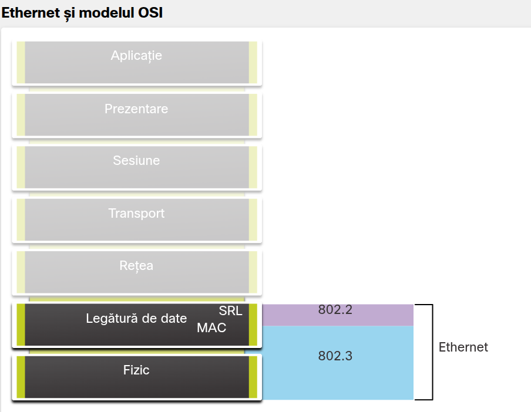
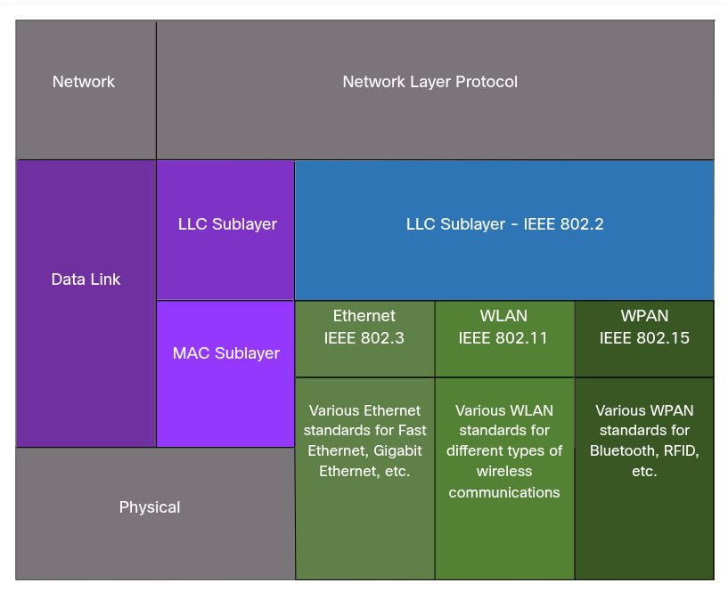
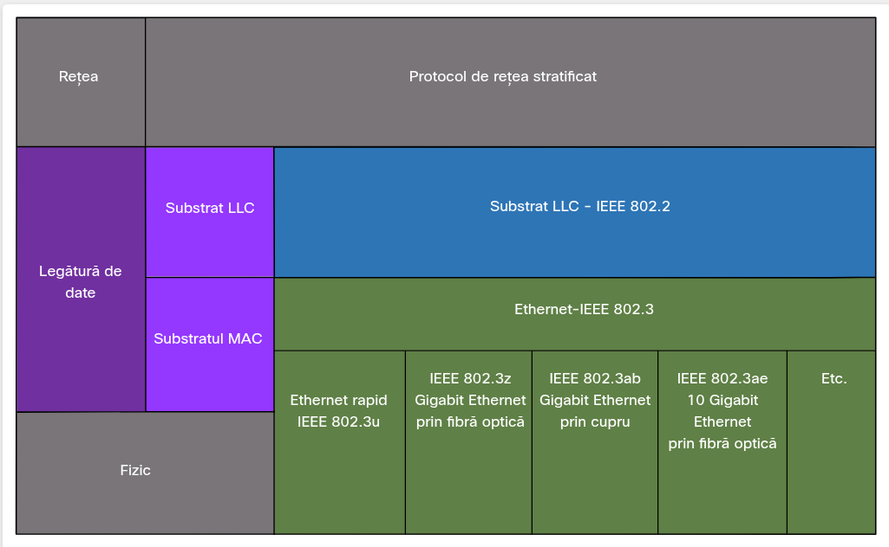
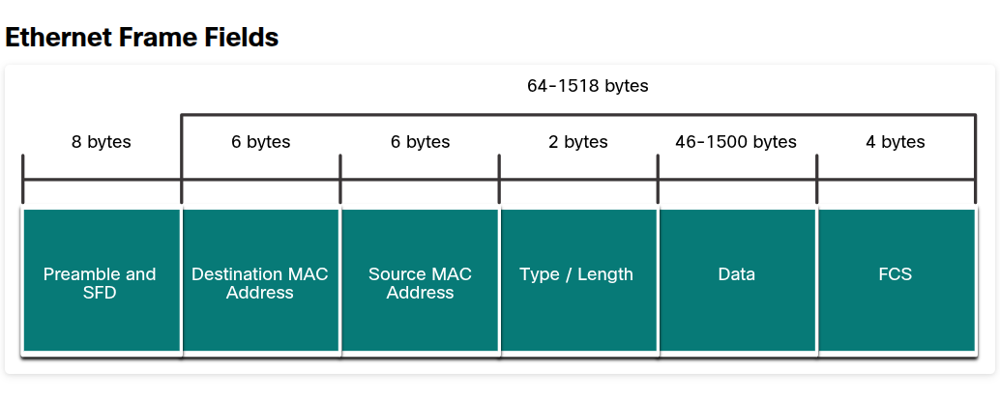
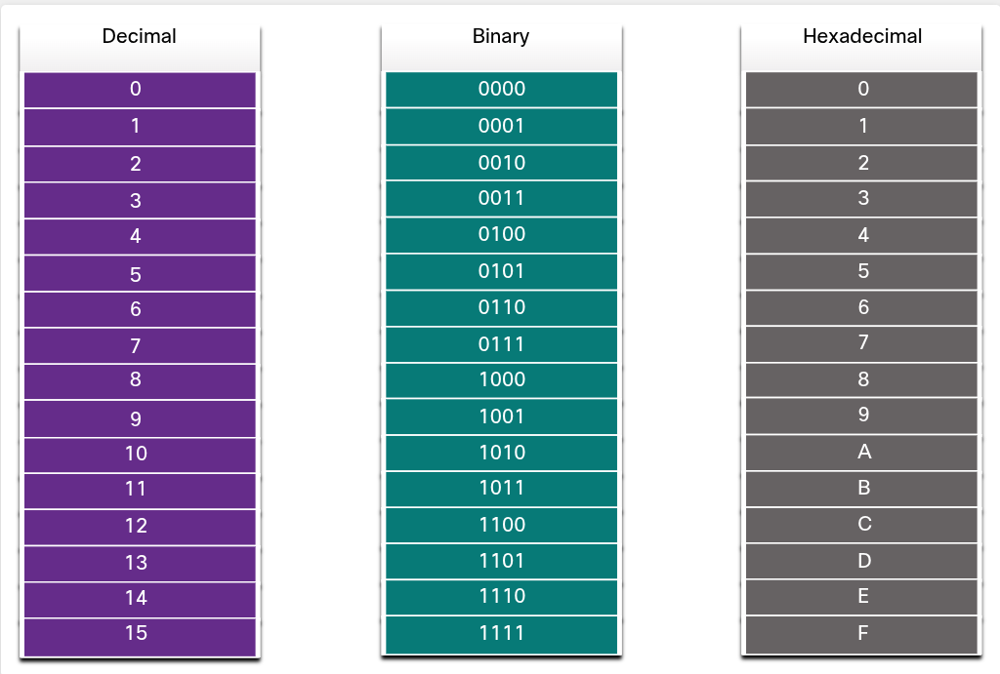
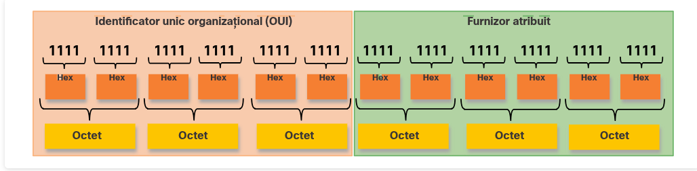
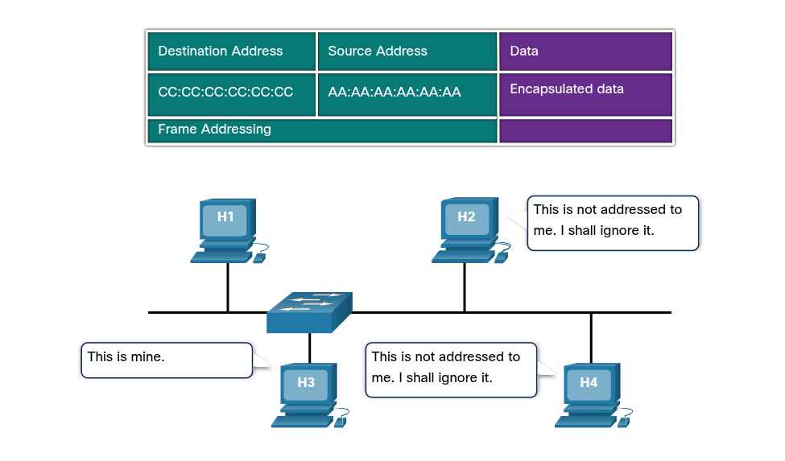

## 7.1 Ethernet Frames

### 7.1.1 Ethernet Encapsulation

- **Ethernet-ul** este una dintre cele 2 tehnologii LAN folosite astăzi, cealalta fiind rețelele LAN fără fir (WLAN).

- **Ethernet-ul** folosește pentru comunicații cabluri, inclusiv cabluri torsadate, dar și fibra optică și cablul coaxial.

- **Ethernet-ul** funcționază pe layer-ul ***physical și data link***.

- este o familie de tehnologii de rețea, care este definită în standarde IEEE 802.2 și 802.3.

- **Viteze de bandwidth suportate:**
	- 10 Mbps 
	- 100 Mbps
	- 1000 Mbps (1 Gbps) 
	- 10,000 Mbps (10 Gbps) 
	- 40,000 Mbps (40 Gbps) 
	- 100,000 Mbps (100 Gbps)

### 7.1.2 Data Link Sublayers

- Pentru a funcționa, atât protocolul IEEE 802 LAN/MAN, cât și Ethernet, utilizează următoarele 2 subniveluri separate ale Data Link-ului:
	- ***LLC SubLayer:***
		1. Comunică între ***software-ul*** de la LAYERELE superioare și ***hardware-ul*** de la LAYERELE inferioare.
		2. Plasează informația într-un ***frame*** care indentifică tipul de protocol de la ***nivelul rețea***.
		3. Permite mai multor protocoale de nivel 3, cum ar fi **IPv4** sau ***IPv6*** să utilizeze aceeași interfață de rețea.

	- ***MAC SubLayer:***
		1. Este implementat direct în hardware.
		2. Este responsabil de încapsulare și controlul mediului de acces.
		3. Acesta oferă adresare pentru layer-ul de data link și este integrat în diverse tehnologii de la layer-ul physical.

### 7.1.3 MAC Sublayer

- ***MAC Sublayer*** este responsabil de încapsulare și controlul mediului de acces.

#### Data Encapsulation (Încapsulare datelor) include:

- ***Ethernet frame:*** reprezintă structura internă a ***Ethernet frame.***

- ***Ethernet addressing:*** ***Ethernet frame*** include o adresă MAC sursă și una destinație, ca să poată livra frame-ul de la un NIC la alt NIC, pe același LAN.

- ***Ethernet  Error detection:*** ***Ethernet frame*** conține un trailer **FCS** (Frame Check Sequence) pentru detectare de erori.

#### Ethernet clasic:
- utilizează tipologie de tip bus/magistrală sau hub-uri.
- este un mediu half-duplex partajat.
- utilizează o metodă bazată pe o convenție, detecția coliziunilor(CSMA/CD), asigurând că doar un singur divice transmite la un moment dat.
- oferă un algoritm de tip ***back-off*** pentru retransmitere.

#### Ethernet modern:
- utilizează switch-uri care funcționează în full-duplex.
- comunicațiile de tip full-duplex cu switch-uri ethernet nu necesită controlul accesului prin CSMA/CD.

#### 7.1.4 Ethernet Frame Fields

- Dimensiunea minimă pentru Ethernet Frame este de 64 bytes și cea maximă de 1518 bytes. Această dimensiune include toți bytes de la MAC destination până la câmpul FCS.

- Orice frame mai mic < 64 este considerat ***collission fragment*** sau ***runt frame***.
- Orice frame mai mare > 1500 este considerat ***jumbo*** sau ***baby giant frames.***
- Dacă frame-ul este mai mic decât minimul sau mai mare decât maximul, atunci device-ul receptor pierde frame-ul. Astfel frame-ul pierdut este rezultatul unei coliziuni sau semnal nedorit, fiind nevalide.
- Frame-urile jumbo sunt acceptate în mare parte de switch-uri, FastEthernet NIC și GigabitEthernet NIC.

#### Ethernet Frame Fields commponente:
- ***Preamble and SFD***: pentru sincronizarea dintre device-ul emițătorului și receptorului.
- ***Destination MAC Address***: identificatorul destinatarului dorit.
- ***Source MAC Address***: identifică NIC-ul sau interfața de origine a frame-ului.
- ***Type / Length***: Identifică tipul protocolului folosit la nivelul superior.
- ***Data***: Conține datele încapsulate dintr-un câmp superior.
- ***FCS***: pentru detectarea erorilor dintr-un frame.

---

## 7.2 Ethernet MAC Address 

### 7.2.1 MAC Address and Hexadecimal

- adresele IPv4 sunt reprezentate în baza 10, respctiv în baza 2.
- adresele IPv6 și Ethernet sunt reprezentate în hexazecimal.
- numerele în hexazecimal folosesc cifrele 0-9 și literele A-F.
- o adresă Ethernet MAC pe 48 biți. Astfel se pot folosi 12 valori în hexazecimal pentru reprezentare. O cifră în hexazecimal poate fi reprezentată pe 4 biți.

### 7.2.2 Ethernet MAC Address

- într-o rețea locală, fiecare device este conectat la același mediu partajat, iar adresa MAC este utilizată pentru a determina NIC-ul sursă și cel destinație. Tot adresa MAC oferă o metodă de identificare pentru layer-ul data link. 

- **48 biți = 12 cifre hex = 6 bytes** (fiecare byte = 2 cifre hex = 8 biți)

-  o adresă MAC trebuie să fie unică pentru un device Ethernet sau interfață Ethernet. Astfel fiecare producător trebuie să se înregistreze la IEEE pentru a obține identificatorul unic  organizațional(OUI).

### 7.2.3 Frame Processing

- uneori adresa MAC se mai numește și burned-in address (BIA) pentru ca este hardcodată în chip-ul ROM.
- de fiecare dată când se pornește pc-ul, NIC-ul copiază adresa MAC din ROM în memoria RAM.
- Antetul Ethernet conține:
	1. ***Source MAC address:*** adresa MAC a NIC-ului device-ului sursă.
	2. ***Destination MAC address:*** adresa MAC a NIC-ului device-ului destinație.

**Notă:** NIC-ul este responsabil să comparere adresa MAC din frame cu cea din memoria RAM de pe divice.  Dacă nu se potrivește îl elimină.

### 7.2.4 Unicast MAC Address

- comunicare 1 la 1. 
- un frame trimis de la un dispozitiv transmițător la un sigur dispozitiv destinație.
- Detalii importante de proces:
	1. ca să trimiți un pachet unicast ai nevoie de ***un destination IP(pachet IP)*** + ***o adresă MAC corespunzătoare (în headerul Ethernet).***
	2. **ARP (Address Resolution Protocol)** - proces prin care host-ul determină MAC-ul destinație pentru o adresă IPv4.
	3. ND (Neighbor Discovery) - echivalentul lui IPv6.

### 7.2.5 Broadcast MAC Address

- trimite către toate dispozitivile.
- caracterisitci:
	1. Adresă destination MAC = **FF-FF-FF-FF-FF-FF** (hex) = **48 de biți de 1** (binar)
	2. Inundă toate porturile switch-ului Ethernet, cu excepția portului de intrare.
	3. Nu este redirecționat de router (routerele opresc broadcast-urile la graniță).

### 7.2.5 Multicast MAC Address

- trimis către un **grup specific** de dispozitive
- caracteristici cheie:
	1. destination MAC = **01-00-5E** (când datele încapsulate sunt pachet **IPv4** multicast) sau **33-33** (când sunt **IPv6** multicast).
	2. Există și alte adrese multicast rezervate pentru trafic non-IP, ex. **STP** (Spanning Tree Protocol) și **LLDP** (Link Layer Discovery Protocol)
	3. Inundă toate porturile switch-ului Ethernet, cu excepția portului de intrare, **cu excepția** dacă switch-ul e configurat pentru **multicast snooping**.
	4. Nu este redirecționat de router, decât dacă router-ul este configurat pentru multicast.

---

## 7.3 The MAC Address Table

### 7.3.1 Switch Fundamentals

- fără MAC table, fiecare switch ar trebui să dea forward pe toate porturile, ceea ce ar duce la o congestie masivă.
- un switch de layer 2 decide doar pe baza MAC address, el nu vede IPv4 sau IPv6 sau ARP  din interiorul framelui.
- la pornire, MAC table este empty, acesta umplându-se pe parcurs, proces numit ”learning”.

### 7.3.2 Switch Learning and Forwarding

- switch-ul construiește dinamic tabelul de adrese MAC examinând adresele MAC sursă din frame-urile primite, ceea ce înseamnă că învăță din MAC address-ul sursă.
- el face forward/redirecționare pe baza adresei MAC destinație.

#### PARTEA 1 — LEARN (învățare)

Procesul:

1. La fiecare frame primit, switch-ul verifică source MAC address-ul + portul pe care a intrat.
2. Dacă MAC-ul sursă NU există în tabel, atunci el este adăugat în tabel alături de portul sursă.
3. Dacă există doar actualizează refresh timer-ul.
4. Timeou implicit: 5 min. Dacă o intrare nu mai primește  trafic nou de la respectivul MAC, atunci este șters după 5 minute.

#### PARTEA 2 — FORWARD (transmitere)

Procesul, pentru **destination MAC unicast**:

1. Switch-ul caută **destination MAC** în tabel
2. **Dacă e găsit** → trimite frame-ul **doar pe portul specificat** (forwarding direcționat, eficient)
3. **Dacă NU e găsit** → trimite frame-ul **pe toate porturile, exceptând portul de intrare** asta se numește **"unknown unicast"**

### 7.3.3 Filtering Frames

- filtering este rezultatul procesului de Learn + Forward, proces prin care switch-ul este capabil să tirmită **doar pe portul specific** unde e destinația pentru că MAC-ul destination e deja cunoscut în tabel.

---

## 7.4 Switch Speeds and Forwarding Methods

### 7.4.1 Frame Forwarding Methods on Cisco Switches

- Cisco switch-urile au 2 metode de forwarding:

#### Store-and-Forward Switching

 Procesul:
	1. Primește **întregul frame** (complet)
	2. Calculează **CRC** (Cyclic Redundancy Check) — formulă matematică bazată pe numărul de biți (1-uri) din frame, ca să verifice erori
	3. **Dacă CRC e valid** → caută destination address → determină portul de ieșire → forward
	4. **Dacă CRC e invalid** (erori detectate) → **frame-ul e aruncat** (discarded)

- avantajul este că detectează erorile înainte de propagarea frame-ului

#### Cut-Through Switching

Procesul:
- Trimite frame-ul **înainte să fie complet primit**
- **Minimul necesar**: doar **destination address** trebuie citit înainte de a începe forward-ul

### 7.4.2 Cut-Through Switching

- Switch-ul acționează asupra datelor **imediat ce sunt recepționate**, chiar dacă transmisia nu e completă
- Stochează în buffer **doar atât cât e necesar** ca să citească **adresa MAC de destinație**
- Adresa MAC destinație e localizată în **primii 6 octeți** ai cadrului, care urmează după **preambul**
- Switch-ul caută MAC-ul destinație în **tabelul de comutare** (MAC table), determină portul de ieșire, și **redirecționează** cadrul
- **Nu efectuează nicio verificare de erori**

#### 2 variante de Cut-Through — capcană importantă de nou nivel

|                      | Comutare rapidă înainte (Fast-Forward) | Comutare fără fragmente (Fragment-Free) |
|----------------------|-----------------------------------------|-----------------------------------------|
| **Ce citește**       | doar **adresa destinație**              | primii **64 octeți** ai cadrului        |
| **Latență**          | **cea mai mică posibilă**               | puțin mai mare decât fast-forward       |
| **Verificare erori** | deloc                                   | verifică parțial (zona unde apar cele mai dese coliziuni) |
| **E "metoda tipică" de cut-through?** | **da** | nu, e o variantă intermediară |

- Cut-through citește destinația din **primii 6 octeți** (după preambul) = dimensiunea unui MAC address
- 2 variante:
    - **Fast-Forward** = citește doar MAC destinație, latență minimă, metoda "tipică" de cut-through
    - **Fragment-Free** = citește primii **64 octeți** (zona cu cele mai multe coliziuni), compromis latență/integritate
- Unele switch-uri sunt **adaptive**: cut-through ↔ store-and-forward, în funcție de rata de erori (prag configurabil)

### 7.4.3 Memory Buffering on Switches

- switch-ul folosește **buffering** ca să stocheze cadre **înainte de a le transmite** util mai ales când **portul de destinație e ocupat** din cauza congestiei.

#### Memorie bazată pe porturi (Port-based memory)

- Cadrele sunt stocate în **cozi** legate de **porturi specifice** de intrare/ieșire
- Un cadru e transmis către portul de ieșire **doar după** ce toate cadrele anterioare din **aceeași coadă** au fost transmise cu succes
- **Problemă majoră**: un **singur cadru** poate întârzia transmiterea **tuturor** celorlalte cadre din memorie, dacă portul destinație e ocupat — **chiar dacă** celelalte cadre ar putea fi trimise către porturi de destinație complet libere

#### Memorie partajată (Shared memory)

- **Toate** cadrele merg într-un **buffer comun**, partajat de **toate porturile** switch-ului
- Cantitatea de memorie alocată fiecărui port e **dinamică**
- Cadrele sunt legate **dinamic** de portul de destinație — permite ca un pachet primit pe un port să fie transmis pe alt port **fără să fie mutat** într-o altă coadă fizică

### 7.4.4 Duplex and Speed Settings

Cele **2 setări de bază** pe fiecare port de switch:
1. **Bandwidth** (numit uneori "speed")
2. **Duplex**

- setările de **duplex și bandwidth trebuie să se potrivească exact** între portul switch-ului și dispozitivul conectat (PC, alt switch etc.) — dacă nu se potrivesc, apar probleme de comunicare (asta e o cauză clasică reală de troubleshooting, nu doar teorie de examen).

-  **Full-duplex** = trimite+primește simultan (fără CSMA/CD necesar)
- **Half-duplex** = doar un capăt transmite la un moment dat (necesită CSMA/CD)

#### Autonegotiation

- Funcție **opțională**, prezentă pe majoritatea switch-urilor și NIC-urilor moderne
- Permite celor 2 dispozitive să **negocieze automat** cea mai bună combinație de speed + duplex
- **Full-duplex e ales dacă ambele dispozitive suportă** asta, împreună cu **cel mai mare bandwidth comun** ambelor

### 7.4.5 Auto-MDIX

#### Regula clasică (fără auto-MDIX):

- **Crossover** → între **dispozitive similare** (switch-switch, host-host, router-router)
- **Straight-through** → între **dispozitive diferite** (switch-router, switch-host)

#### Auto-MDIX — ce rezolvă

- Feature suportat de majoritatea switch-urilor moderne
- Detectează **automat** tipul de cablu conectat la port și **configurează interfața corespunzător**
- Rezultat practic: poți folosi **fie crossover, fie straight-through**, pe un port copper 10/100/1000, **indiferent** de tipul dispozitivului de partea cealaltă

#### Detalii tehnice/istorice importante

- Activat **implicit (by default)** pe switch-uri cu **Cisco IOS Release 12.2(18)SE sau ulterior**
- Poate fi **dezactivat** manual
- Comandă pentru reactivare: **`mdix auto`** (interface configuration command)
