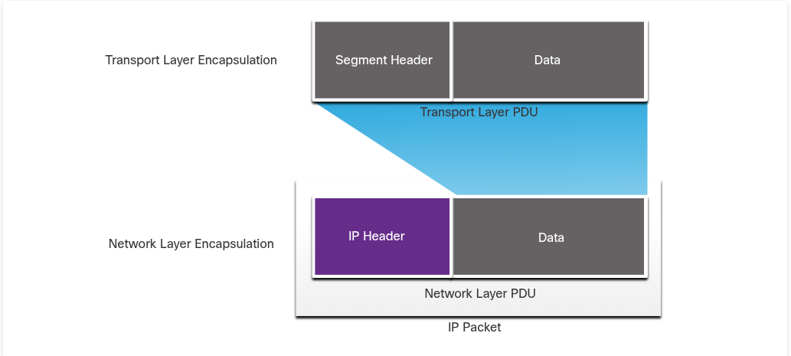
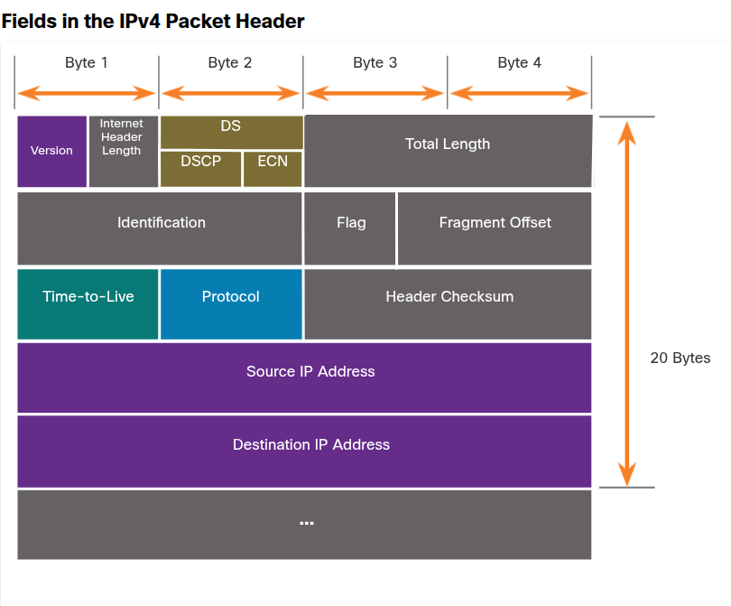
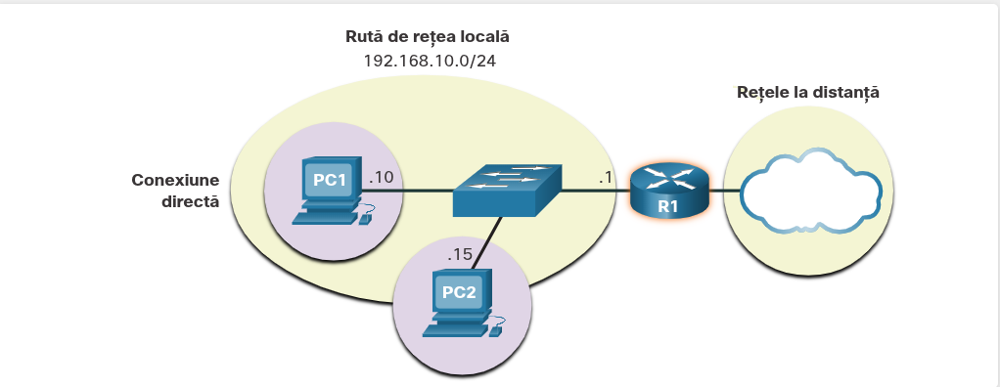
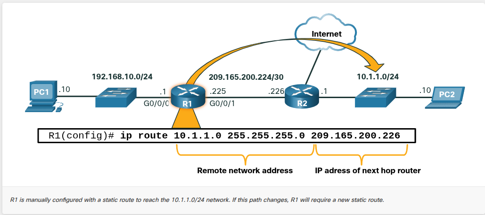
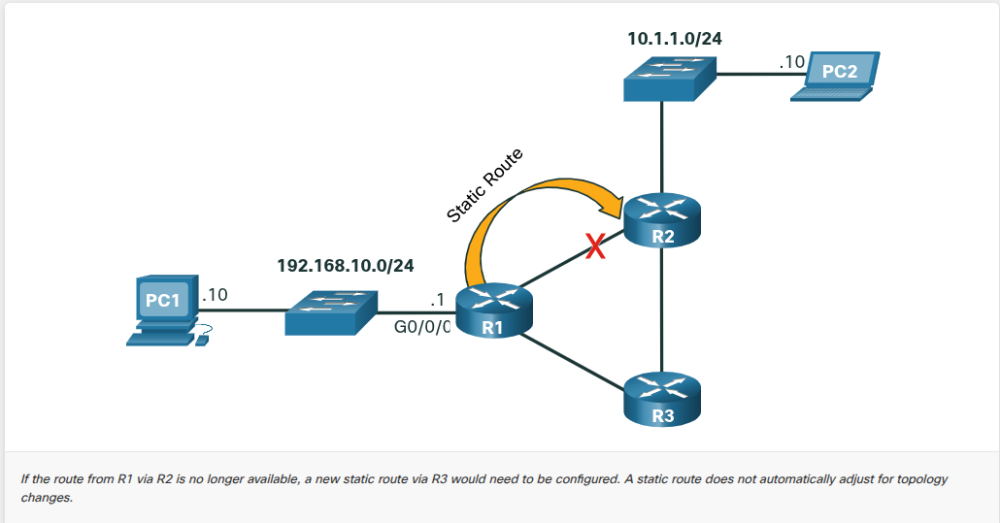
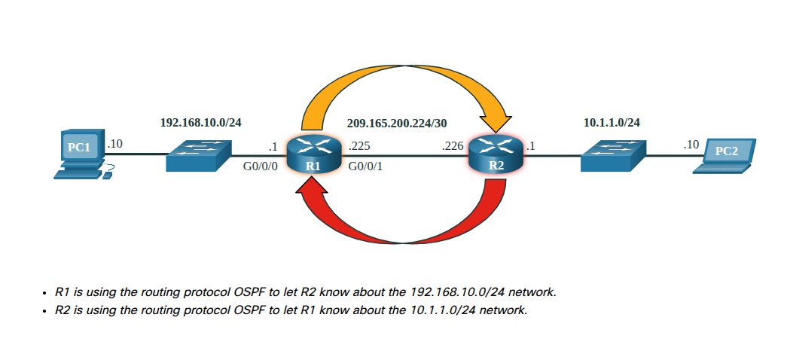
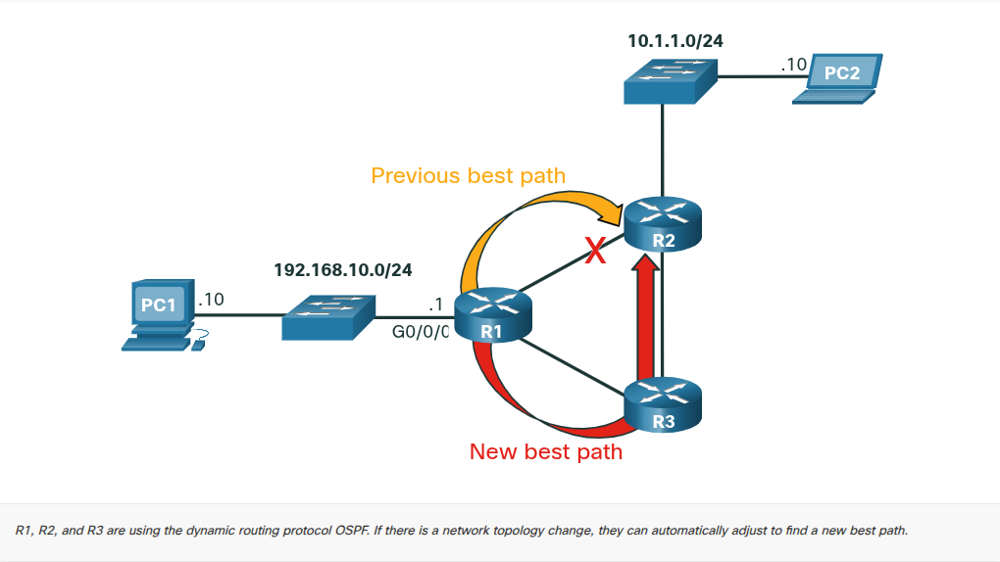
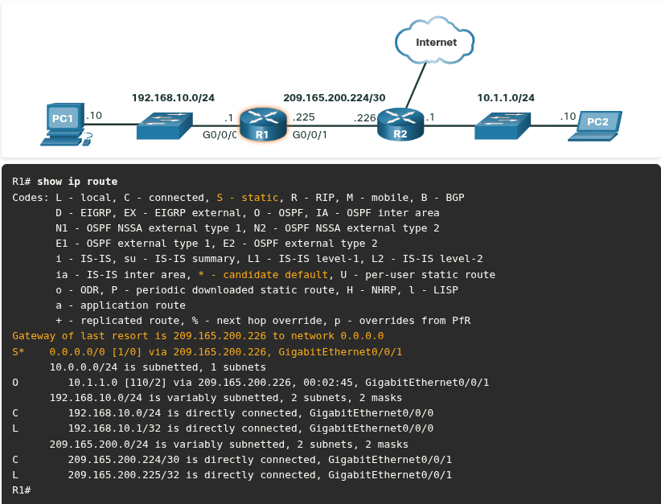

## 8.1 Network Layer Characteristics

### 8.1.1 The Network Layer

- network layer sau OSI layer 3 este stratul care se ocupă de transmiterea datelor între rețele(nu doar în aceeași rețea).
- protocoalele esențiale sunt IPv4 și IPv6, dar și protocoalele de routare precum OSPF (Open Shortest Path First) și ICMP(protocol pentru mesagerie, ex: ping).

##### Cele 4 operații de bază:

1. ***Addressing*** - fiecare device are o adresă IP unică, pentru a putea să fie indentificată.
2. ***Encapsulation*** - toate datele care vin de la transport layer (TCP/UDP) primesc un header care conține adresa IP sursă și destinație.
3. ***Routing*** - pachetul trece prin routere care decide cel mai bun drum spre destinație. Fiecare router prin care trece = un "hop".
4. ***De-encapsulation*** - la destinație, router-ul/host-ul verifică adresa IP-ului din header să vadă dacă este a lui. Dacă este a lui, scoate header-ul IP și trimite ce rămâne mai sus la transport layer.

### 8.1.2 IP Encapsulation

- IP încapsulează segementele de la nivelul transport și adaugă un antet IP. Antetul IP este utilizat pentru a livra pachetul către gazda destinație.



- Routerele fac routarea uitându-se **doar la header-ul IP** (adresa sursă/destinație), nu se uită la ce e în interior (datele/segmentul rămân neatinse).
- dacă e implicat **NAT** (Network Address Translation), adresa IP se poate schimba pe drum.

### 8.1.3 Characteristics of IP

- protocolul IP a fost proiectat ca un protocol de costuri reduse.
- Caracteristici:
	1. ***Connectionless*** - IP nu stabilește o conexiune înainte să trimită datele.
	2. ***Best Effort (unreliable)*** - IP-ul nu garantează că pachetul ajunge la destinație.
	3. ***Media Independent*** - IP funcționează **la fel indiferent de mediul fizic** prin care circulă datele: cablu de cupru, fibră optică, sau wireless.

### 8.1.4 Connectionless

- IP **nu creează o conexiune dedicată end-to-end** înainte să trimită date.
### 8.1.5 Best Effort

- **Ideea centrală:** IP nu ține câmpuri suplimentare în header pentru a menține o "conexiune stabilită" (spre deosebire de TCP). Asta reduce mult overhead-ul, dar are un preț.

- **Ce nu știe transmițătorul (senderul), practic:**
	- Nu știe dacă **destinația există și funcționează** în momentul trimiterii
	- Nu știe dacă destinația **a primit** pachetul
	- Nu știe dacă destinația **poate accesa/citi** pachetul primit

### 8.1.6 Media Independent

- IP nu poate **gestiona sau recupera** pachete pierdute/corupte pentru că pachetele nu conțin informație care să-i spună senderului dacă livrarea a reușit sau nu
- Pachetele pot ajunge: **corupte, în altă ordine, sau deloc** - IP nu face retransmisie în niciunul din cazuri
- Dacă apar probleme de ordine sau pachete lipsă, **aplicațiile sau straturile superioare** trebuie să le rezolve (adică TCP, la Layer 4)
- Asta face IP-ul **foarte eficient** - nu pierde timp cu verificări, doar trimite


- IP funcționează independent de mediul fizic (cablu de cupru, fibră optică, wireless) - responsabilitatea de a pregăti pachetul pentru transmisie pe mediul respectiv o are **Data Link Layer**, nu Network Layer
- **MTU (Maximum Transmission Unit)** = mărimea maximă a unui PDU pe care un anumit mediu o poate transporta. Data Link Layer îi spune Network Layer-ului care e MTU-ul, iar Network Layer decide cât de mari pot fi pachetele.
- **Fragmentarea**: dacă un router trebuie să treacă un pachet **IPv4** de pe un mediu cu MTU mare pe unul cu MTU mai mic, îl **fragmentează** (îl împarte în bucăți mai mici). Asta cauzează **latență** suplimentară.
- **Foarte important de reținut pentru quiz:** **pachetele IPv6 NU pot fi fragmentate de router** - asta e o diferență cheie față de IPv4, des întrebată la teste.


---

## 8.2 IPv4 Packet

### 8.2.1 IPv4 Packet Header

- header-ul IPv4 conține câmpuri cu valori binare care sunt citite de procesul Layer 3, ca să știe cum să livreze pachetul la următorul "stop" spre destinație.

### 8.2.2 IPv4 Packet Header Fields



|Câmp|Ce face|
|---|---|
|**Version**|4 biți, valoare `0100` = identifică pachetul ca IPv4|
|**DS (DiffServ)**|8 biți, prioritate pachet. Se împarte în **DSCP** (6 biți) + **ECN** (2 biți)|
|**TTL (Time to Live)**|8 biți - "viața" pachetului. Se scade cu 1 la fiecare router. Dacă ajunge la 0, routerul aruncă pachetul și trimite un mesaj ICMP "Time Exceeded" înapoi la sursă|
|**Protocol**|spune ce protocol e "în interior" (payload) - ex: ICMP=1, TCP=6, UDP=17|
|**Header Checksum**|verifică dacă header-ul e corupt|
|**Source/Destination IPv4 Address**|adresele sursă și destinație, 32 biți fiecare|

---

## 8.3. IPv6 Packet

### 8.3.1 Limitations of IPv4

1. ***IPv4 address depletion*** - doar 4 miliarde de adrese unice posibile pe 32 biți fiecare.
2. ***Lack of end-to-end connectivity*** - din cauza NAT-ului (mai multe device-uri share-uiesc o singură adresă publică), adresa reală a unui host intern rămâne ascunsă, ceea ce creează probleme pentru tehnologii care au nevoie de conexiune directă end-to-end
3. ***Increased network complexity*** - NAT a fost gândit doar ca soluție temporară de tranziție, dar implementările lui adaugă complexitate, latență și fac troubleshooting-ul mai greu

### 8.3.2 IPv6 Overview

- ***adresarea pe 128 biți*** - față de 32 biți pentru IPv4 rezultând 340 undecillion de adrese.
- ***header simplificat*** - ma puține câmpuri.
- ***eliminarea nevoie de NAT*** - fiindcă sunt atât de multe adrese publice disponibile, nu mai e nevoie să le "împarți" prin NAT.


### 8.3.3 IPv4 Packet Header Fields in the IPv6 Packet Header

- IPv4: header de lungime **variabilă**, 20 octeți de bază (până la 60 dacă se folosesc Options) - 12 câmpuri de bază
- IPv6: header de lungime **fixă**, 40 octeți - simplificare majoră, procesare mai eficientă.


### 8.3.4 IPv6 Packet Header


| IPv6                                | Echivalent IPv4         | Observație                                                                                                           |
| ----------------------------------- | ----------------------- | -------------------------------------------------------------------------------------------------------------------- |
| **Version**                         | Version                 | 4 biți, `0110` = IPv6                                                                                                |
| **Traffic Class**                   | DiffServ (DS)           | Prioritate pachet                                                                                                    |
| **Flow Label**                      | - (nou)                 | 20 biți; pachetele cu același flow label sunt tratate la fel de routere                                              |
| **Payload Length**                  | Total Length            | Lungimea doar a payload-ului, nu include header-ul fix (40 bytes)                                                    |
| **Next Header**                     | Protocol                | Specifică protocolul următor (upper layer)                                                                           |
| **Hop Limit**                       | TTL                     | Decrementat cu 1 la fiecare router; dacă ajunge la 0, pachetul este aruncat și se trimite mesaj ICMPv6 Time Exceeded |
| **Source/Destination IPv6 Address** | Source/Destination IPv4 | 128 biți fiecare                                                                                                     |

---

## 8.4 How a Host Routes

### 8.4.1 Host Forwarding Decision

- la IPv4 și IPv6, pachetele, sunt create întotdeauna la source host.
- gazda sursă trebuie să poată direcționa pachetul către gazda destinație.
- fiecare source host are propria tabelă de routare.

##### Cele 3 destinații posibile pentru un pachet

- ***Itself*** - folosind adresa specială 127.0.0.1 (IPv4) și ::1 (IPv6).
- ***Local Host*** - un divice care se află pe aceeași rețea cu sursa.
- ***Un host remote*** - un divice aflat pe altă rețea.

##### Local vs Remote

- IPv4 - PC-ul folosește adresa proprie de IP, Subnet Mask și IP-ul destinație.  Subet Mask-ul îi spune pc-ului care porțiune din IP reprezintă rețeaua. Dacă rețeaua lui coincide cu rețeaua destinației, înseamnă că sunt pe plan local.

- IPv6 - Mecanismul e puțin diferit. Routerul local trimite mesaje pe rețea (advertisements) prin care informează toate dispozitivele care este prefixul rețelei locale.


### 8.4.2 Default Gateway

- default gateway este un device de rețea (router și switch de layer 3) care poate redirecționa traficul către alte rețele.
- analogie: ușa de la o cameră.

##### Caracteristici:

- are o adresă IP locală în același interval de adrese ca alți hosts din rețeaua locală.
- poate accepta date din rețeaua locală și să trimită date în afara rețelei.
- redirecționează traficul către alte rețele.
- fără gateway, traficul nu poate să fie redirecționat.

### 8.4.3 A Host Routes to the Default Gateway

- o tabelă de rutare va conține un gateway imiplicit.
- la IPv4, host-ul primește adresa IPv4 a gateway-ului implicit dinamic de la DHCP sau manual.
- la IPv6, router-ul anunță adresa gateway implicit sau host-ul poate configura manual.



### 8.4.4 Host Routing Tables

- pentru a putea vedea tabela de routare în windows:

```Terminal
route print
```

SAU

```Terminal
netstat -r
```


---

## 8.5 Introduction to Routing

### 8.5.1 Router Packet Forwarding Decision

- **Ce examinează routerul?** Când primește un pachet, routerul se uită STRICT la **Adresa IP Destinație** (nu îl interesează sursa în acest moment).
    
- **Cum decide?** Caută acea adresă IP destinație în **Tabela sa de Rutare** (Routing Table).
    
- **Ce conține Tabela de Rutare?** O listă cu rețele cunoscute (prefixe) și instrucțiuni despre unde trebuie trimis pachetul mai departe (interfața de ieșire sau IP-ul următorului echipament).
    
- **REGULA DE AUR (Longest Match Rule / Longest Prefix Match):** Dacă există mai multe rute posibile către aceeași destinație, routerul va alege MEREU **ruta cea mai specifică** (cea care are cei mai mulți biți potriviți de la stânga la dreapta / masca de subrețea cea mai mare).
    
    - _Exemplu de notat:_ Dacă routerul are o rută pentru `192.168.1.0 /24` și una pentru `192.168.0.0 /16`, va alege ruta cu `/24` pentru că este o potrivire mai lungă (mai exactă).

### 8.5.2 IP Router Routing Table


- **1. Rețele direct conectate (Directly-connected networks):**
    - Reprezintă rețelele la care routerul este conectat fizic (prin propriile cabluri).
    - Se adaugă _automat_ în tabelă imediat ce configurezi o adresă IP pe o interfață și o activezi (îi dai comanda `no shutdown`).
        
- **2. Rețele la distanță (Remote networks):**
    - Reprezintă rețelele aflate dincolo de alte routere.
    - Routerul le învață în două moduri: fie manual (sunt configurate explicit de un administrator, sub formă de rute statice), fie automat (comunicând cu alte routere prin protocoale de rutare dinamică, precum OSPF sau EIGRP).
        
- **3. Ruta implicită (Default route):**
    - Este cunoscută și sub numele de **"Gateway of last resort"** (Poarta de ultimă instanță).
    - Este folosită de router ca o plasă de siguranță: dacă primește un pachet pentru o destinație necunoscută (nu găsește o potrivire mai bună/mai lungă în tabelă), va trimite pachetul pe această rută implicită, sperând că următorul echipament va ști ce să facă cu el.
      
      


### 8.5.3 Static Routing

- **Configurare Manuală:** Rutele statice nu sunt descoperite automat. Un administrator trebuie să intre în linia de comandă a routerului și să îi spună explicit: _"Ca să ajungi la rețeaua X (remote network), trimite pachetele către adresa IP Y (next-hop)"_.


    
- **Lipsa adaptabilității (Rigiditate):** Acesta este cel mai mare dezavantaj și un subiect foarte comun la CCNA. Dacă un cablu se rupe sau un router vecin "pică" (cum arată acel "X" roșu din a doua imagine pe traseul spre R2), ruta statică **nu** se șterge automat și **nu** își caută un drum nou. Routerul va continua să trimită pachete în "gol", până când administratorul intervine, șterge ruta veche și o configurează manual pe cea nouă (ex: prin routerul R3).





- **Când este recomandată?** Datorită faptului că nu se adaptează singură la schimbările de topologie, rutarea statică este potrivită doar pentru:
    - **Rețele mici:** Unde ai puține echipamente și e ușor să gestionezi manual traseele.        
    - **Topologii fără redundanță (sau cu redundanță minimă):** Acolo unde există practic un singur drum de intrare/ieșire din rețea. Dacă există un singur cablu spre internet și acela pică, oricum nu ai o rută alternativă, deci o rută statică simplă își face treaba perfect.

### 8.5.4 Dynamic Routing

### Conceptul de Rutare Dinamică

- Un protocol de rutare dinamică permite routerelor să învețe automat despre rețelele la distanță, inclusiv despre o rută implicită, de la alte routere.
- Routerele care folosesc aceste protocoale fac schimb automat de informații de rutare.
- Ele compensează pentru orice schimbări apărute în topologie fără a fi nevoie de implicarea unui administrator de rețea.
- Două exemple cunoscute de astfel de protocoale sunt OSPF și EIGRP.


### Ce face protocolul automat?

Odată ce administratorul a făcut configurarea de bază (care presupune doar activarea rețelelor direct conectate în cadrul protocolului), acesta va rula în fundal și va face automat următoarele lucruri:

- Va descoperi rețelele la distanță (remote networks).
- Va menține informațiile de rutare mereu actualizate.
- Va alege cea mai bună cale (best path) către rețelele destinație.
- Va încerca să găsească o nouă cale optimă dacă drumul curent pică sau nu mai este disponibil.
- Va introduce adresa rețelei la distanță și adresa "next hop" direct în tabela de rutare




### 8.5.6 Introduction to an IPv4 Routing Table

### Comanda esențială

- Pentru a vizualiza tabela de rutare IPv4 pe un router Cisco IOS, trebuie să folosești comanda `show ip route` din modul privilegiat (privileged EXEC mode).

### Codurile surselor de rutare (Legenda)

La începutul fiecărei înregistrări din tabela de rutare se află un cod care este folosit pentru a identifica tipul rutei sau modul în care aceasta a fost învățată. Cele mai comune coduri sunt:

- **L** - Adresa IP a interfeței locale direct conectate (Directly connected local interface IP address).
- **C** - Rețea direct conectată (Directly connected network).
- **S** - Rută statică configurată manual de un administrator (Static route was manually configured by an administrator).
- **O** - OSPF.
- **D** - EIGRP.



### Cum sunt adăugate rutele în tabelă

- **Rutele direct conectate:** O rută direct conectată este creată automat când o interfață a routerului este configurată cu informații despre adresa IP și este activată. Routerul adaugă două intrări pentru aceasta: una cu codul **C** pentru rețeaua conectată și una cu codul **L** pentru adresa IP locală a acelei interfețe.
    
- **Rutele dinamice:** Routerele folosesc protocoale de rutare dinamică, precum OSPF, pentru a face schimb de informații de rutare. De exemplu, routerul R1 are o înregistrare pentru rețeaua 10.1.1.0/24 pe care a învățat-o dinamic de la routerul R2 folosind protocolul OSPF.
    
- **Ruta implicită (Default route):** O rută implicită folosește o adresă de rețea formată doar din zerouri, un exemplu pentru IPv4 fiind adresa 0.0.0.0. O înregistrare pentru o rută statică implicită începe cu codul **S*** în tabela de rutare. Un administrator o poate configura pentru a trimite pachetele către un alt router (cum ar fi R2) atunci când în tabela de rutare nu există o intrare specifică care să se potrivească cu adresa IP destinație a pachetului.
