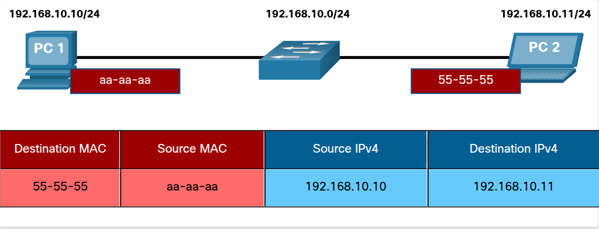
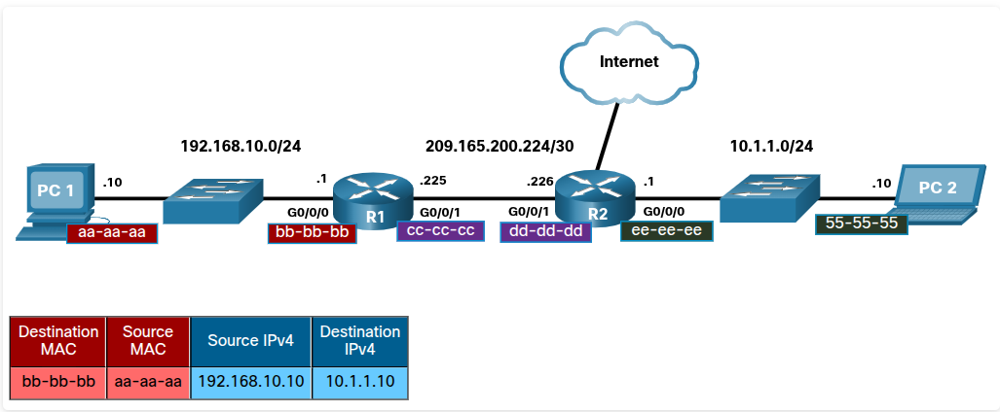
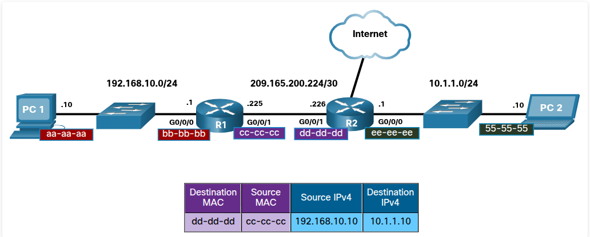
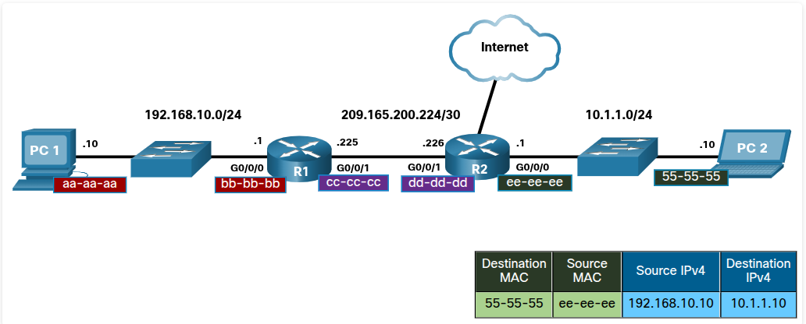
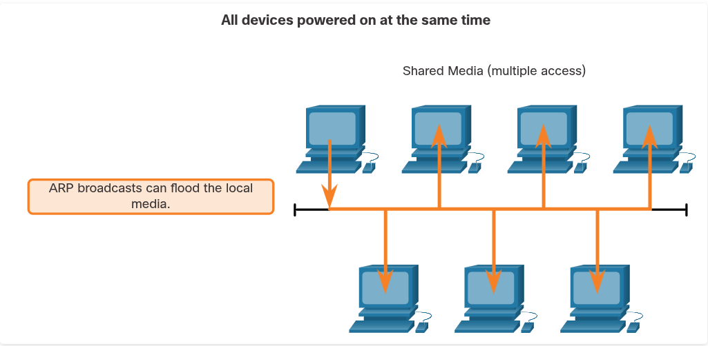
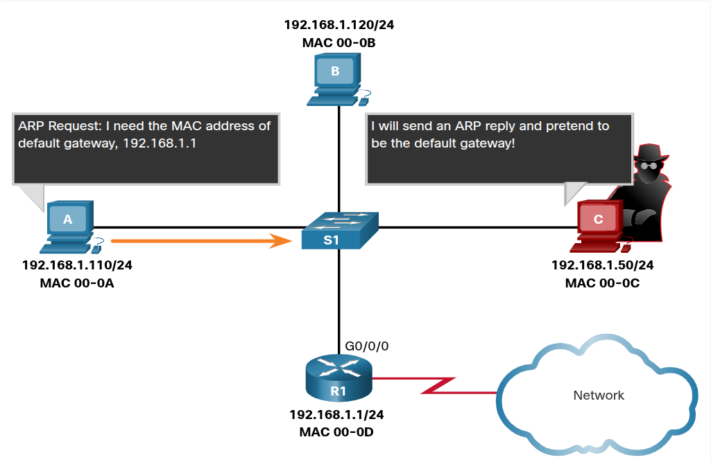
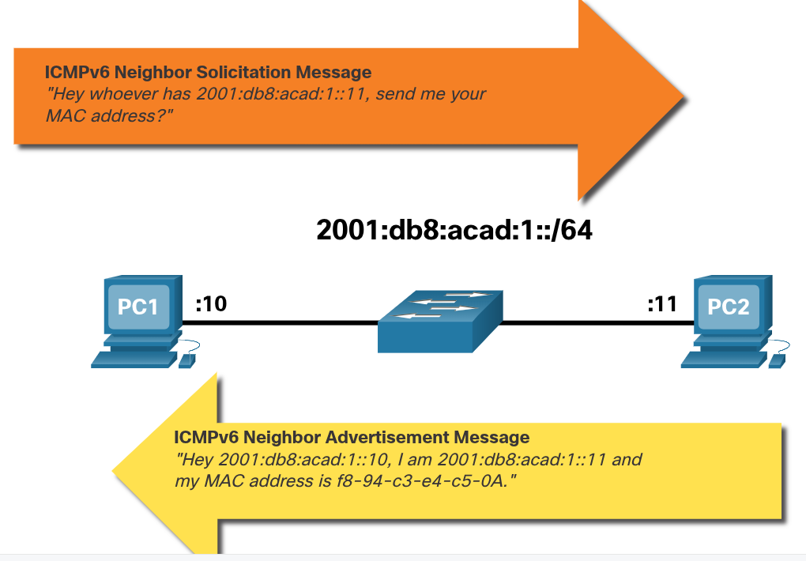

## 9.1. MAC and IP

### 9.1.1 Destination on Same Network

Când destinația e pe același LAN, la Layer 2 pui direct MAC-ul destinației finale. Nu intervine niciun router aici, e schimb direct între cele două NIC-uri prin switch.




**Din exemplu:**

- PC1 (192.168.10.10) vrea să trimită la PC2 (192.168.10.11) — sunt în același subnet /24
- Frame-ul de Layer 2 conține:
    - Destination MAC = 55-55-55 (MAC-ul lui PC2)
    - Source MAC = aa-aa-aa (MAC-ul lui PC1)
- Pachetul de Layer 3 conține:
    - Source IP = 192.168.10.10
    - Destination IP = 192.168.10.11

### 9.1.2 Destination on Remote Network

- dacă destinația IP e pe altă rețea, destination MAC din frame **nu** mai e al destinației finale, ci al **default gateway-ului** (interfața routerului local). IP-ul rămâne end-to-end neschimbat, dar MAC-ul se schimbă la fiecare hop.








**Ce se întâmplă pas cu pas, în exemplul cu PC1 → PC2 prin R1 și R2:**

1. **PC1 → R1** (LAN local 192.168.10.0/24)
    - Source MAC = aa-aa-aa (PC1), Destination MAC = bb-bb-bb (G0/0/0 al lui R1, gateway-ul lui PC1)
    - Source IP = 192.168.10.10, Destination IP = 10.1.1.10 (rămâne fix tot drumul)
2. **R1 primește frame-ul**, îl de-încapsulează, se uită la destination IP, decide next-hop-ul, și **re-încapsulează** pachetul într-un frame nou pentru legătura următoare.
3. **R1 → R2** (link 209.165.200.224/30)
    - Source MAC = cc-cc-cc (G0/0/1 al lui R1), Destination MAC = dd-dd-dd (G0/0/1 al lui R2)
    - IP-urile rămân aceleași
4. **R2 → PC2** (LAN 10.1.1.0/24)
    - Source MAC = ee-ee-ee (G0/0/0 al lui R2), Destination MAC = 55-55-55 (PC2, pentru că acum R2 e pe aceeași rețea cu PC2, deci pune MAC-ul real al destinației)


- Cele două protocoale corecte pe care trebuie să le selectezi sunt **ARP** (pentru IPv4) și **ND / Neighbor Discovery** (pentru IPv6).

---

## 9.2. ARP

### 9.2.1 ARP Overview

- ARP este protocolul care mapează (asociază) o adresă IPv4 la adresa MAC corespunzătoare pentru comunicarea în rețeaua locală.

**De ce e nevoie de el:**

- Destination IPv4 - fie îl știi deja, fie e rezolvat prin nume (DNS)
- Destination MAC - **nu se știe niciodată direct**, trebuie descoperit dinamic

**ARP are exact 2 funcții de bază:**

1. **Resolving IPv4 addresses to MAC addresses** — practic "cine are IP-ul ăsta, dă-mi MAC-ul"
2. **Maintaining a table of IPv4 to MAC address mappings** — ține minte răspunsurile ca să nu întrebe la fiecare pachet (ARP cache/table)


### 9.2.2 ARP Functions

- înainte să trimită orice ARP request, device-ul verifică întâi local — **ARP table (ARP cache)**, stocată temporar în RAM. Doar dacă nu găsește nimic acolo, trece la request.

**Ce caută device-ul, mai exact:**

- Dacă destination IP e pe **aceeași rețea** → caută în ARP table MAC-ul destinației finale
- Dacă destination IP e pe **altă rețea** → caută în ARP table MAC-ul **default gateway-ului**

**Structura ARP table:** fiecare rând = un "map" (o legătură) între un IPv4 și un MAC. Tabela ține evidența astea temporar, doar pentru device-urile de pe LAN.

**Logica finală, simplă:**

- Găsește IP-ul în tabel → ia MAC-ul de acolo, îl pune direct ca destination MAC în frame
- Nu găsește nimic → trimite un **ARP request**


### 9.2.3 Video - ARP Request

- mesajele ARP **nu au header IPv4**. Se încapsulează direct în frame Ethernet — deci ARP nu e "peste IP", e un protocol separat care merge direct pe Layer 2.

**Structura frame-ului de ARP request:**

- **Destination MAC** = FF-FF-FF-FF-FF-FF (broadcast) — toate NIC-urile de pe LAN trebuie să-l accepte și proceseze
- **Source MAC** = MAC-ul celui care trimite request-ul
- **Type** = 0x806 — asta îi spune NIC-ului destinatar "hei, datele astea nu sunt un pachet normal, du-le la procesul ARP", nu la IP stack normal

**Ce se întâmplă la nivel de rețea:**

- Fiindcă e broadcast, switch-ul **flood-uiește** request-ul pe toate porturile, mai puțin cel pe care l-a primit
- Toate NIC-urile de pe LAN sunt obligate să proceseze broadcast-ul și să-l ducă la OS
- **Routerul nu forward-uiește broadcast-uri** pe alte interfețe — deci ARP request rămâne strict local, nu trece de gateway (asta explică de ce ARP funcționează doar în LAN, cum ți-am zis la început)
- Doar device-ul al cărui IP se potrivește cu target IP din request răspunde. Toate celelalte ignoră tăcut.


### 9.2.4 Video - ARP Operation - ARP Reply

- singurul device al cărui IP se potrivește cu target-ul răspunde, iar răspunsul e **unicast**, direct către cel care a cerut — nu mai e broadcast.

**Structura frame-ului de ARP reply:**

- **Destination MAC** = MAC-ul celui care a trimis request-ul (deci acum e specific, nu broadcast)
- **Source MAC** = MAC-ul celui care răspunde
- **Type** = tot 0x806 (la fel ca la request)

**Ce se întâmplă după:**

- Doar device-ul care a trimis request-ul original primește reply-ul (că e unicast)
- Adaugă perechea IP-MAC în propriul ARP table
- Abia acum poate încapsula pachetul cu MAC-ul corect și trimite frame-ul efectiv


### 9.2.6 Removing Entries from an ARP Table

- entry-urile din ARP table nu stau acolo la infinit — există un **timer** care le șterge automat dacă nu au fost folosite o perioadă

- **Detaliu concret:** timpul diferă în funcție de OS. Exemplu dat: Windows-urile mai noi păstrează entry-urile între **15 și 45 de secunde**. Nu e un număr fix universal, ci un range specific implementării.

- **De ce contează practic:**
	- Ține tabela curată — nu se acumulează entry-uri vechi pentru device-uri care poate nu mai există sau și-au schimbat placa de rețea (deci MAC-ul)
	- Dacă un device dispare sau își schimbă MAC-ul, restul rețelei nu rămâne blocată cu o mapare greșită mult timp — se auto-corectează la următorul ARP request 


### 9.2.7 ARP Tables on Networking Devices

```Terminal
show ip arp
```

```Terminal
arp -a
```


### 9.2.8 ARP Issues - ARP Broadcasts and ARP Spoofing

**Problema 1: ARP broadcasts pot inunda rețeaua**

**Ideea centrală:** fiindcă ARP request e broadcast, **fiecare** device de pe LAN e obligat să-l primească și să-l proceseze — chiar dacă nu e destinatarul. Normal, impact minim. Dar dacă multe device-uri pornesc simultan (gen luni dimineața, toată lumea își pornește PC-ul deodată), toate trimit ARP broadcasts în același timp → poate apărea o scădere temporară de performanță.

**Detaliu important:** e **temporar** — după ce fiecare device și-a "învățat" MAC-urile de care are nevoie (gateway etc.), impactul dispare, pentru că data urmatoare foloseşte cache-ul.




**Problema 2: ARP Spoofing / ARP Poisoning (asta e partea de securitate)**

**Ideea centrală:** ARP nu are **nicio autentificare**. Orice device poate răspunde la un ARP request, indiferent dacă e cel vizat sau nu. Un atacator exploatează exact asta.

**Cum funcționează atacul:**

1. Atacatorul trimite un **ARP reply fals** — pretinde că el e proprietarul unui IP care nu e al lui (de exemplu, IP-ul default gateway-ului)
2. Reply-ul conține **MAC-ul atacatorului**, nu al gateway-ului real
3. Victima primește reply-ul, îl salvează necondiționat în ARP table (nu verifică dacă a cerut sau nu, sau dacă e corect)
4. De acum, victima trimite tot traficul destinat gateway-ului direct către atacator — deci atacatorul poate intercepta, modifica sau redirecționa traficul (man-in-the-middle)



---

## 9.3. IPv6 Neighbor Discovery

### 9.3.2 IPv6 Neighbor Discovery Messages

- la IPv6 nu mai există ARP separat ca protocol — totul e integrat în **ICMPv6**, sub numele de **ND (Neighbor Discovery)**, uneori numit și NDP. Practic ICMPv6 face treaba pe care o făcea ARP la IPv4, plus ceva mai mult.

**ND folosește 5 tipuri de mesaje ICMPv6:**

1. **Neighbor Solicitation (NS)** — echivalentul ARP Request
2. **Neighbor Advertisement (NA)** — echivalentul ARP Reply
3. **Router Solicitation (RS)** — device-ul cere info de la router
4. **Router Advertisement (RA)** — routerul anunță info (ex: prefix de rețea, pt autoconfigurare)
5. **Redirect Message** — routerul spune unui host să folosească un alt gateway mai bun pt o rută

**De reținut pentru exam — separarea clară:**

- **NS/NA** = pentru **address resolution** (device-to-device), exact ca ARP Request/Reply la IPv4 — asta e partea direct comparabilă cu ce ai învățat la 9.2
- **RS/RA** = pentru **router discovery** — ceva ce ARP la IPv4 nu face deloc (la IPv4, router discovery se face separat, prin DHCP sau config manuală)
- **Redirect** = optimizare de rutare, nu are echivalent ARP


### 9.3.3 IPv6 Neighbor Discovery - Address Resolution

- funcțional e identic cu ARP — "cine are adresa X, dă-mi MAC-ul" / "eu sunt, uite MAC-ul" — dar tehnic diferă la un punct important: **modul de transmisie**.



 ARP Request = **broadcast** (FF-FF-FF-FF-FF-FF) → toate NIC-urile trebuie să-l ducă la OS pentru procesare, chiar dacă nu sunt destinatarul.

Neighbor Solicitation = **multicast** (adresă specială Ethernet + IPv6) → NIC-ul poate decide **la nivel de hardware** dacă mesajul e pentru el, fără să-l trimită mereu la OS.

**De ce contează asta:** e exact rezolvarea problemei de la 9.2.8 (ARP broadcasts pot inunda rețeaua) — IPv6 evită asta din start, folosind multicast în loc de broadcast, deci reduce load-ul inutil pe device-urile care oricum nu sunt vizate.

**Legătura cu tot ce știi:**

- Solicitation = Request (dar multicast, nu broadcast)
- Advertisement = Reply (rămâne unicast, la fel ca ARP Reply)
- Rezolvă aceeași problemă ca ARP, dar mai eficient la nivel de rețea