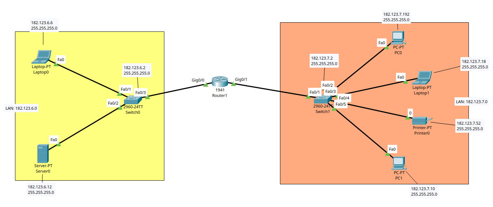

# Ghid de Configurare: Topologie Interconectare LAN-uri cu Router 1941

## Descriere

Acest proiect simulează o rețea locală formată din două subrețele interconectate printr-un router central (Router1).

- **LAN Stânga (Galben):** Rețea `182.123.6.0/24`
- **LAN Dreapta (Portocaliu):** Rețea `182.123.7.0/24`

## Topologie



## Tabel de Adresare IP

| **Dispozitiv** | **Interfață** | **Adresă IP** | **Subnet Mask** |
| -------------- | ------------- | ------------- | --------------- |
| **Router1**    | Gig0/0        | 182.123.6.1   | 255.255.255.0   |
| **Router1**    | Gig0/1        | 182.123.7.1   | 255.255.255.0   |
| **Switch0**    | VLAN 1        | 182.123.6.2   | 255.255.255.0   |
| **Switch1**    | VLAN 1        | 182.123.7.2   | 255.255.255.0   |
| **Server0**    | Fa0           | 182.123.6.12  | 255.255.255.0   |
| **Laptop0**    | Fa0           | 182.123.6.6   | 255.255.255.0   |
| **PC0**        | Fa0           | 182.123.7.192 | 255.255.255.0   |
| **Laptop1**    | Fa0           | 182.123.7.18  | 255.255.255.0   |
| **Printer0**   | Fa0           | 182.123.7.52  | 255.255.255.0   |
| **PC1**        | Fa0           | 182.123.7.10  | 255.255.255.0   |
## Configurări de Bază (Securitate)

- **Configurarea adreselor IP** pe toate dispozitivele (conform tabelului de mai sus).
- **Testarea conectivității (ping)** între toate dispozitivele rețelei.
- **Configurări pe Router și Switch-uri:**
    - **Hostname:** (ex: `Router1`, `Switch0`, `Switch1`)
    - **Parolă mod privilegiat (enable):** `ccna`
    - **Parolă consolă:** `user`
    - **Criptarea parolelor:** (folosind comanda `service password-encryption`)
    - **Banner:** `Authorization #2 Required`
    - **Configurare Telnet:** (pentru acces la distanță)


**Nu uita:** Să setezi `Default Gateway` pe fiecare PC/Laptop/Server/Printer.
- Pentru cele din stânga, `Gateway` este `182.123.6.1`.
- Pentru cele din dreapta, `Gateway` este `182.123.7.1`.

---

# Pasul 1: Configurarea adreselor IP

În această etapă, se realizează setarea parametrilor de rețea pe fiecare dispozitiv terminal și pe interfețele dispozitivelor intermediare.

- **Scop:** Stabilirea conectivității de Layer 3 pentru a permite comunicația între subrețelele `182.123.6.0/24` și `182.123.7.0/24`.
    
- **Procedură:**
    - Configurarea adreselor IPv4 statice și a măștilor de rețea pe toate stațiile de lucru (PC-uri, Laptopuri, Server, Printer) conform Tabelului de Adresare.
    - Setarea adresei de **Default Gateway** pe fiecare dispozitiv final (indispensabil pentru comunicarea inter-VLAN/inter-rețea).
    - Activarea și configurarea adreselor IP pe interfețele `Gig0/0` și `Gig0/1` ale routerului `Router1`.
    - Alocarea adreselor IP pe interfețele de management (`VLAN 1`) ale switch-urilor `Switch0` și `Switch1`.


---

# Pasul 2: Configurarea Switch-urilor (LAN cu LAN)

În această etapă, configurăm fiecare switch cu adresa IP de management (pe VLAN 1), gateway-ul implicit pentru a putea comunica în afara rețelei locale și setările de securitate obligatorii.

## 2.1 Configurarea LAN 1 (Switch0 / SW0)

Deschideți CLI-ul pe **Switch0** (situat în LAN1, partea stângă) și introduceți următoarele comenzi.

```Cisco CLI
enable
```

```Cisco CLI
configure terminal
```

### 1. Setare numelui

```Cisco CLI
hostname SW0
```

### 2. Configurarea parolei de mod privilegiat

```Cisco CLI
enable secret ccna
```

### 3. Configurarea adresei IP de management (VLAN 1)

```Cisco CLI
interface vlan 1 
ip address 182.123.6.2 255.255.255.0 
no shutdown 
exit
```

### 4. Setarea Default Gateway-ului (IP-ul viitor al interfeței Routerului pentru LAN 1)

```Cisco CLI
ip default-gateway 182.123.6.1
```

### 5. Securizarea accesului pe consola

```Cisco CLI
line console 0 
password user 
login 
exit
```

### 6. Criptarea parolelor și setarea mesajului de avertizare (Banner)

```Cisco CLI
service password-encryption 
banner motd $Authorization #2 Required$
```

### 7. Ieșire și salvarea configurației local

```Cisco CLI 
end 
write memory
```

---

## 2.2 Configurarea LAN 2 (Switch1 / SW1)

Deschideți CLI-ul pe **Switch0** (situat în LAN1, partea stângă) și introduceți următoarele comenzi.

```Cisco CLI
enable
```

```Cisco CLI
configure terminal
```

### 1. Setare numelui

```Cisco CLI
hostname SW1
```

### 2. Configurarea parolei de mod privilegiat

```Cisco CLI
enable secret ccna
```

### 3. Configurarea adresei IP de management (VLAN 1)

```Cisco CLI
interface vlan 1 
ip address 182.123.7.2 255.255.255.0 
no shutdown 
exit
```

### 4. Setarea Default Gateway-ului (IP-ul viitor al interfeței Routerului pentru LAN 2)

```Cisco CLI
ip default-gateway 182.123.7.1
```

### 5. Securizarea accesului pe consola

```Cisco CLI
line console 0 
password user 
login 
exit
```

### 6. Criptarea parolelor și setarea mesajului de avertizare (Banner)

```Cisco CLI
service password-encryption 
banner motd $Authorization #2 Required$
```

### 7. Ieșire și salvarea configurației local

```Cisco CLI 
end 
write memory
```

---

# 3. Configurarea Routerului Central (R1)

Configurarea routerului se împarte în două etape: aplicarea setărilor standard de securitate (similare cu cele de pe switch-uri) și activarea interfețelor care deservesc fiecare LAN.

Deschideți CLI-ul pe Router și introduceți următoarele comenzi:

## 3.1 Setări de bază și Securitate

```Cisco CLI
enable 
configure terminal
```

### 1. Setarea numelui

```Cisco CLI
hostname R1
```

### 2. Configurarea parolei de mod privilegiat

```Cisco CLI
enable secret ccna
```

### 3. Securizarea accesului pe consola

```Cisco CLI
line console 0 
password user 
login 
exit
```

### 4. Criptarea parolelor și setarea mesajului de avertizare (Banner)

```Cisco CLI
service password-encryption 
banner motd $Authorization #2 Required$
```

----

## 3.2 Configurarea Interfețelor (Default Gateway-uri)

Acum vom aloca adresele IP `.1` pentru fiecare interfață care este conectată la un anumit LAN și vom "aprinde" porturile (comanda `no shutdown`).

### 1. -- LAN 1 (Rețeaua 182.123.6.0/24) --  

```Cisco CLI
interface g0/0 
ip address 182.123.6.1 255.255.255.0 
no shutdown 
exit
```

### 2. -- LAN 2 (Rețeaua 182.123.7.0/24) --  

```Cisco CLI
interface g0/1 
ip address 182.123.7.1 255.255.255.0 
no shutdown 
exit
```

```Cisco CLS
write memory
```


---

# 4. Verificare și Testare

După ce toate echipamentele au fost configurate, este esențial să verificăm starea rețelei și să salvăm setările în siguranță pe serverul TFTP.

## 4.1 Verificarea stării interfețelor

Această comandă este una dintre cele mai folosite în rețelistică. Afișează un rezumat al tuturor interfețelor, adresele IP alocate și starea lor (dacă sunt aprinse sau stinse).

Pe **Router (R1)** (sau pe oricare Switch), în modul privilegiat, rulați:

```Cisco CLI
show ip interface brief
```

**Cum citim rezultatul:** Asigurați-vă că la interfețele configurate aveți adresa IP corectă, iar la coloanele `Status` și `Protocol` scrie **up** și **up**. Dacă scrie _administratively down_, înseamnă că ați uitat comanda `no shutdown`.

## 4.2 Verificarea configurației active

Pentru a vedea absolut toate setările aplicate pe un echipament (parole criptate, interfețe, bannere), folosiți comanda de mai jos. Este utilă pentru a depista eventualele greșeli (typo-uri).

```Cisco CLI
show running-config
```

**Sfat:** Deoarece configurația este lungă, apăsați tasta **Space** pentru a derula pagina în jos, sau **Enter** pentru a derula linie cu linie.
