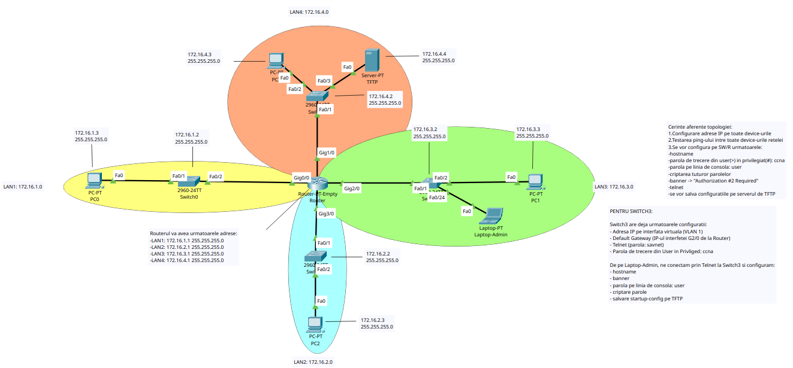

# Ghid de Configurare: Topologie Interconectare 4 LAN-uri

### Descrierea Proiectului

Acest document detaliază pașii necesari pentru configurarea unei topologii de rețea formate din 4 rețele locale (LAN-uri) interconectate printr-un router central. Configurația de nivel 2 se realizează exclusiv pe VLAN-ul implicit (VLAN 1).



---

## Tabel de Adresare IP 

| **Dispozitiv**  | **Interfață / VLAN** | **Adresă IP** | **Subnet Mask** | **Default Gateway** |
| --------------- | -------------------- | ------------- | --------------- | ------------------- |
| **Router**      | Gig0/0 (LAN1)        | 172.16.1.1    | 255.255.255.0   | N/A                 |
| **Router**      | Gig3/0 (LAN2)        | 172.16.2.1    | 255.255.255.0   | N/A                 |
| **Router**      | Gig2/0 (LAN3)        | 172.16.3.1    | 255.255.255.0   | N/A                 |
| **Router**      | Gig1/0 (LAN4)        | 172.16.4.1    | 255.255.255.0   | N/A                 |
| **SW0**         | VLAN 1               | 172.16.1.2    | 255.255.255.0   | 172.16.1.1          |
| **SW1**         | VLAN 1               | 172.16.2.2    | 255.255.255.0   | 172.16.2.1          |
| **SW3**         | VLAN 1               | 172.16.3.2    | 255.255.255.0   | 172.16.3.1          |
| **SW4**         | VLAN 1               | 172.16.4.2    | 255.255.255.0   | 172.16.4.1          |
| **PC0**         | FastEthernet0        | 172.16.1.3    | 255.255.255.0   | 172.16.1.1          |
| **PC2**         | FastEthernet0        | 172.16.2.3    | 255.255.255.0   | 172.16.2.1          |
| **PC1**         | FastEthernet0        | 172.16.3.3    | 255.255.255.0   | 172.16.3.1          |
| **Laptop**      | FastEthernet0        | 172.16.3.10   | 255.255.255.0   | 172.16.3.1          |
| **PC (LAN4)**   | FastEthernet0        | 172.16.4.3    | 255.255.255.0   | 172.16.4.1          |
| **Server TFTP** | FastEthernet0        | 172.16.4.4    | 255.255.255.0   | 172.16.4.1          |

---

# Pasul 1: Configurarea Dispozitivelor Finale (End Devices)

În această etapă, alocăm adresele IP statice pentru toate calculatoarele și pentru serverul TFTP.

- Accesați tab-ul **Desktop -> IP Configuration** pentru fiecare echipament.
- Introduceți Adresa IP, Subnet Mask-ul și Default Gateway-ul conform tabelului de adresare de mai sus.


---

# Pasul 2: Configurarea Switch-urilor (LAN cu LAN)

În această etapă, configurăm fiecare switch cu adresa IP de management (pe VLAN 1), gateway-ul implicit pentru a putea comunica în afara rețelei locale și setările de securitate obligatorii.

## 2.1 Configurarea LAN 1 (Switch0 / SW0)

Deschideți CLI-ul pe **Switch0** (situat în LAN1, partea stângă) și introduceți următoarele comenzi.

```Cisco CLI
enable
```

```Cisco CLI
configure terminal
```

### 1. Setare numelui

```Cisco CLI
hostname SW0
```

### 2. Configurarea parolei de mod privilegiat

```Cisco CLI
enable secret ccna
```

### 3. Configurarea adresei IP de management (VLAN 1)

```Cisco CLI
interface vlan 1 
ip address 172.16.1.2 255.255.255.0 
no shutdown 
exit
```

### 4. Setarea Default Gateway-ului (IP-ul viitor al interfeței Routerului pentru LAN 1)

```Cisco CLI
ip default-gateway 172.16.1.1
```

### 5. Securizarea accesului pe consola

```Cisco CLI
line console 0 
password user 
login 
exit
```

### 6. Securizarea accesului de la distanță (Telnet)

```Cisco CLI
line vty 0 15 
password cisco 
login 
transport input telnet 
exit
```

### 7. Criptarea parolelor și setarea mesajului de avertizare (Banner)

```Cisco CLI
service password-encryption 
banner motd $Authorization #2 Required$
```

### 8. Ieșire și salvarea configurației local

```Cisco CLI 
end 
write memory
```


---

## Explicația Comenzilor Utilizate

Pentru a înțelege ce face fiecare comandă aplicată pe switch, regăsiți mai jos o descriere detaliată:

- **`enable`**: Trece echipamentul din modul utilizator (limitat) în modul privilegiat (oferind acces la comenzi de vizualizare și configurare).
    
- **`configure terminal`**: Accesează modul de configurare globală, locul de unde se fac modificările ce afectează întregul dispozitiv.
    
- **`hostname SW0`**: Schimbă numele dispozitivului în rețea (ajută la identificare și management).
    
- **`enable secret ccna`**: Setează o parolă puternică (criptată automat) pentru a proteja accesul în modul privilegiat.
    
- **`interface vlan 1`**: Accesează interfața virtuală implicită a switch-ului. Deoarece un switch de nivel 2 nu are adrese IP pe porturile fizice, IP-ul de management se pune pe acest VLAN.
    
- **`ip address 172.16.1.2 255.255.255.0`**: Atribuie adresa IP și masca de rețea interfeței de management.
    
- **`no shutdown`**: Pornește (activează) interfața virtuală.
    
- **`ip default-gateway 172.16.1.1`**: Indică switch-ului către ce adresă IP (routerul nostru) să trimită pachetele care sunt destinate altor rețele (cum ar fi serverul TFTP din LAN 4).
    
- **`line console 0`**: Accesează setările pentru portul fizic de consolă (folosit pentru configurarea inițială cu cablul albastru).
    
- **`password user`** și **`login`**: Stabilesc parola pentru portul de consolă și obligă echipamentul să ceară această parolă la conectare.
    
- **`line vty 0 15`**: Accesează liniile virtuale de la 0 la 15, folosite pentru conexiunile de la distanță (prin rețea).
    
- **`transport input telnet`**: Permite strict conexiunile de tip Telnet pe aceste linii virtuale.
    
- **`service password-encryption`**: Criptează toate parolele care altfel ar apărea în text clar (simplu) în fișierul de configurare.
    
- **`banner motd $...$`**: Creează un „Message of the Day” – un mesaj de avertizare care apare pe ecran înainte de autentificare. Delimitatorul `$` marchează începutul și sfârșitul mesajului.
    
- **`end`**: Iese din orice sub-mod de configurare și te întoarce direct în modul privilegiat.
    
- **`write memory`**: Salvează configurația curentă (din memoria volatilă RAM) în memoria nevolatilă (NVRAM), astfel încât setările să nu se piardă dacă switch-ul este repornit.

---

### **Notă importantă privind ordinea de configurare:** 

- Ordinea în care alegeți să configurați dispozitivele sau LAN-urile nu este strictă și nu afectează funcționalitatea finală a rețelei. În acest indrumător, am ales să parcurgem rețeaua în mod organizat, în sens invers acelor de ceasornic (începând cu LAN 1 în stânga, apoi LAN 2 jos, etc.). Atâta timp cât la final toate echipamentele au adresele IP corecte și setările corespunzătoare, ordinea de execuție a pașilor poate fi adaptată după preferințe.

---

## 2.2 Configurarea LAN 2 (Switch2 / SW2)

Deschideți CLI-ul pe **Switch0** (situat în LAN1, partea stângă) și introduceți următoarele comenzi.

```Cisco CLI
enable
```

```Cisco CLI
configure terminal
```

### 1. Setare numelui

```Cisco CLI
hostname SW2
```

### 2. Configurarea parolei de mod privilegiat

```Cisco CLI
enable secret ccna
```

### 3. Configurarea adresei IP de management (VLAN 1)

```Cisco CLI
interface vlan 1 
ip address 172.16.2.2 255.255.255.0 
no shutdown 
exit
```

### 4. Setarea Default Gateway-ului (IP-ul viitor al interfeței Routerului pentru LAN 2)

```Cisco CLI
ip default-gateway 172.16.2.1
```

### 5. Securizarea accesului pe consola

```Cisco CLI
line console 0 
password user 
login 
exit
```

### 6. Securizarea accesului de la distanță (Telnet)

```Cisco CLI
line vty 0 15 
password cisco 
login 
transport input telnet 
exit
```

### 7. Criptarea parolelor și setarea mesajului de avertizare (Banner)

```Cisco CLI
service password-encryption 
banner motd $Authorization #2 Required$
```

### 8. Ieșire și salvarea configurației local

```Cisco CLI 
end 
write memory
```

---

## 2.3 Configurarea LAN 3 (Switch3) via Telnet

În LAN3 (`172.16.3.0/24`), echipamentul **Switch3** este deja parțial preconfigurat (are alocată adresa IP pe VLAN 1, are Default Gateway-ul setat și are configurate parolele pentru accesul Telnet și modul privilegiat). Finalizarea configurării se va realiza de la distanță (remote), de pe **Laptop-Admin**.

### **Pași pentru conectarea prin Telnet:**

1. Deschideți fereastra de configurare pentru **Laptop-Admin**.
2. Navigați la tab-ul **Desktop** și deschideți **Command Prompt**.
3. Inițiați conexiunea către IP-ul de management al Switch3 tastând comanda: `telnet 172.16.3.2`
4. Când vi se solicită parola de verificare a utilizatorului, introduceți: `savnet`
5. Tastați comanda `enable` pentru a intra în modul privilegiat și introduceți parola: `ccna`

```Cisco CLI
configure terminal
```
### 1. Setarea numelui echipamentului

```Cisco CLI
hostname SW3
```

### 2. Securizarea accesului pe consola fizică (chiar dacă suntem conectați prin Telnet)

```Cisco CLI
line console 0
password user
login
exit
```

### 3. Criptarea tuturor parolelor în text clar

```Cisco CLI
service password-encryption
```

### 4. Setarea mesajului de avertizare (Banner)

```Cisco CLI
banner motd $Authorization #2 Required$
```

### 5. Ieșire și salvarea configurației local

```Cisco CLI
end
write memory
```

---

## 2.4 Configurarea LAN 4 (Switch1 / SW1)

Deschideți CLI-ul pe **Switch1** (situat în LAN 4) și introduceți următoarele comenzi pentru a-i aplica setările standard de rețea și securitate:

```Cisco CLI
enable 
configure terminal
```

### 1. Setarea numelui

```Cisco CLI
hostname SW1
```

### 2. Configurarea parolei de mod privilegiat

```Cisco CLI
enable secret ccna
```

### 3. Configurarea adresei IP de management (VLAN 1)

```Cisco CLI
interface vlan 1 
ip address 172.16.4.2 255.255.255.0 
no shutdown 
exit
```

### 4. Setarea Default Gateway-ului (IP-ul interfeței Routerului pentru LAN 4)

```Cisco CLI
ip default-gateway 172.16.4.1
```

### 5. Securizarea accesului pe consola

```Cisco CLI
line console 0 
password user 
login 
exit
```

### 6. Securizarea accesului de la distanță (Telnet)

```Cisco CLI
line vty 0 15 
password cisco 
login 
transport input telnet 
exit
```

### 7. Criptarea parolelor și setarea mesajului de avertizare (Banner)

```Cisco CLI
service password-encryption 
banner motd $Authorization #2 Required$
```

### 8. Ieșire și salvarea configurației local 

```Cisco CLI
end 
write memory
```

**Notă de progres:** În acest moment, toate cele patru switch-uri (SW0, SW2, SW3 și SW1) au configurațiile de bază aplicate și salvate local în NVRAM. Pasul final pentru securizarea lor completă va fi salvarea configurației `running-config` pe serverul TFTP (aflat în LAN 4), acțiune care se va realiza imediat după ce Routerul central va fi configurat pentru a permite comunicarea între diferitele rețele (Inter-VLAN Routing).

---

# 3. Configurarea Routerului Central (R1)

Configurarea routerului se împarte în două etape: aplicarea setărilor standard de securitate (similare cu cele de pe switch-uri) și activarea interfețelor care deservesc fiecare LAN.

Deschideți CLI-ul pe Router și introduceți următoarele comenzi:

## 3.1 Setări de bază și Securitate

```Cisco CLI
enable 
configure terminal
```

### 1. Setarea numelui

```Cisco CLI
hostname R1
```

### 2. Configurarea parolei de mod privilegiat

```Cisco CLI
enable secret ccna
```

### 3. Securizarea accesului pe consola

```Cisco CLI
line console 0 
password user 
login 
exit
```

### 4. Securizarea accesului de la distanță (Telnet)

```Cisco CLI
line vty 0 4 
password cisco 
login 
transport input telnet 
exit
```

### 5. Criptarea parolelor și setarea mesajului de avertizare (Banner)

```Cisco CLI
service password-encryption 
banner motd $Authorization #2 Required$
```

----

## 3.2 Configurarea Interfețelor (Default Gateway-uri)

Acum vom aloca adresele IP `.1` pentru fiecare interfață care este conectată la un anumit LAN și vom "aprinde" porturile (comanda `no shutdown`).

### 1. -- LAN 1 (Rețeaua 172.16.1.0/24) --  

```Cisco CLI
interface g0/0 
ip address 172.16.1.1 255.255.255.0 
no shutdown 
exit
```

### 2. -- LAN 2 (Rețeaua 172.16.2.0/24) --  

```Cisco CLI
interface g3/0 
ip address 172.16.2.1 255.255.255.0 
no shutdown 
exit
```

### 3. -- LAN 3 (Rețeaua 172.16.3.0/24) --  

```Cisco CLI
interface g2/0 
ip address 172.16.3.1 255.255.255.0 
no shutdown 
exit
```

### 4. -- LAN 4 (Rețeaua 172.16.4.0/24) --  

```Cisco CLI
interface g1/0 
ip address 172.16.4.1 255.255.255.0 
no shutdown 
exit
```

---

# 4. Verificare, Testare și Backup

După ce toate echipamentele au fost configurate, este esențial să verificăm starea rețelei și să salvăm setările în siguranță pe serverul TFTP.

## 4.1 Verificarea stării interfețelor

Această comandă este una dintre cele mai folosite în rețelistică. Afișează un rezumat al tuturor interfețelor, adresele IP alocate și starea lor (dacă sunt aprinse sau stinse).

Pe **Router (R1)** (sau pe oricare Switch), în modul privilegiat, rulați:

```Cisco CLI
show ip interface brief
```

**Cum citim rezultatul:** Asigurați-vă că la interfețele configurate aveți adresa IP corectă, iar la coloanele `Status` și `Protocol` scrie **up** și **up**. Dacă scrie _administratively down_, înseamnă că ați uitat comanda `no shutdown`.

## 4.2 Verificarea configurației active

Pentru a vedea absolut toate setările aplicate pe un echipament (parole criptate, interfețe, bannere), folosiți comanda de mai jos. Este utilă pentru a depista eventualele greșeli (typo-uri).

```Cisco CLI
show running-config
```

**Sfat:** Deoarece configurația este lungă, apăsați tasta **Space** pentru a derula pagina în jos, sau **Enter** pentru a derula linie cu linie.

---

## 4.3 Salvarea configurației pe serverul TFTP (Backup)

Acesta este pasul final și cel mai important pentru securitatea datelor. Acum că Routerul permite comunicarea între LAN-uri (Inter-VLAN Routing), putem trimite configurațiile de pe echipamente direct pe Serverul TFTP aflat în LAN 4.

Pe fiecare echipament (Router și cele 4 Switch-uri), rulați comanda:

```Cisco CLI
copy running-config tftp
```

Echipamentul vă va pune câteva întrebări. Răspundeți astfel:

1. **Address or name of remote host []?** Introduceți adresa IP a serverului TFTP (ex: `172.16.4.4` - _adaptați cu IP-ul real al serverului vostru din LAN 4_).
2. **Destination filename [R1-confg]?** Apăsați pur și simplu tasta **Enter** pentru a păstra numele implicit propus de sistem (sau tastați un nume nou, ex: `Backup-R1`).
    

Veți vedea un mesaj cu semne de exclamare (`!!!`) urmat de `[OK]`, ceea ce confirmă că fișierul a fost transferat cu succes pe server.

---
## Ce este TFTP și de ce l-am folosit în acest proiect?

**TFTP (Trivial File Transfer Protocol)** este un protocol de rețea simplificat, utilizat pentru transferul de fișiere între dispozitive. Spre deosebire de FTP (File Transfer Protocol), TFTP nu necesită autentificare cu utilizator și parolă, fiind conceput pentru a fi rapid, ușor de implementat și ideal pentru rețele locale (LAN) sigure.

În mediul echipamentelor Cisco, TFTP este standardul industriei pentru gestionarea fișierelor de configurare și a imaginilor de sistem de operare (Cisco IOS).

**Motivele pentru care am integrat un Server TFTP în această topologie:**

- **Centralizarea datelor (Backup eficient):** În loc să avem configurațiile salvate doar izolat pe memoria internă a fiecărui dispozitiv, TFTP ne-a permis să adunăm setările tuturor celor 4 Switch-uri și ale Routerului central într-un singur loc (Serverul TFTP din LAN 4).
    
- **Recuperare rapidă în caz de dezastru (Disaster Recovery):** Dacă memoria NVRAM a unui switch se corupe sau echipamentul se defectează fizic și trebuie înlocuit, nu mai este nevoie să refacem manual toată configurarea. Putem pur și simplu să descărcăm fișierul de backup de pe serverul TFTP direct pe noul echipament.
    
- **Istoricul modificărilor (Versiune):** Într-un mediu de producție real, administratorii de rețea folosesc servere TFTP pentru a salva copii periodice ale configurației (ex: `R1-confg-v1`, `R1-confg-v2`). Astfel, dacă o nouă setare strică rețeaua, se poate face "rollback" imediat la o versiune anterioară stabilă.
    
- **Validarea rutei complete (Inter-VLAN Routing):** Faptul că am reușit să trimitem fișiere de pe Switch0 (din LAN 1) către Serverul TFTP (din LAN 4) a demonstrat practic că Routerul R1 rutează corect pachetele între subrețele diferite.